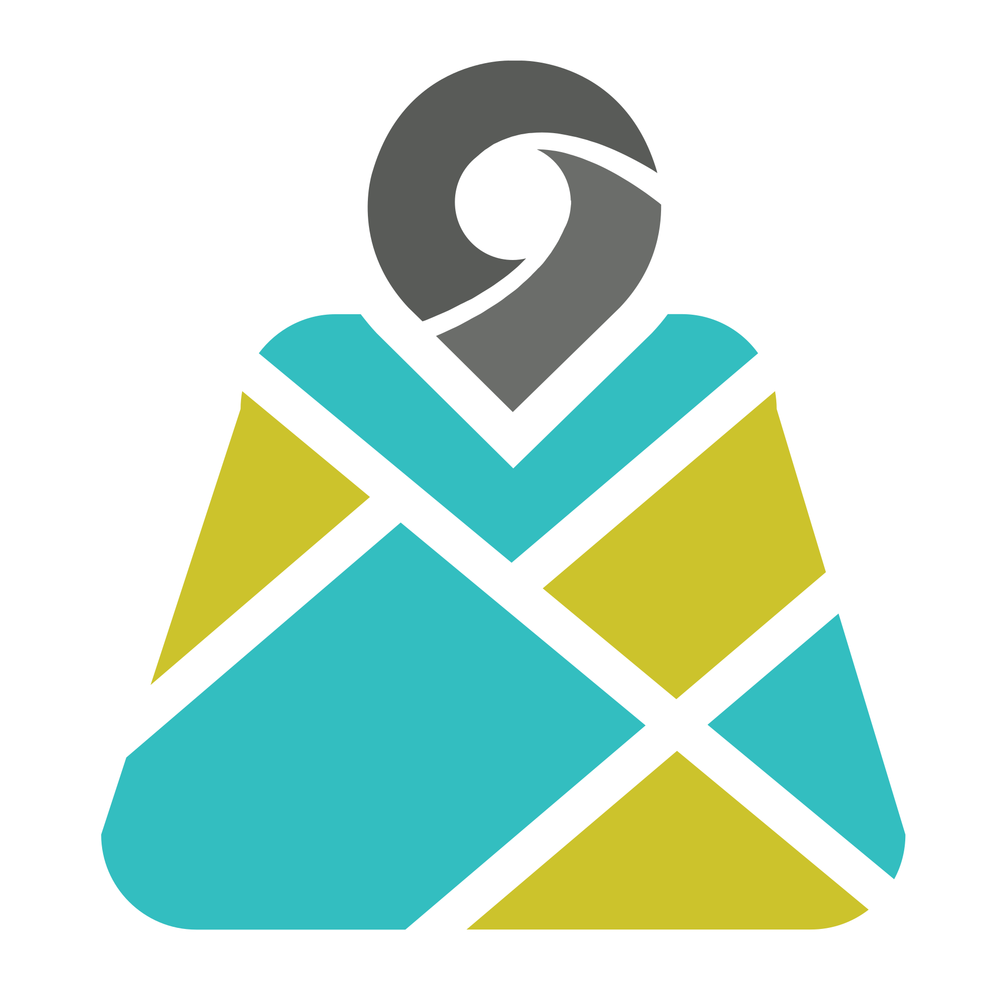
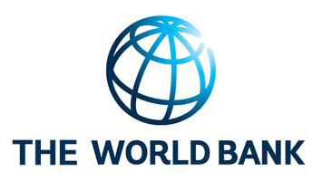
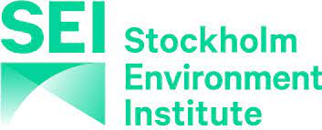
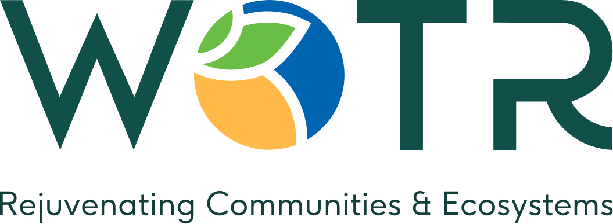

---
hide:
  - navigation
  - toc
---

  

    

      
    

    

      <h1>Rotten Grapes Pvt. Ltd.</h1>
      

        Rotten Grapes Private Limited is a geospatial technology company based in Nashik, India, specializing in GIS, Remote Sensing, Web GIS, GeoAI, and enterprise geospatial solutions. Since its inception in 2020, the company has successfully delivered projects for government agencies, NGOs, startups, and private organizations across six continents. Our expertise spans hydrology, agriculture, forestry, urban governance, land management, environmental monitoring, and infrastructure planning, leveraging open-source technologies to build scalable and cost-effective solutions.
      

      

        In addition to consulting and custom software development, Rotten Grapes develops innovative geospatial products and platforms that help organizations harness the power of location intelligence and Earth Observation data. Our team of GIS specialists, software engineers, and data scientists works on advanced applications involving satellite imagery analysis, hydrological modeling, spatial data infrastructure, decision support systems, and AI-driven geospatial analytics. Through our commitment to open-source innovation and practical problem-solving, we aim to make geospatial technology more accessible and impactful for organizations worldwide.
      

      

        <strong>Website:</strong> <a href="https://rottengrapes.tech" target="_blank">https://rottengrapes.tech</a> 
        <strong>Email:</strong> <a href="mailto:office@rottengrapes.tech">office@rottengrapes.tech</a> 
        <strong>Schedule a call:</strong> <a href="https://rottengrapes.tech/contact" target="_blank">Calendar link</a>
      

    

  

<h2 class="section-title">Selected Clients & Partners</h2>

  

    
  

  

    
  

  

    
  

  

    
  

  

    
  

