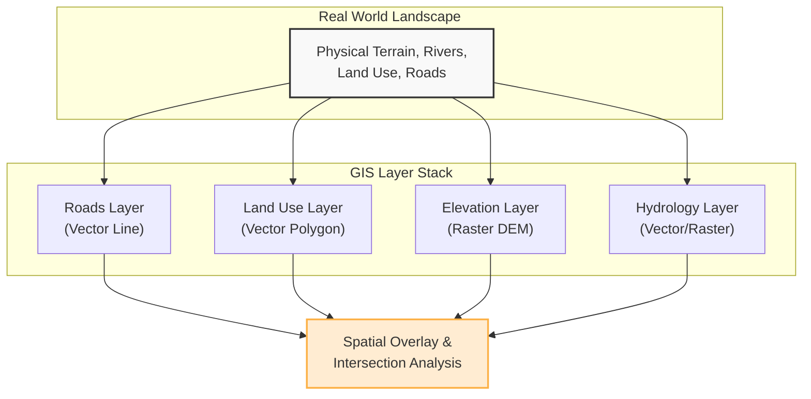
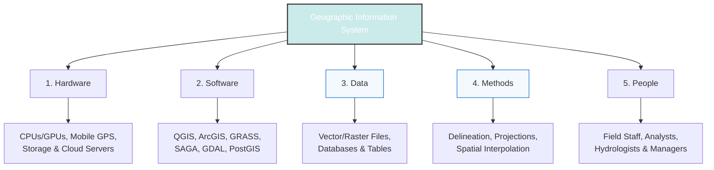
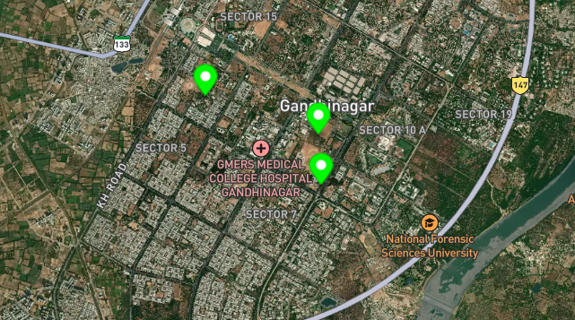
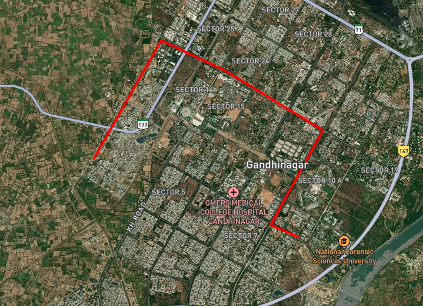
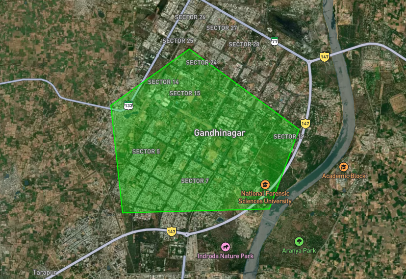
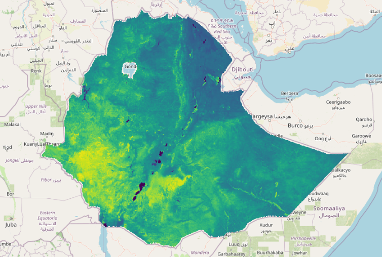
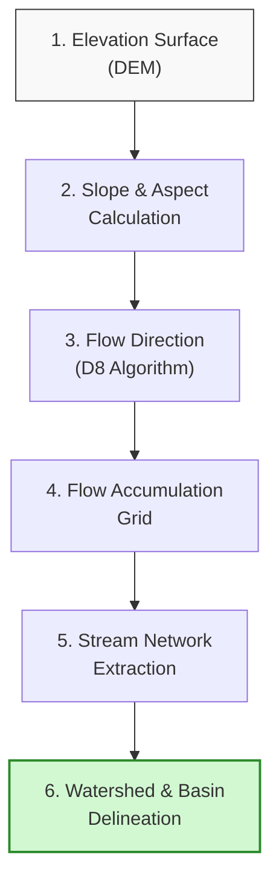
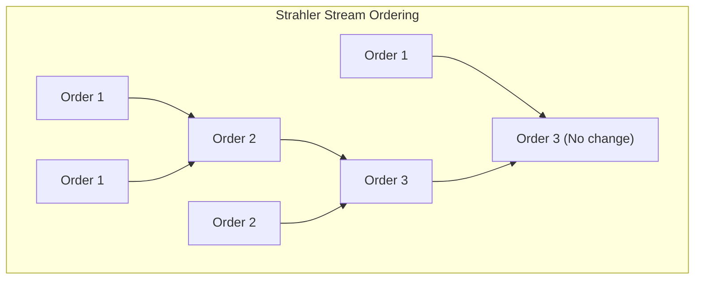

# Introduction to GIS and Spatial Thinking

Geographic Information Systems (GIS) and spatial thinking form the foundation of modern water resource management. This section provides a comprehensive, deep-dive into what GIS is, its core structural components, how it compares to other analytical software, the principles of spatial thinking, and how these concepts are applied to solve real-world river basin challenges at the Water and Energy Commission Secretariat (WECS).

!!! tip  "Presentation Slides"
    You can download or view the lecture slides for this topic: [Spatial_Hydrology_Framework.pdf](presentations/01_Spatial_Hydrology_Framework.pdf)

---

## 1. What is GIS? A Deep-Dive Framework

At its core, a **Geographic Information System (GIS)** is an integrated suite of database, graphic, and analytical tools designed to capture, store, manipulate, analyze, manage, and present all types of geographical and spatial data. 

To truly understand GIS, we must differentiate between **Spatial Data** (where something is) and **Aspatial/Attribute Data** (what something is). In traditional spreadsheets or databases, data is stored as disconnected rows and columns. In a GIS, every tabular record is explicitly tied to a coordinate geometry in physical space.

### The Core Concept: Layering the World
The defining mechanism of GIS is the overlay concept (originally popularized by landscape architect Ian McHarg). Instead of representing the real world as a single, complex map, GIS breaks the environment down into thematic **spatial layers**. Each layer represents a specific class of features (e.g., rivers, soils, elevation, roads, administrative boundaries). By stacking these layers on top of one another using a common coordinate reference system, we can analyze the relationships between them.

### Tobler's First Law of Geography
All spatial thinking and modeling in GIS are governed by **Tobler's First Law of Geography**:
> *"Everything is related to everything else, but near things are more related than distant things."*

In hydrology, this law manifests continuously:

* Rainfall in one headwater sub-catchment impacts the streamflow of adjacent streams more than streams in a separate river basin.

* Runoff coefficients are highly correlated within continuous land-cover blocks.

* Elevation values at a given point are highly dependent on the elevation values of neighboring pixels (spatial autocorrelation).

### Spatial Representation: Discrete Objects vs. Continuous Fields
GIS represents spatial phenomena in two fundamental ways:

1. **Discrete Object Model (Vector):** Represents the world as distinct objects with clear boundaries (e.g., a water quality monitoring station as a point, a river channel as a line, or a lake boundary as a polygon).

2. **Continuous Field Model (Raster):** Represents phenomena that vary continuously across space without distinct boundaries (e.g., terrain elevation, soil moisture, surface temperature, or precipitation grids).

---

## 2. The Five Key Components of GIS

A GIS is not merely "mapping software." It is a dynamic system composed of five critical parts:

### 1. Hardware
The computational demands of GIS require specialized hardware:

* **Processing Power (CPU/GPU):** High-speed multi-core processors are necessary for running heavy spatial algorithms (like raster interpolation, viewshed analysis, and hydrodynamic routing). GPUs are increasingly used to accelerate parallel spatial computations.

* **Storage Systems:** Spatial datasets (such as multi-temporal satellite imagery, high-resolution LiDAR DEMs, and global climate grids) consume gigabytes or terabytes of space. Fast solid-state drives (SSDs) and network-attached storage (NAS) are essential.

* **Data Capture Devices:** GPS/GNSS receivers, drone sensors, and digitizing tablets used to collect coordinates in the field.

### 2. Software
GIS software provides the tools to store, analyze, and display spatial data:

* **Desktop GIS:** Software like **QGIS** (Free and Open Source) or **ArcGIS Pro** (Proprietary). These provide graphical interfaces for spatial editing, styling, layout design, and processing.

* **Spatial Database Engines:** Databases like **PostgreSQL with the PostGIS extension**. They allow writing spatial SQL queries (e.g., finding all water wells within 500 meters of a polluted river stretch).

* **Geospatial Libraries:** Back-end libraries like **GDAL/OGR** (for raster/vector translation), **PROJ** (for coordinate transformations), and **GEOS** (for topology operations). These libraries power QGIS and custom python scripts.

### 3. Data
Geospatial data is divided into two primary types, which will be covered in detail on subsequent days:

* **Vector Data:** Uses coordinates ($X, Y$ and sometimes $Z$) to define points, lines, and polygons.

    * *Points:* Coordinate pairs representing zero-dimensional features (e.g., rain gauges, spring locations).
    

    * *Lines:* Connected sequences of points representing one-dimensional features (e.g., streams, roads).
    

    * *Polygons:* Closed loops representing two-dimensional areas (e.g., reservoirs, soil zones, watersheds).
    

* **Raster Data:** Consists of a matrix of cells (or pixels) organized into a grid. Each cell contains a value representing the phenomenon at that location (e.g., elevation, land cover class, daily rainfall in millimeters).

### 4. Methods and Workflows
The analytical workflows, equations, and steps applied to solve spatial problems. For example:

* **Spatial Interpolation:** Calculating rainfall values at unsampled locations using data from a limited number of weather stations (e.g., using Inverse Distance Weighting or Kriging).

* **Overlay Analysis:** Intersecting a slope map, soil map, and land-use map to find optimal locations for groundwater recharge basins.

* **Terrain Routing:** Algorithms that calculate how water flows from cell to cell based on slopes.

### 5. People
The most critical component. Even the most advanced hardware and software are useless without:

* **GIS Analysts & Developers:** Who build the databases, write Python automation scripts, and run complex models.

* **Domain Experts (Hydrologists/Engineers):** Who understand physical processes (like stream discharge or soil saturation) and translate physical models into GIS workflows.

* **Decision Makers:** Managers and policymakers who interpret maps to make choices regarding water allocation, flood response, and infrastructure development.

---

## 3. Tool Comparison: GIS vs. CAD vs. MIS vs. Excel

Water resource projects often involve multiple teams using different tools. Understanding the strengths and boundaries of each system is critical for seamless integration.

| Technical Capabilities | Geographic Information System (GIS) | Computer-Aided Design (CAD) | Management Information System (MIS) | Spreadsheet (Excel) |
| :--- | :--- | :--- | :--- | :--- |
| **Primary Data Type** | Georeferenced features (Raster/Vector) tied to relational tables. | High-precision geometry vectors (lines, arcs, solids). | Structured relational tables (alphanumeric). | Flat tabular grids (rows, columns). |
| **Spatial Reference Systems** | Native support for projections (UTM, State Plane) and datums (WGS 84, NAD 83). | Typically local cartesian grid ($0,0$ origin or local engineering benchmark). | None natively. Spatial data must be converted to text/IDs. | None. Coordinates are treated as plain text or numbers. |
| **Spatial Topology** | High. Enforces rules like "polygons must not overlap" or "lines must connect at nodes." | Low. Geometries exist independently; lines can cross without forming a node. | None. Relational integrity is logical, not spatial. | None. |
| **Database Coupling** | Tight. Every geographic feature is linked to a database row. | Loose. Attributes are often text annotations or basic layers. | Maximum. Relies heavily on SQL relational constraints. | Weak. Lacks relational integrity checks between separate sheets. |
| **Spatial Analysis Tools** | Buffer, overlay, viewshed, watershed routing, network analysis. | Dimensioning, volume calculation, geometric offsets. | Querying, grouping, business intelligence, aggregation. | Numerical calculations, sorting, charting. |
| **Scale & Generalization** | Designed for regional, basin, and global-scale models. | Designed for site-scale, high-precision engineering models (millimeter scale). | Organizational, departmental, or enterprise-scale database. | Personal or project-scale calculator. |

### Practical Workflow Scenario: Building a Hydropower Reservoir
To understand how these tools interact, consider the workflow for planning a new reservoir:

1. **Spreadsheets (Excel):** Hydrologists compile 30 years of daily river gauge records to calculate flow duration curves and average monthly discharge.

2. **GIS:** Planners overlay regional elevation grids (DEMs) to locate the narrowest valley point, delineate the upstream catchment basin, calculate the reservoir's volume at various fill heights, and map the communities and forests that will be inundated.

3. **CAD:** Structural engineers import the reservoir boundary from GIS and design the concrete gravity dam, spillways, and intake tunnels in high-precision 3D environments.

4. **MIS:** The project management team tracks construction budgets, equipment inventory, labor logs, and land-compensation payments in a relational database system.

---

## 4. Spatial Thinking in Hydrology

Spatial thinking goes beyond identifying coordinates on a map. It involves conceptualizing how physical objects occupy space and how processes (like the water cycle) operate across space. In hydrology, water flow is determined by spatial relationships:

### 1. Spatial Adjacency and Connectivity
In a river basin, cells or polygons are spatially adjacent. Water flows from one cell to its neighbor based on gravity. 

* **D8 Flow Model:** A common raster method that inspects a pixel and its eight surrounding neighbors. Water is assumed to flow in the direction of the steepest downward slope.

* **Hydrological Connectivity:** This connectivity determines how pollutants or sediments run off from farm fields, travel through small streams, and accumulate in larger rivers.

### 2. Terrain Derivatives: Slope, Aspect, and Flow Path

* **Slope:** The steepness or rate of change of elevation. Steep slopes generate fast surface runoff; flat slopes encourage water ponding and infiltration.

* **Aspect:** The compass direction that a slope faces. In mountainous regions (like the Himalayas), south-facing slopes receive more solar radiation, leading to faster snowmelt and different evaporation rates than north-facing slopes.

* **Flow Accumulation:** A calculation that counts how many upstream cells drain into each cell. Cells with high flow accumulation represent stream channels; cells with zero accumulation represent ridge lines or watershed divides.

### 3. Spatial Scale and Resolution
Hydrological processes must be analyzed at appropriate spatial scales:

* **Micro-scale:** Analyzing soil water movement in a single field requires high-resolution raster datasets (e.g., $1\text{ m}$ grids from LiDAR).

* **Macro-scale:** Modeling water balance for the entire Koshi or Karnali river basins requires regional-scale datasets ($30\text{ m}$ to $90\text{ m}$ grids from satellite missions like SRTM).

* **The Scale Effect:** If a grid is too coarse (e.g., $1\text{ km}$ pixels), narrow river channels disappear, causing flow path calculations to fail.

---

## 5. Real-World Applications in River Basin Management (WECS)

For the **Water and Energy Commission Secretariat (WECS)**, GIS is an essential tool for evidence-based decision-making. Key applications include:

### 1. Automated Watershed Delineation
Manual delineation of watershed boundaries from paper maps is time-consuming and prone to errors. GIS automates this process using digital elevation datasets. Hydrologists can input any point along a river network (such as a planned hydropower intake site) and the GIS will automatically calculate the boundary of the entire catchment area draining to that specific point.

> [!TIP]
> This allows rapid calculation of watershed areas, average basin slopes, and catchment-wide average rainfall—all of which are inputs for hydrologic design.

### 2. Stream Order Classification
GIS can automatically analyze river network geometries to calculate stream order based on classification systems:

* **Strahler Stream Order:** Intersection of two first-order streams creates a second-order stream. Intersection of two second-order streams creates a third-order stream, and so on. If a lower-order stream intersects a higher-order stream, the order does not change.

* **Shreve Stream Order (Stream Magnitude):** Additive system. When two streams intersect, their magnitudes are added together. This is highly correlated with cumulative river flow volumes.

### 3. Soil Erosion Hotspot Analysis
By combining multiple spatial datasets within a GIS, planners can run the **Revised Universal Soil Loss Equation (RUSLE)**:
$$A = R \times K \times LS \times C \times P$$
Where:

* $A$ = Annual Soil Loss (Raster output)

* $R$ = Rainfall Erosivity (Raster interpolated from weather stations)

* $K$ = Soil Erodibility (Vector soil map converted to raster)

* $LS$ = Slope Length and Steepness (Calculated from DEM)

* $C$ = Crop/Vegetation Cover (Calculated from NDVI satellite data)

* $P$ = Support Practice Factor (Conservation measures map)

The output map identifies erosion hotspots, allowing WECS to allocate conservation budgets to the areas with the highest soil degradation rates.

### 4. Flood Inundation and Vulnerability Mapping
GIS intersects physical flood hazard zones with demographic datasets:

* **Hazard Layer:** A raster output from hydraulic models (e.g., HEC-RAS) showing water depth and velocity during a 100-year flood event.

* **Vulnerability Layer:** Vector polygons containing population density, building footprints, and location of critical infrastructure (hospitals, power grids).

* **Risk Mapping:** By intersecting these layers, GIS identifies high-risk zones, helping planners design flood warning systems and select evacuation routes.

<iframe width="560" height="315" src="https://www.youtube.com/embed/FRnpau-iD7g?si=AmXonunjpF4ulETy" title="YouTube video player" frameborder="0" allow="accelerometer; autoplay; clipboard-write; encrypted-media; gyroscope; picture-in-picture; web-share" referrerpolicy="strict-origin-when-cross-origin" allowfullscreen></iframe>
