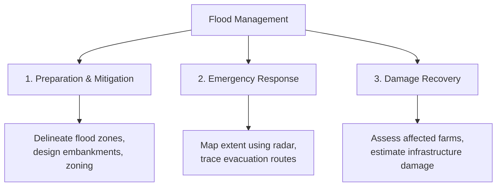

# Role of Geospatial Technologies in Water Resource Management

Water resource management is fundamentally spatial and temporal. Rivers cross administrative boundaries, rainfall patterns vary across mountains, and floods impact low-lying valleys. Managing these resources requires a system that can model the physical landscape and analyze the human impact on it. This section details how Geographic Information Systems (GIS) and Remote Sensing (RS) are used across key areas of water resource management.

!!! tip  "Presentation Slides"
    You can download or view the lecture slides for this topic: [Geospatial_Water_Management.pdf](presentations/02_Geospatial_Water_Management.pdf)

---

## 1. Watershed Planning
A **watershed** (or catchment/basin) is the basic unit of hydrology. It is defined as the area of land where all precipitation drains to a single common point (such as a river confluence or reservoir outlet). Watershed planning uses GIS to characterize these areas:

* **Catchment Characterization:** Calculating physical parameters like catchment area, perimeter, shape factors (e.g., circularity ratio), elongation ratio, and average slope. These factors directly influence how quickly rainfall gathers into flood peaks.

* **Drainage Density:** Measuring the total length of streams per unit area:
  $$D_d = \frac{\sum L}{A}$$
  High drainage density indicates rapid surface runoff, high erosion risk, and low groundwater infiltration, which is critical for WECS in prioritizing sub-basins for soil conservation.

* **Land-Use Impact Modeling:** Simulating how changes in land use (e.g., deforestation, urbanization) impact watershed hydrology. By overlaying soil and land-cover maps, planners can run hydrological models to predict changes in water yield and peak discharges.

---

## 2. Flood Monitoring and Hazard Mapping
Floods are among the most destructive natural disasters. GIS and remote sensing play a role in all stages of flood management:

* **Live Inundation Mapping:** During peak monsoon season, heavy cloud cover blocks optical satellites. Hydrologists use **Synthetic Aperture Radar (SAR)** datasets (like Sentinel-1) because radar signals penetrate clouds and map water bodies at night.

* **Risk Assessment:** By overlaying flood depth maps with building footprints, agricultural lands, and population densities, emergency teams can identify which sub-districts require immediate evacuation and resource allocation.

---

## 3. Reservoir Management and Siltation Studies
Reservoirs are critical for irrigation, hydropower, and drinking water, but their storage capacity decreases over time due to sedimentation (siltation).

* **Inflow Forecasting:** Coupling rainfall-runoff models with GIS to predict how much water will enter a reservoir based on upstream rain gauge and satellite precipitation data.

* **Siltation Assessment:** Using multitemporal satellite data to monitor changes in the reservoir's surface area at various water levels. By comparing these areas over decades, engineers can estimate the rate of sediment accumulation without relying on expensive bathymetric (underwater) surveys.

* **Capacity Curve Updates:** Updating elevation-area-capacity curves, which are essential for daily reservoir operation, hydropower scheduling, and flood control releases.

---

## 4. Drought Assessment and Drought Indices
Unlike sudden floods, droughts develop slowly over months or years. GIS and remote sensing track drought indicators across large regions:

* **Meteorological Drought:** Interpolating rain gauge data to map rainfall deficits across catchments, calculating indices like the **Standardized Precipitation Index (SPI)**.

* **Agricultural Drought:** Monitoring vegetation health using the **Normalized Difference Vegetation Index (NDVI)** from Sentinel-2 or MODIS imagery. Anomalies in NDVI values indicate crop stress due to water shortage.

* **Hydrological Drought:** Mapping the surface area shrinkage of lakes, reservoirs, and wetlands over time to assess water table decline and streamflow depletion.

---

## 5. River Morphology and Channel Shifting
Rivers in active tectonic zones (such as those in Nepal) transport heavy sediment loads, causing their channels to shift and erode banks.

* **Migration Mapping:** By co-registering satellite images from different decades, hydrologists can map river centerlines and track how the main channel shifts over time.

* **Bank Erosion Modeling:** Identifying locations along river banks that are highly vulnerable to erosion, which is crucial for planning protective structures like gabion walls and guide bunds.

---

## 6. Environmental and Water Quality Monitoring
Healthy river basins require maintaining ecological flows and water quality.

* **Water Quality Mapping:** Integrating point measurements (pH, turbidity, dissolved oxygen, heavy metals) taken at sampling stations into a continuous spatial database. Interpolation techniques are then used to map water quality zones.

* **Riparian Buffer Zone Assessment:** Using buffer tools in GIS to analyze land use within 100 to 500 meters of river banks. Restoring vegetation within these buffers helps filter agricultural runoff and stabilize banks.

* **Ecological Flow Compliance:** Monitoring whether minimum environmental flows are maintained downstream of run-of-river hydropower projects by overlaying layout maps with real-time discharge database records.

---

## 7. Groundwater Assessment and Aquifer Mapping
Groundwater is an invisible but vital resource. GIS and Remote Sensing help visualize and manage aquifers:

* **Aquifer Vulnerability Mapping:** Using the **DRASTIC** model (Depth to water, net Recharge, Aquifer media, Soil media, Topography, Impact of vadose zone, and hydraulic Conductivity) to map areas highly susceptible to pollution.

* **Groundwater Potential Zone (GWPZ) Mapping:** Integrating multiple thematic layers (geology, geomorphology, slope, land cover, lineament density, and drainage density) in a weighted overlay analysis to identify potential groundwater recharge zones.

* **Satellite Gravity Monitoring:** Utilizing **GRACE (Gravity Recovery and Climate Experiment)** satellite data to track long-term regional changes in total water storage and estimate groundwater depletion rates.

---

## 8. Rainfall Analysis and Hydrometeorology
Weather and climate drive the hydrological cycle. Spatial analysis of meteorological data is critical:

* **Spatial Interpolation of Rainfall:** Using techniques like **Inverse Distance Weighting (IDW)**, **Kriging**, and **Spline** to convert point observations from weather stations into continuous rainfall surfaces.

* **Satellite Rainfall Estimates (SRE):** Utilizing high-resolution gridded datasets such as **CHIRPS** (Climate Hazards Group InfraRed Precipitation with Station data) or **GPM** (Global Precipitation Measurement) to model hydrology in ungauged or remote basins.

* **Orographic Effects Modeling:** Incorporating elevation datasets (DEMs) to adjust spatial rainfall estimates based on elevation gradients, crucial for mountainous terrains like Nepal.

---

## 9. Hydrological Modeling and Decision Support Systems
Decision support systems integrate data and models to help policymakers manage river basins:

* **GIS-Model Coupling:** Exporting geospatial parameters (catchment boundaries, slopes, land cover, soil classifications) from GIS into physical models such as **SWAT (Soil and Water Assessment Tool)** or **HEC-HMS (Hydrological Modeling System)**.

* **Scenario Analysis:** Running models under different scenarios (e.g., land-use changes or infrastructure development) to visualize future water availability and discharge dynamics.

* **Web-Based Dashboards:** Deploying interactive Web GIS portals to visualize real-time streamflow, water quality, and reservoir levels for river basin management.

---

## 10. Climate Change and Water Security
Climate change directly alters hydrological patterns, affecting water security:

* **Glacial Lake Outburst Flood (GLOF) Monitoring:** Using satellite imagery (Sentinel-2, Landsat) to monitor glacial retreat, map glacial lakes, and model downstream flood paths to secure mountain communities.

* **Snow Cover Mapping:** Extracting snow cover area (SCA) using indices like the **Normalized Difference Snow Index (NDSI)** from MODIS or Sentinel-3 to forecast spring snowmelt contributions.

* **Future Inundation Scenarios:** Simulating future flood extents by forcing hydraulic models with climate projection data (e.g., CMIP6 scenarios) to plan resilient structures.

---

## 11. Water Infrastructure Planning
The siting and design of water infrastructure are spatial decisions:

* **Optimal Dam Siting:** Using multicriteria evaluation (MCE) in GIS to identify optimal locations for dams and reservoirs based on storage capacity, slope stability, environmental impact, and geological safety.

* **Canal Routing and Alignment:** Using least-cost path analysis and DEMs to route irrigation canals or drinking water pipelines to minimize excavation costs and pump energy.

* **Command Area Mapping:** Delineating irrigation command areas and monitoring crop water requirements by analyzing remote sensing crop indices.

---

## 12. Real-Time Monitoring and Early Warning Systems
Early warning systems save lives and property by providing advance alerts:

* **Telemetry Integration:** Overlaying live water level and discharge data from telemetry stations onto GIS risk maps to dynamically track flood warning levels.

* **Rapid Flood Inundation Models:** Running pre-calculated flood libraries or simplified hydraulic models in real time to generate immediate inundation maps during extreme storm events.

* **Public Alert Mapping:** Generating spatial alert zones to distribute targeted notifications via SMS or local broadcast networks.

---

## 13. Emerging Technologies in Water Resource Management
New technologies are accelerating the transition from static mapping to dynamic modeling:

* **Cloud Computing (Google Earth Engine):** Processing petabytes of satellite imagery in seconds to perform national-scale water surface monitoring, land-cover mapping, and long-term climate analysis.

* **UAVs and LiDAR:** Deploying drones to capture ultra-high-resolution topography and bathymetry, which is crucial for detailed hydraulic modeling and riverbank stability analysis.

* **AI and Machine Learning:** Applying deep learning models to predict flood inundation, forecast rainfall-runoff, and classify remote sensing images.

---

## 14. Water Balance and Water Accounting
Water accounting quantifies water availability and consumption across river basins:

* **Precipitation-Runoff Balancing:** Delineating the water budget components ($P = ET + Q + \Delta S$) using remote sensing estimates of precipitation (P), evapotranspiration (ET), and streamflow telemetry (Q).

* **Evapotranspiration Estimation:** Using surface energy balance models (e.g., **METRIC**, **SEBAL**) with thermal satellite bands (Landsat-8/9) to measure actual crop water consumption.

* **Basin-Wide Water Auditing:** Compiling standardized water accounts (such as WA+ framework) to help authorities allocate water rights equitably among agriculture, energy, and urban sectors.

