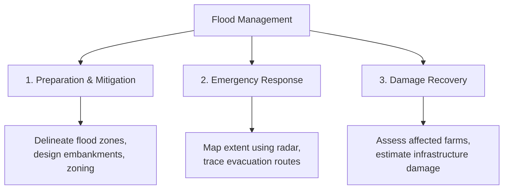

# Role of Geospatial Technologies in Water Resource Management

Water resource management is fundamentally spatial and temporal. Rivers cross administrative boundaries, rainfall patterns vary across mountains, and floods impact low-lying valleys. Managing these resources requires a system that can model the physical landscape and analyze the human impact on it. This section details how Geographic Information Systems (GIS) and Remote Sensing (RS) are used across key areas of water resource management.

---

## 1. Watershed Planning
A **watershed** (or catchment/basin) is the basic unit of hydrology. It is defined as the area of land where all precipitation drains to a single common point (such as a river confluence or reservoir outlet). Watershed planning uses GIS to characterize these areas:

* **Catchment Characterization:** Calculating physical parameters like catchment area, perimeter, shape factors (e.g., circularity ratio), elongation ratio, and average slope. These factors directly influence how quickly rainfall gathers into flood peaks.

* **Drainage Density:** Measuring the total length of streams per unit area:
  $$D_d = \frac{\sum L}{A}$$
  High drainage density indicates rapid surface runoff, high erosion risk, and low groundwater infiltration, which is critical for WECS in prioritizing sub-basins for soil conservation.

* **Land-Use Impact Modeling:** Simulating how changes in land use (e.g., deforestation, urbanization) impact watershed hydrology. By overlaying soil and land-cover maps, planners can run hydrological models to predict changes in water yield and peak discharges.

---

## 2. Flood Monitoring and Hazard Mapping
Floods are among the most destructive natural disasters. GIS and remote sensing play a role in all stages of flood management:

* **Live Inundation Mapping:** During peak monsoon season, heavy cloud cover blocks optical satellites. Hydrologists use **Synthetic Aperture Radar (SAR)** datasets (like Sentinel-1) because radar signals penetrate clouds and map water bodies at night.

* **Risk Assessment:** By overlaying flood depth maps with building footprints, agricultural lands, and population densities, emergency teams can identify which sub-districts require immediate evacuation and resource allocation.

---

## 3. Reservoir Management and Siltation Studies
Reservoirs are critical for irrigation, hydropower, and drinking water, but their storage capacity decreases over time due to sedimentation (siltation).

* **Inflow Forecasting:** Coupling rainfall-runoff models with GIS to predict how much water will enter a reservoir based on upstream rain gauge and satellite precipitation data.

* **Siltation Assessment:** Using multitemporal satellite data to monitor changes in the reservoir's surface area at various water levels. By comparing these areas over decades, engineers can estimate the rate of sediment accumulation without relying on expensive bathymetric (underwater) surveys.

* **Capacity Curve Updates:** Updating elevation-area-capacity curves, which are essential for daily reservoir operation, hydropower scheduling, and flood control releases.

---

## 4. Drought Assessment and Drought Indices
Unlike sudden floods, droughts develop slowly over months or years. GIS and remote sensing track drought indicators across large regions:

* **Meteorological Drought:** Interpolating rain gauge data to map rainfall deficits across catchments, calculating indices like the **Standardized Precipitation Index (SPI)**.

* **Agricultural Drought:** Monitoring vegetation health using the **Normalized Difference Vegetation Index (NDVI)** from Sentinel-2 or MODIS imagery. Anomalies in NDVI values indicate crop stress due to water shortage.

* **Hydrological Drought:** Mapping the surface area shrinkage of lakes, reservoirs, and wetlands over time to assess water table decline and streamflow depletion.

---

## 5. River Morphology and Channel Shifting
Rivers in active tectonic zones (such as those in Nepal) transport heavy sediment loads, causing their channels to shift and erode banks.

* **Migration Mapping:** By co-registering satellite images from different decades, hydrologists can map river centerlines and track how the main channel shifts over time.

* **Bank Erosion Modeling:** Identifying locations along river banks that are highly vulnerable to erosion, which is crucial for planning protective structures like gabion walls and guide bunds.

---

## 6. Environmental and Water Quality Monitoring
Healthy river basins require maintaining ecological flows and water quality.

* **Water Quality Mapping:** Integrating point measurements (pH, turbidity, dissolved oxygen, heavy metals) taken at sampling stations into a continuous spatial database. Interpolation techniques are then used to map water quality zones.

* **Riparian Buffer Zone Assessment:** Using buffer tools in GIS to analyze land use within 100 to 500 meters of river banks. Restoring vegetation within these buffers helps filter agricultural runoff and stabilize banks.

* **Ecological Flow Compliance:** Monitoring whether minimum environmental flows are maintained downstream of run-of-river hydropower projects by overlaying layout maps with real-time discharge database records.
