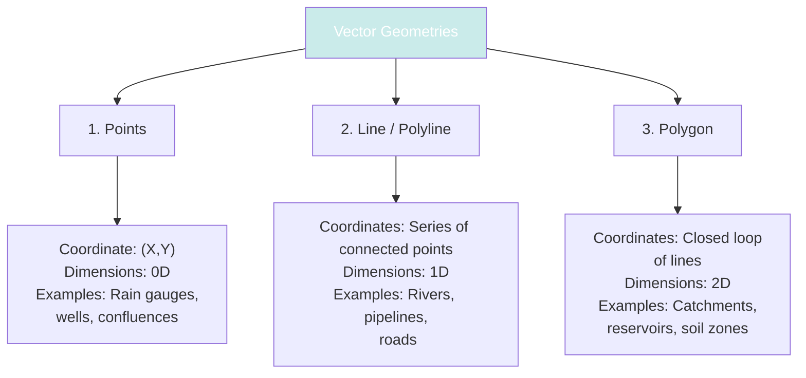
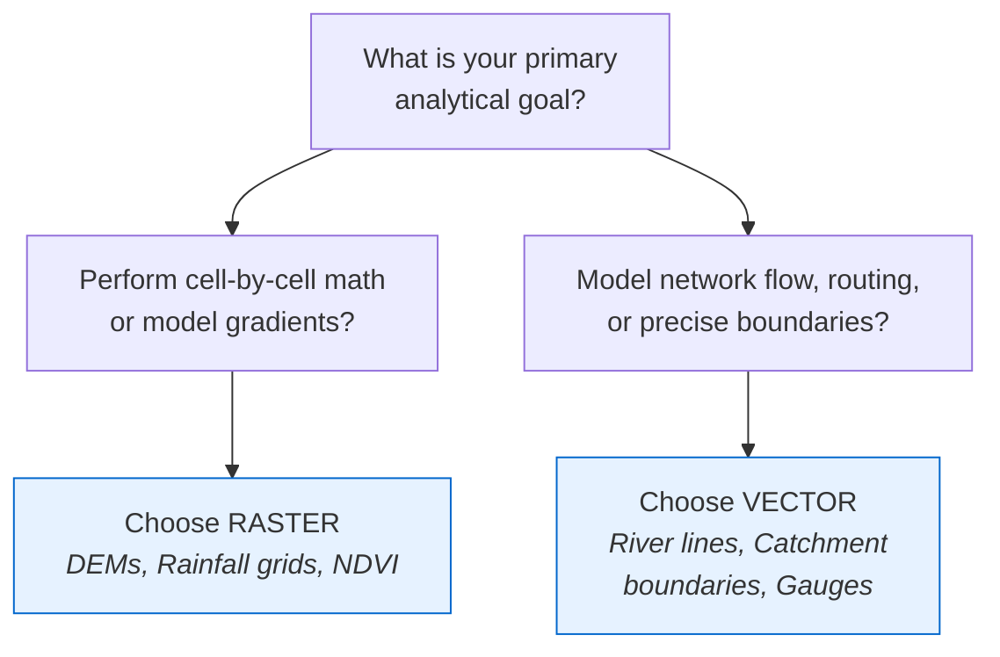

# Spatial Data Models and Geospatial Datasets

To analyze real-world geographic features digitally, we must convert them into structured coordinate systems. In GIS, this is achieved using two primary spatial data models: **Vector** and **Raster**. This section details their structures, data properties, applications in water resources, and the core datasets used in hydrological modeling.


!!! tip  "Presentation Slides"
    You can download or view the lecture slides for this topic: [Spatial_Data_Anatomy.pdf](presentations/03_Spatial_Data_Anatomy.pdf)

---

## 1. The Vector Data Model
The vector data model represents the world as discrete features with explicit coordinate geometries. Features are defined by coordinate pairs ($X, Y$, and optionally elevation $Z$) and grouped into three geometric types:



### Key Vector Characteristics
* **Vertices and Nodes:** Lines and polygons are constructed from connected points called **vertices**. The start and end points of a line are called **nodes**.

* **Topology:** Vector data structures enforce spatial relationships (topology) such as:
  * **Connectivity:** Streams must connect at confluences to model downstream flow.
  * **Adjacency:** Neighboring sub-watersheds share a common boundary line without gaps or overlaps.
  * **Containment:** Rain gauges are located within a specific sub-catchment boundary.

* **Attributes:** Every vector geometry is linked to a row in an attribute database using a unique ID. This allows querying geometric shapes based on database fields (e.g., find all rivers where name = 'Karnali').

---

## 2. The Raster Data Model
The raster data model represents geographic features as a continuous grid of cells (or pixels) organized into rows and columns. Each cell contains a numeric value representing the phenomenon at that location.

```text
+---+---+---+---+
| 85| 87| 89| 90|  <-- Raster Grid Cells
+---+---+---+---+  Each cell represents a square area on the ground
| 82| 84| 86| 88|  (e.g., 30m x 30m) containing a single value
+---+---+---+---+  such as elevation in meters.
| 79| 81| 83| 85|
+---+---+---+---+
```

### Key Raster Characteristics
* **Cell Size (Resolution):** The ground area covered by a single pixel. A $10\text{ m}$ resolution raster captures more land detail but requires 9 times more storage space than a $30\text{ m}$ resolution raster covering the same area.

* **Georeferencing Tie-Points:** A raster is positioned in space by defining the coordinate of its upper-left pixel, its cell size, and its rotation angle. From this data, the GIS calculates the coordinate of every other pixel.

* **Bands:** A raster can contain a single band (e.g., elevation data) or multiple bands representing different wavelengths of light (e.g., RGB bands in optical photography or multispectral bands in satellite sensors).

---

## 3. Discrete vs. Continuous Datasets
Understanding the nature of spatial phenomena determines which model to use:
* **Discrete Datasets:** Features that have clear, well-defined boundaries.
  * **Examples:** Country borders, river centerlines, forest patches, administrative zones.
  * **Best represented as:** **Vector** models, though they can be represented as integer rasters (where each cell contains a category ID).

* **Continuous Datasets:** Phenomena that exist everywhere and change gradually across space without clear boundaries.
  * **Examples:** Elevation (terrain), soil moisture, air temperature, wind speed, precipitation.
  * **Best represented as:** **Raster** models, where cell values are floating-point numbers representing gradients.

---

## 4. Key Geospatial Datasets and Their Significance in Hydrology
Hydrological modeling requires importing and combining spatial datasets from multiple sources. Each type of dataset has specific properties and plays a distinct role in water resource management:

### Administrative Boundaries
* **Format:** Almost always represented as **Vector Polygons**.
* **Source:** National mapping agencies, geoportals, or global databases (e.g., GADM).
* **Hydrological Significance:** While water flow is determined by topographic divides rather than administrative boundaries, these layers are critical for reporting statistics (e.g., calculating the total water demand or average rainfall per district) and coordinating local watershed interventions.
* **GIS Best Practice:** Ensure topology rules are active to prevent gaps or overlaps between adjacent administrative divisions.

### Drainage Networks and River Channels
* **Format:** **Vector Lines (Polylines)**.
* **Hydrological Significance:** Delineating stream centerlines is critical for route tracking, calculating travel times, and modeling stream channels in 1D hydraulic models.
* **Digital Stream Burning (Hydrological Conditioning):** When overlaying vector streams on top of digital elevation grids, the streams do not always align with the lowest points of the terrain due to elevation errors. Hydrologists use vector streams to "burn" (lower) the elevation values of the DEM along the channel, forcing the computer-calculated flow path to match the real-world river alignment.

### Digital Elevation Models (DEMs)
* **Format:** Single-band **Raster Grid** (Float32).
* **DEM Subtypes:**
  * **Digital Terrain Model (DTM):** Represents the bare earth surface, excluding buildings and trees. **Always use DTM for hydrological modeling.**
  * **Digital Surface Model (DSM):** Represents the top surface of all features, including tree canopies and building rooftops. Useful for urban flood modeling.
```text
 DSM:  ===Tree===   ===Building===
        |       |    |          |
 DTM:  _Land____|____|__________|_  <-- Bare Earth Surface (Hydrology DEM)
```
* **Common Elevation Sources:**
  * **SRTM (Shuttle Radar Topography Mission):** $30\text{ m}$ global resolution. Reliable but can have voids in mountainous areas.
  * **ALOS PALSAR:** $12.5\text{ m}$ high-resolution terrain product. Very popular for slope analysis.
  * **Copernicus DEM (CopDEM):** $30\text{ m}$ modern global standard with high vertical accuracy.

### Satellite Imagery
* **Format:** Multi-band **Raster Grids**.
* **Optical Satellites (Sentinel-2, Landsat 8/9):** Measure solar reflection across various wavelengths (blue, green, red, near-infrared, shortwave-infrared). Used for mapping surface water, crop types, and sediment plumes.
* **SAR Satellites (Sentinel-1):** Active radar sensors that measure backscattered radio waves. Essential for mapping flood extents during cloud cover or at night.

### Land Use and Land Cover (LULC)
* **Format:** Integer **Raster Grids** (where each number represents a class ID) or **Vector Polygons**.
* **Hydrological Significance:** LULC determines how much rainfall is absorbed by the ground vs. how much runs off. It is used to assign **Curve Numbers (CN)** in the USDA Soil Conservation Service (SCS) runoff model:
  
| LULC Class | Hydrological Properties | Runoff Potential |
| :--- | :--- | :--- |
| **Forest** | High soil permeability, root absorption, high intercept. | Low |
| **Agriculture** | Moderate soil permeability, subject to seasonal bare soil. | Medium |
| **Urban (Concrete)** | Impermeable surfaces, high drainage connectivity. | Maximum |

### Precipitation and Rainfall Datasets
* **Format:** Vector Points (for gauges) or Raster Grids (for satellite products).
* **Point Gauge Datasets:** Daily or hourly measurements from weather stations. These provide high temporal accuracy but poor spatial coverage in remote mountain areas.
* **Satellite Precipitation Estimates:**
  * **CHIRPS (Climate Hazards Group InfraRed Precipitation with Station data):** $5\text{ km}$ resolution, optimized for long-term trend analysis.
  * **GPM (Global Precipitation Measurement):** High temporal resolution (half-hourly), useful for flood event modeling.
* **Gridded Interpolation:** Hydrologists use interpolation tools in GIS to convert point weather station data into continuous surfaces (e.g., PRISM or Kriging interpolations) for input into basin models.

---

## 5. Choosing the Right Data Model

| Capability / Feature | Vector Data Model | Raster Data Model |
| :--- | :--- | :--- |
| **Precision** | High geometric accuracy. Features are represented at their exact coordinates. | Limited by cell size. Features are generalized to the nearest grid square. |
| **Data Storage** | Efficient for simple structures. File sizes are small for points and lines. | Large file sizes, especially as resolution increases. |
| **Topology Analysis** | High capability. Crucial for modeling networks (flow routing, roads). | Poor. No native topological relationships between neighboring cells. |
| **Overlay Operations** | Complex. Intersecting polygons requires complex coordinate intersection math. | Simple and fast. Cell-by-cell map algebra (e.g., DEM - Soil Water Capacity). |
| **Continuous Modeling** | Difficult. Requires contour lines or Triangulated Irregular Networks (TIN). | Natural and native. Ideal for modeling gradients (slope, temperature). |
| **File Formats** | Shapefile, GeoPackage, GeoJSON, KML. | GeoTIFF, JPEG2000, NetCDF, HDF5. |

### Hydrological Decision Flowchart
How to decide which model to use:


