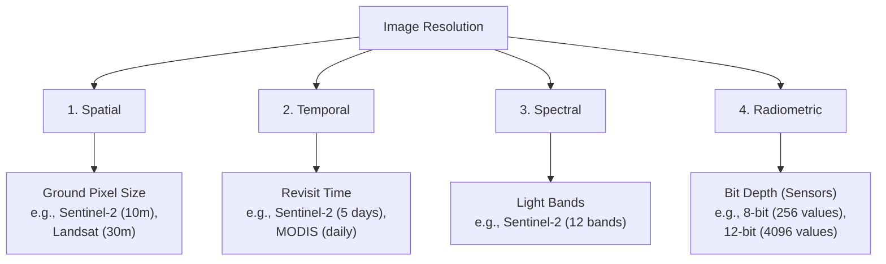
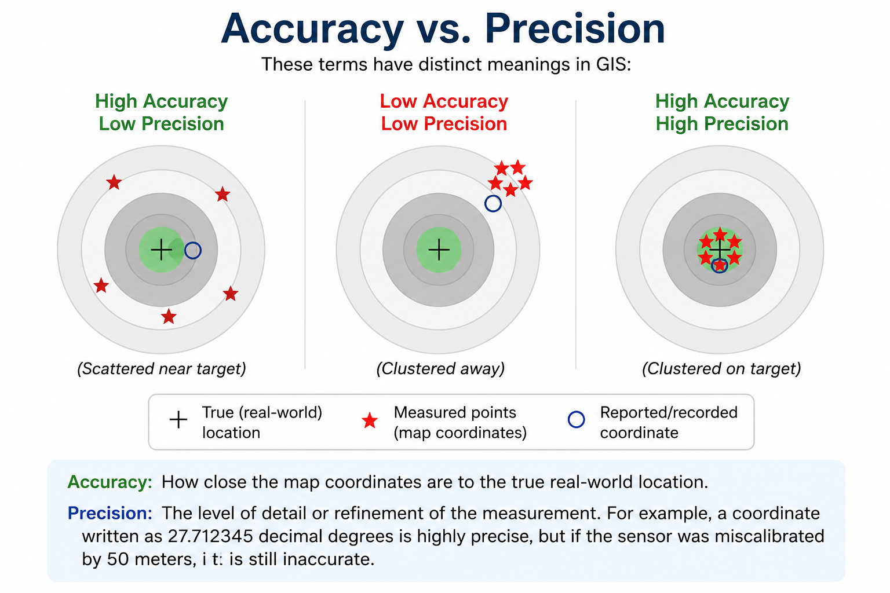
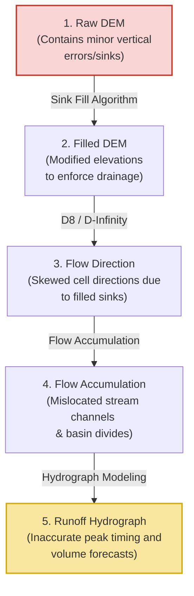

# Map Scale, Resolution, and Accuracy

Developing accurate water models requires understanding the quality, detail, and limits of spatial datasets. This section explains the concepts of map scale, spatial/temporal/spectral resolutions, the difference between accuracy and precision, and how scale dependency affects spatial analysis.

!!! tip  "Presentation Slides"
    You can download or view the lecture slides for this topic: [Map_scale_resolution.pdf](presentations/05_Map_scale_resolution.pdf)

---

## 1. Map Scale
Map scale is the relationship between distance on the map and distance on the ground. It is expressed in three ways:

1. **Representative Fraction (Ratio):** e.g., $1:50,000$ (meaning $1\text{ cm}$ on the map equals $50,000\text{ cm}$ or $500\text{ m}$ on the ground).

2. **Verbal Statement:** e.g., "One centimeter represents 500 meters."

3. **Graphic (Bar Scale):** A scale bar drawn on the map layout that scales dynamically if the map is resized.

> [!IMPORTANT]
> * **Large-Scale Maps:** Show a small geographic area in high detail (e.g., $1:5,000$, showing building footprints and town drainage ditches).
> * **Small-Scale Maps:** Show a large geographic area with less detail (e.g., $1:1,000,000$, showing national borders and primary river basins).

---

## 2. Spatial, Temporal, Spectral, and Radiometric Resolutions
In remote sensing and raster modeling, resolution determines the level of detail captured:

### Applications in Hydrology:

* **Spatial:** A $90\text{ m}$ elevation raster is too coarse to detect narrow mountain gullies, which can lead to errors in stream network calculation. A $12.5\text{ m}$ DEM is much more effective for modeling terrain at this scale.

* **Temporal:** Flood mapping requires high temporal resolution (daily or sub-daily observations) to capture the peak water level. Drought monitoring can use lower temporal resolutions (e.g., 8-day or monthly composite datasets).

* **Spectral:** Multi-spectral bands are needed to calculate indexes like the Normalized Difference Water Index (NDWI), which isolates water bodies by comparing green light reflection with shortwave infrared absorption.

* **Radiometric:** Higher bit depth (e.g., Landsat 8/9's 12-bit or Sentinel-2's 12-bit data) increases the sensor's sensitivity to subtle differences in reflected energy. This is critical when monitoring water quality parameters like turbidity, suspended sediment concentrations, or chlorophyll-a, where water surface reflectance values are extremely low.

---

## 3. Accuracy vs. Precision
These terms have distinct meanings in GIS:

* **Accuracy:** How close the map coordinates are to the true real-world location.

* **Precision:** The level of detail or refinement of the measurement. For example, a coordinate written as `27.712345` decimal degrees is highly precise, but if the sensor was miscalibrated by 50 meters, it is still inaccurate.

### Vertical Accuracy in Hydrology ($LE_{90}$ and $RMSE_z$)
While horizontal accuracy defines the location of boundaries, vertical accuracy ($Z$-coordinate) is far more critical in water resource engineering and hydrological modeling.

* **$LE_{90}$ (Linear Error at 90% Confidence):** A metric indicating that 90% of vertical elevations in a dataset are within a specified distance of their true value.
* **$RMSE_z$ (Root Mean Square Error in Z):** The standard deviation of the difference between dataset elevations and reference checkpoints.
* **Hydrological Impact:** In flat floodplains, a vertical error of just $0.5\text{ m}$ in a DEM can result in kilometers of difference in predicted flood inundation boundaries.

---

## 4. Scale Dependency and Generalization
Geospatial features change their representation depending on the scale of the map:

* **Vector Generalization:** At $1:5,000$, a river bank is mapped as a detailed polygon showing sandbars and bends. At $1:1,000,000$, the same river is simplified to a single line, smoothing out small curves.

* **The Coastline Paradox:** The measured length of a river changes depending on the measurement scale. Large-scale maps capture small channel bends, resulting in a longer total stream length calculation than small-scale maps where these curves are smoothed out.

> [!TIP]
> When compiling spatial data for a project, ensure that all layers are mapped at a similar scale to prevent topological misalignment during overlay analysis.

---

## 5. Error Propagation in Hydrological Models
When spatial datasets containing minor inaccuracies are used in secondary calculations, those errors multiply. This process is called **error propagation**:

* **Sink Filling Artifacts:** DEMs contain natural depressions, but also artificial ones caused by sensor noise. Hydrological tools must "fill" these artificial sinks to allow continuous flow routing. If a DEM is coarse or has poor vertical accuracy, massive depressions are artificially filled, flattening real valleys and altering the calculated flow path directions.
* **Mislocated Divides:** A tiny vertical deviation on a ridge line can cause the D8 routing algorithm to route runoff into an adjacent sub-basin, incorrectly calculating the total drainage area of the watershed.

---

## 6. Resampling Impacts on Continuous Grids
Resampling is necessary when combining layers of different resolutions (e.g., matching a $30\text{ m}$ Landsat precipitation grid with a $10\text{ m}$ Sentinel-2 land cover map). However, the chosen resampling method directly alters data integrity:

* **Nearest Neighbor:** 
    * *How it works:* Assigns the value of the nearest cell without interpolation.
    * *Hydrological Impact:* Best for categorical data (e.g., LULC classes, soil types) as it preserves discrete values. Avoid for DEMs and precipitation, as it creates jagged, step-like artifacts along terrain slopes.
    * *Risk:* Can cause artificial flow disconnections or blockages in narrow valleys.

* **Bilinear Interpolation / Cubic Convolution:**
    * *How it works:* Computes a distance-weighted average of neighboring cells ($4$ for Bilinear, $16$ for Cubic).
    * *Hydrological Impact:* Ideal for continuous datasets like elevation and temperature. It produces smooth slope grids, which are essential for calculating realistic hydraulic gradients and hydrological routing.
    * *Risk:* Never use on land-use classifications (e.g., averaging Land Use Class 3 (Water) and Class 5 (Urban) results in Class 4, which is physically meaningless).
