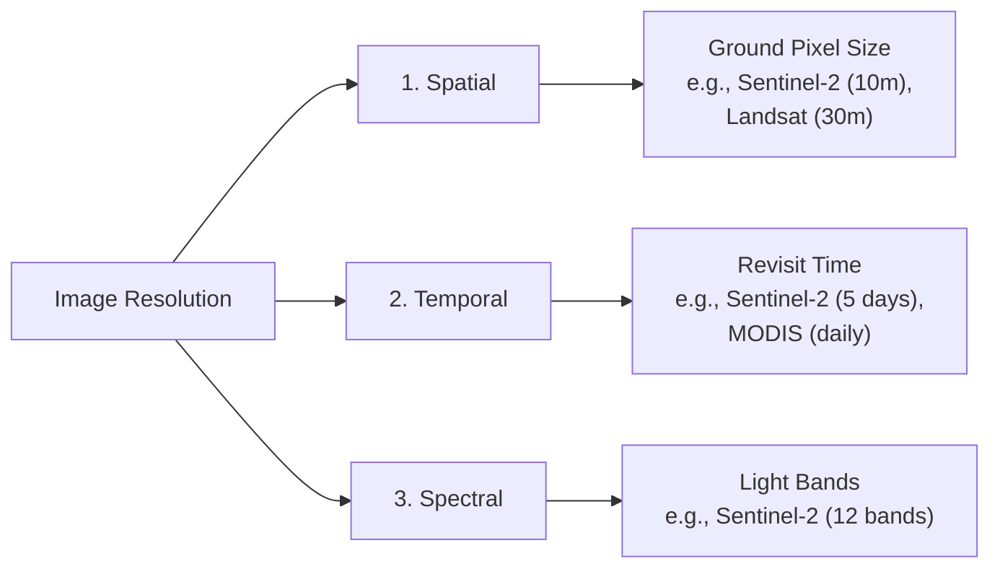

# Map Scale, Resolution, and Accuracy

Developing accurate water models requires understanding the quality, detail, and limits of spatial datasets. This section explains the concepts of map scale, spatial/temporal/spectral resolutions, the difference between accuracy and precision, and how scale dependency affects spatial analysis.

---

## 1. Map Scale
Map scale is the relationship between distance on the map and distance on the ground. It is expressed in three ways:

1. **Representative Fraction (Ratio):** e.g., $1:50,000$ (meaning $1	ext{ cm}$ on the map equals $50,000	ext{ cm}$ or $500	ext{ m}$ on the ground).

2. **Verbal Statement:** e.g., "One centimeter represents 500 meters."

3. **Graphic (Bar Scale):** A scale bar drawn on the map layout that scales dynamically if the map is resized.

> [!IMPORTANT]
> * **Large-Scale Maps:** Show a small geographic area in high detail (e.g., $1:5,000$, showing building footprints and town drainage ditches).
> * **Small-Scale Maps:** Show a large geographic area with less detail (e.g., $1:1,000,000$, showing national borders and primary river basins).

---

## 2. Spatial, Temporal, and Spectral Resolutions
In remote sensing and raster modeling, resolution determines the level of detail captured:



### Applications in Hydrology:

* **Spatial:** A $90	ext{ m}$ elevation raster is too coarse to detect narrow mountain gullies, which can lead to errors in stream network calculation. A $12.5	ext{ m}$ DEM is much more effective for modeling terrain at this scale.

* **Temporal:** Flood mapping requires high temporal resolution (daily or sub-daily observations) to capture the peak water level. Drought monitoring can use lower temporal resolutions (e.g., 8-day or monthly composite datasets).

* **Spectral:** Multi-spectral bands are needed to calculate indexes like the Normalized Difference Water Index (NDWI), which isolates water bodies by comparing green light reflection with shortwave infrared absorption.

---

## 3. Accuracy vs. Precision
These terms have distinct meanings in GIS:

```text
    High Accuracy            High Precision             High Accuracy
    Low Precision            Low Accuracy              High Precision

       *   *                     * * *                     * * *

     *   o   *                   *  o  *                   *  o  *

       *   *                     * * *                     * * *
    (Scattered near target)   (Clustered away)        (Clustered on target)
```

* **Accuracy:** How close the map coordinates are to the true real-world location.

* **Precision:** The level of detail or refinement of the measurement. For example, a coordinate written as `27.712345` decimal degrees is highly precise, but if the sensor was miscalibrated by 50 meters, it is still inaccurate.

---

## 4. Scale Dependency and Generalization
Geospatial features change their representation depending on the scale of the map:

* **Vector Generalization:** At $1:5,000$, a river bank is mapped as a detailed polygon showing sandbars and bends. At $1:1,000,000$, the same river is simplified to a single line, smoothing out small curves.

* **The Coastline Paradox:** The measured length of a river changes depending on the measurement scale. Large-scale maps capture small channel bends, resulting in a longer total stream length calculation than small-scale maps where these curves are smoothed out.

> [!TIP]
> When compiling spatial data for a project, ensure that all layers are mapped at a similar scale to prevent topological misalignment during overlay analysis.
