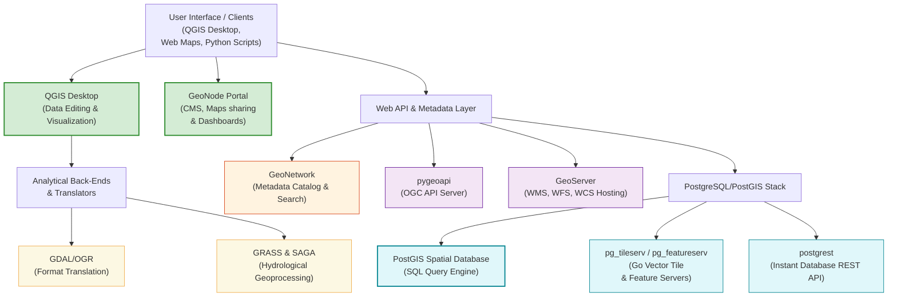
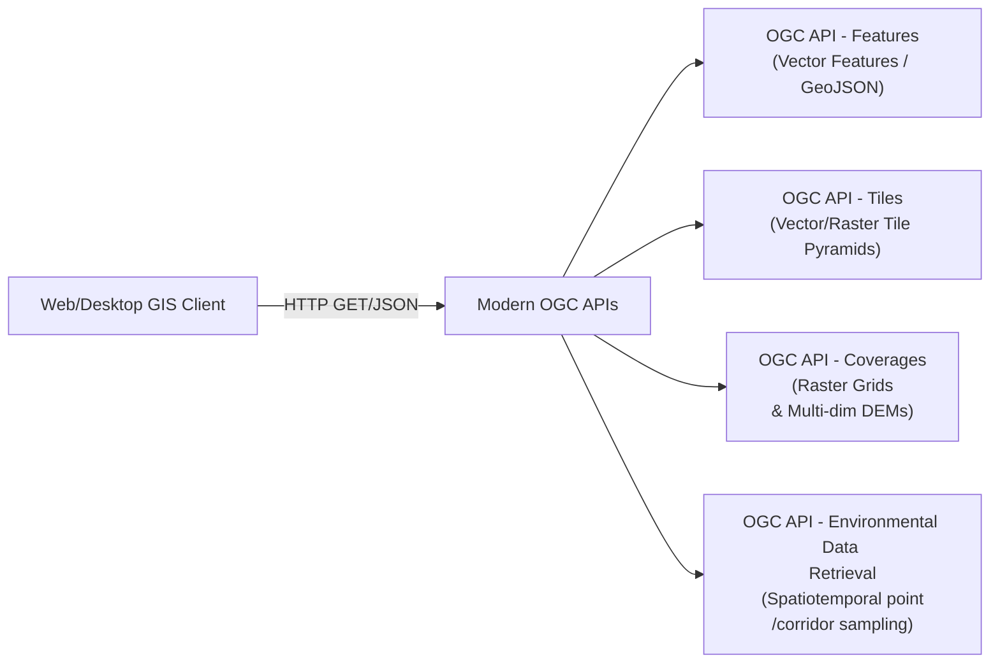

# Open Geospatial Ecosystem

Geospatial analysis was historically dominated by expensive, proprietary desktop programs. Today, free and open-source software (FOSS) tools are the standard for scientific research and public water resource management. This section details the open geospatial ecosystem, the role of the OSGeo Foundation, and the core open-source tools used by WECS.


!!! tip  "Presentation Slides"
    You can download or view the lecture slides for this topic: [Open_Geospatial_standards.pdf](presentations/06_Open_Geospatial_standards.pdf)

---

## 1. The OSGeo Foundation
The **Open Source Geospatial Foundation (OSGeo)** is a non-profit organization established to support and promote the collaborative development of open geospatial technologies. It ensures that projects follow open standards, maintain clear licensing agreements, and have active, self-sustaining developer communities.

---

## 2. Core Components of the Open Source Stack



### 1. QGIS (Quantum GIS)
QGIS is the leading desktop application in the open stack.

* **Capabilities:** Provides a user-friendly interface to view, edit, compose, and analyze spatial data.

* **Extensibility:** Includes a Python API, allowing users to write custom automation scripts and build plugins.

* **Processing Toolbox:** Functions as a unified interface to run tools from other open-source programs like GRASS, SAGA, and GDAL.

### 2. GDAL/OGR (Geospatial Data Abstraction Library)
The translator library under the hood of almost all GIS software.

* **GDAL (Geospatial Data Abstraction Library):** Handles reading and writing raster formats (e.g., converting NetCDF rainfall grids to GeoTIFF).

* **OGR (Simple Features Library):** Handles reading and writing vector formats (e.g., converting shapefiles to GeoJSON).

* **CLI Power:** Runs as a fast command-line tool, making it ideal for automating large file translation tasks.

### 3. The PostgreSQL / PostGIS Spatial Stack
The enterprise-grade relational database and microservice ecosystem for spatial data.

* **PostgreSQL:** An open-source object-relational database management system (RDBMS) that provides robust transactions, SQL querying, and relational integrity.
* **PostGIS:** A spatial database extension for PostgreSQL. It adds support for geographic objects, spatial indexing (R-Tree-based GiST index), and hundreds of SQL functions for spatial overlay and analysis.
* **pg_tileserv:** A lightweight, Go-based vector tile server. It queries PostGIS tables dynamically, utilizing fast database-side rendering (`ST_AsMVT`) to stream vector layers as Mapbox Vector Tiles (MVT) to web maps.
* **pg_featureserv:** A lightweight, Go-based feature server that implements the modern OGC API - Features standard. It publishes PostGIS tables and SQL functions directly as RESTful GeoJSON endpoints.
* **postgrest:** A web server that reads your PostgreSQL database schema directly and generates a fully compliant, secure RESTful API. It maps tables and views to HTTP endpoints automatically, allowing developers to query, insert, and update database records over the web.

* **Hydrological SQL Example (PostGIS):**
  ```sql
  -- Find all precipitation gauges within 10km of the Koshi River
  SELECT gauge.name, ST_Distance(gauge.geom, river.geom) AS dist
  FROM gauges AS gauge, rivers AS river
  WHERE river.name = 'Koshi'
    AND ST_DWithin(gauge.geom, river.geom, 10000);
  ```

### 4. GeoServer
The map publishing engine.

* **Function:** A Java-based server software used to publish spatial datasets on the web.

* **Standards Compliance:** Supports Open Geospatial Consortium (OGC) specifications:

  * **WMS (Web Map Service):** Renders spatial data as map images (PNG/JPEG) for browser display.

  * **WFS (Web Feature Service):** Serves raw vector geometries and attributes directly to web clients.

  * **WCS (Web Coverage Service):** Serves raw raster grids (such as DEMs or rainfall surfaces).

### 5. PROJ
The coordinate transformation engine.

* **Function:** A library that performs coordinate conversions and datums transformations between coordinate reference systems.

* **Role:** Powers on-the-fly reprojection in QGIS and coordinate conversions in GDAL.

### 6. pygeoapi
A modern Python-based server implementation of the OGC API suite.

* **Function:** A lightweight web server designed to publish spatial data using modern RESTful JSON-based OGC API standards.
* **Hydrological Application:** Commonly used to deploy environmental timeseries datasets (using OGC API - Environmental Data Retrieval) or run web-based watershed delineation models (using OGC API - Processes).

### 7. GeoNetwork
The geospatial metadata catalog.

* **Function:** A catalog application to manage spatially referenced resources. It provides metadata editing, search, and distribution capabilities.
* **Hydrological Application:** Crucial for cataloging and searching all available institutional datasets (e.g. basin shapes, digital elevation models, and soil maps) using international metadata standards (ISO 19115 / ISO 19139).

### 8. GeoNode
The enterprise web GIS platform and content management system.

* **Function:** A Django-based spatial content management platform that integrates Django, GeoServer, PostgreSQL, and MapStore.
* **Hydrological Application:** Provides a user-friendly web portal where non-technical staff can upload shapefiles or rasters, style layers, compile collaborative maps, and set strict user access controls on water resources datasets.

---

## 3. OGC Standards & Modern OGC APIs
The **Open Geospatial Consortium (OGC)** defines open, consensus-based standards to ensure GIS datasets and services are interoperable. Historically, OGC services used XML-based communication and SOAP-like endpoints (WMS, WFS, WCS). Modern OGC standards have evolved into the **OGC API** suite, which uses RESTful principles, JSON payloads, and OpenAPI specifications.



### Key Differences: Traditional vs. Modern OGC Standards

| Specification | Traditional (XML-based) | Modern OGC API (JSON/RESTful) | Primary Hydrological Use Case |
| :--- | :--- | :--- | :--- |
| **Vector Data** | **WFS** (Web Feature Service) | **OGC API - Features** | Accessing raw river centerline geometries or sub-basin boundaries. |
| **Gridded Data** | **WCS** (Web Coverage Service) | **OGC API - Coverages** | Fetching raw raster values (e.g., DEM elevations or soil moisture grids). |
| **Map Rendering** | **WMS** (Web Map Service) | **OGC API - Maps** | Displaying pre-rendered river basin background layers on web dashboards. |
| **Tiled Maps** | **WMTS** (Web Map Tile Service) | **OGC API - Tiles** | Loading fast, multi-resolution base maps (satellite imagery background). |
| **Sensor/Sampling**| **SOS** (Sensor Observation Service) | **OGC API - Environmental Data Retrieval (EDR)** | Querying meteorological timeseries, streamflow gauges, or cross-section profiles. |

* **Why the Transition Matters:** Modern OGC APIs are highly developer-friendly, work natively with standard web tools, support OpenAPI (self-documenting APIs), and return lightweight GeoJSON format, making it easy to build fast web maps and integrate spatial data directly into Python/R scripts.

---

## 4. Cloud Native Geospatial Architecture
Historically, GIS workflows required downloading massive files (e.g., a $10\text{ GB}$ regional DEM or a $5\text{ GB}$ Sentinel scene) to local desktops before processing. **Cloud Native Geospatial** is a modern design pattern where data is formatted and stored in the cloud in a way that allows clients to query and extract only the specific chunks of data they need over the internet without downloading the full files.

This is made possible by **HTTP Range Requests** (which request specific byte offsets of a file) combined with specialized file formats:

### Core Cloud Native Formats:

1. **Cloud Optimized GeoTIFF (COG):**

    * *Structure:* A standard TIFF file containing internal tiling (dividing the image into small rectangular grids) and overviews (pre-calculated lower-resolution versions of the image).
    * *Hydrological Application:* A user can open a $20\text{ GB}$ national DEM stored on a cloud server in QGIS, zoom to a tiny $1\text{ km}^2$ micro-watershed, and QGIS will only fetch the specific bytes representing those pixels in seconds, without downloading the rest of the country.

2. **Zarr:**

    * *Structure:* Stores N-dimensional chunked, compressed arrays. It is highly optimized for cloud object storage.
    * *Hydrological Application:* Used for storing massive, multi-temporal datasets like CMIP6 climate projections or daily precipitation grids, allowing fast queries across time series at a single pixel.

3. **FlatGeobuf:**

    * *Structure:* A binary vector format that supports spatial indexing.
    * *Hydrological Application:* Allows rapid streaming and spatial filtering of huge river network datasets. A client can fetch only the stream segments inside a bounding box directly from cloud storage.

4. **SpatioTemporal Asset Catalog (STAC):**

    * *Structure:* A standard metadata specification that makes it easy to catalog and search spatial assets (images, vectors, tables) across time and space using JSON.
    * *Hydrological Application:* Used to query public cloud archives (e.g., AWS Sentinel/Landsat catalogs) to find and download satellite imagery matching a specific river basin boundary for a specific month.
