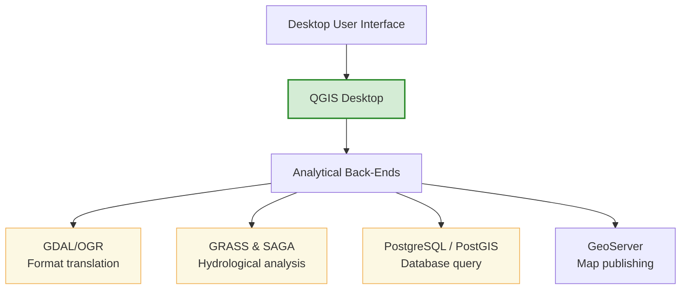

# Open Geospatial Ecosystem

Geospatial analysis was historically dominated by expensive, proprietary desktop programs. Today, free and open-source software (FOSS) tools are the standard for scientific research and public water resource management. This section details the open geospatial ecosystem, the role of the OSGeo Foundation, and the core open-source tools used by WECS.

---

## 1. The OSGeo Foundation
The **Open Source Geospatial Foundation (OSGeo)** is a non-profit organization established to support and promote the collaborative development of open geospatial technologies. It ensures that projects follow open standards, maintain clear licensing agreements, and have active, self-sustaining developer communities.

---

## 2. Core Components of the Open Source Stack



### 1. QGIS (Quantum GIS)
QGIS is the leading desktop application in the open stack.

* **Capabilities:** Provides a user-friendly interface to view, edit, compose, and analyze spatial data.

* **Extensibility:** Includes a Python API, allowing users to write custom automation scripts and build plugins.

* **Processing Toolbox:** Functions as a unified interface to run tools from other open-source programs like GRASS, SAGA, and GDAL.

### 2. GDAL/OGR (Geospatial Data Abstraction Library)
The translator library under the hood of almost all GIS software.

* **GDAL (Geospatial Data Abstraction Library):** Handles reading and writing raster formats (e.g., converting NetCDF rainfall grids to GeoTIFF).

* **OGR (Simple Features Library):** Handles reading and writing vector formats (e.g., converting shapefiles to GeoJSON).

* **CLI Power:** Runs as a fast command-line tool, making it ideal for automating large file translation tasks.

### 3. PostgreSQL / PostGIS
The enterprise-level spatial database engine.

* **PostgreSQL:** An open-source relational database management system (RDBMS).

* **PostGIS:** An extension that adds spatial data types (points, lines, polygons), spatial indexes (R-Tree), and spatial SQL functions.

* **Hydrological SQL Example:**
  ```sql
  -- Find all precipitation gauges within 10km of the Koshi River
  SELECT gauge.name, ST_Distance(gauge.geom, river.geom) AS dist
  FROM gauges AS gauge, rivers AS river
  WHERE river.name = 'Koshi'
    AND ST_DWithin(gauge.geom, river.geom, 10000);
  ```

### 4. GeoServer
The map publishing engine.

* **Function:** A Java-based server software used to publish spatial datasets on the web.

* **Standards Compliance:** Supports Open Geospatial Consortium (OGC) specifications:

  * **WMS (Web Map Service):** Renders spatial data as map images (PNG/JPEG) for browser display.

  * **WFS (Web Feature Service):** Serves raw vector geometries and attributes directly to web clients.

  * **WCS (Web Coverage Service):** Serves raw raster grids (such as DEMs or rainfall surfaces).

### 5. PROJ
The coordinate transformation engine.

* **Function:** A library that performs coordinate conversions and datums transformations between coordinate reference systems.

* **Role:** Powers on-the-fly reprojection in QGIS and coordinate conversions in GDAL.
