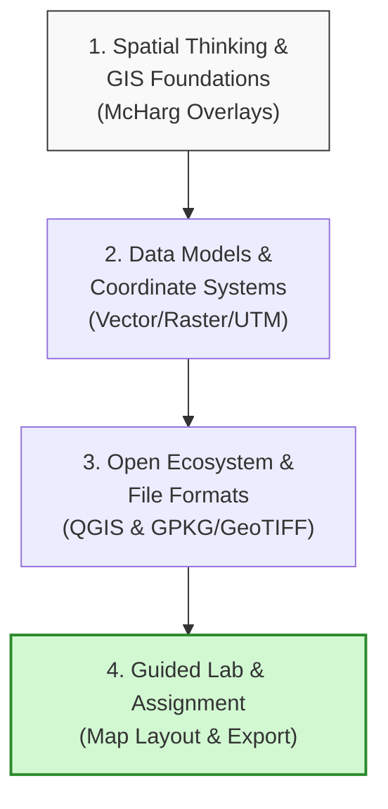

# Spatial Thinking, GIS Foundations & Hydrological Context

Welcome to the first module of the **Hydrological Modelling using Geospatial and Remote Sensing Data** training program. This module lays the essential groundwork for all spatial analysis, mapping, and watershed modeling workflows that you will build throughout the week.

We will transition from understanding how spatial data represents the physical environment to working hands-on inside a Geographic Information System (GIS) to process layers and compile professional map layouts.

---

## Learning Objectives
By the end of today's sessions, you will be able to:

* **Distinguish** spatial datasets from traditional relational databases and spreadsheets.

* **Explain** how physical terrain features (elevation, slope, aspect) dictate flow direction and accumulation in river basins.

* **Identify** the differences between Geographic and Projected Coordinate Reference Systems, select the correct UTM zones for Nepal (44N/45N), and avoid projection errors.

* **Select** appropriate spatial data models (Vector vs. Raster) and storage formats (Shapefiles vs. GeoPackages vs. Cloud-Optimized GeoTIFFs) for diverse hydrological tasks.

* **Navigate** the open-source geospatial ecosystem (QGIS, GDAL, PostGIS, GeoServer).

* **Construct** a standardized GIS project directory, import data, reproject layers, style symbology, and generate a print-ready map PDF.

---

## Learning Roadmap
Below is the progression of topics for today, moving from core theoretical concepts to practical, independent map compilation:

---

## Topics and Schedule

* **[Topic 1: Introduction to GIS and Spatial Thinking](01_intro_gis.md)**
  An introduction to the five components of GIS, map overlay concepts, and how spatial adjacency and Tobler's First Law govern water movement.

* **[Topic 2: Role of Geospatial Technologies in Water Resource Management](02_role_geospatial.md)**
  Explores real-world use cases, including watershed planning, flood inundation mapping (SAR), reservoir sedimentation, and drought indexes compliance.

* **[Topic 3: Spatial Data Models](03_spatial_data_models.md)**
  A deep-dive into vector primitives (points, lines, polygons, nodes, vertices) versus continuous raster grids, and how to choose the right model.

* **[Topic 4: Understanding Geospatial Datasets](04_understanding_datasets.md)**
  Familiarization with administrative boundaries, stream networks, DEMs (DTM vs. DSM), satellite sensors, LULC runoff curves, and gridded rainfall.

* **[Topic 5: Coordinate Reference Systems and Projections](05_crs_projections.md)**
  An essential guide to geoids, datums (WGS 84), projections, the UTM coordinate grid, EPSG codes, and how to troubleshoot displaced layers.

* **[Topic 6: Map Scale, Resolution and Accuracy](06_map_scale.md)**
  Details map scales, spatial/temporal/spectral resolutions, the accuracy-precision matrix, and scale-dependent vector generalizations.

* **[Topic 7: Open Geospatial Ecosystem](07_open_geospatial.md)**
  Overview of the OSGeo software stack: QGIS Desktop, GDAL/OGR translators, PostGIS spatial databases, GeoServer, and the PROJ transformation engine.

* **[Topic 8: Geospatial Data Formats](08_geospatial_formats.md)**
  Details legacy Shapefile limitations, OGC GeoPackage advantages, web-native GeoJSON, and Cloud-Optimized GeoTIFF (COG) internal tile mechanisms.

* **[Topic 9: Practical Lab & Assignment](09_practical_session.md)**
  Step-by-step laboratory tutorial on setting up project structures, loading datasets, running expression queries, styling elevations, exporting reprojected layers, and compiling a styled watershed overview layout map.

---

## Expected Outputs for Today
At the end of Day 1, you will submit a zipped folder containing:

1. A standardized **GIS Project Directory Layout** (data/vector, data/raster, projects, outputs).

2. A unified **GeoPackage (.gpkg) Database** containing all reprojected vector layers in WGS 84 / UTM Zone 45N (EPSG:32645).

3. An **A4 Landscape Map PDF** (`Watershed_Overview_WECS.pdf`) styled and prepared using the QGIS Print Layout, complete with scale bar, north arrow, coordinate graticules grid, title block, and formatted legend.
