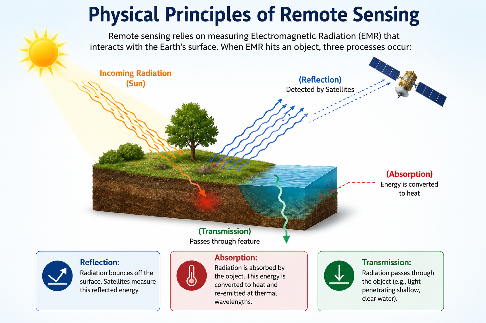
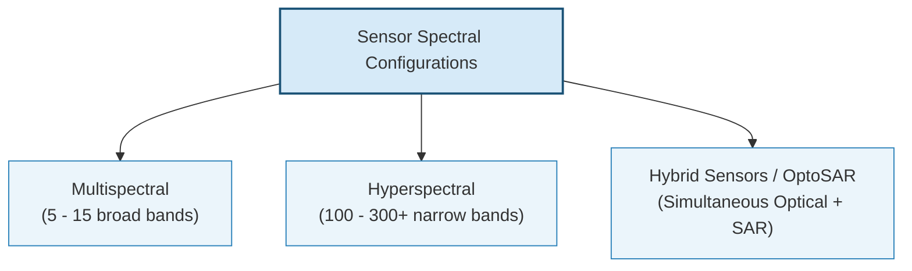
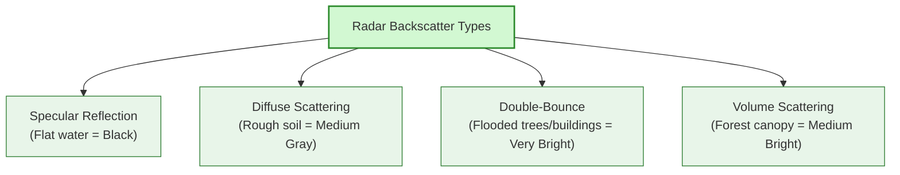

# Introduction to Remote Sensing

Remote sensing is the science of obtaining information about an object or phenomenon without making physical contact. In hydrology, spaceborne sensors allow us to monitor rivers, measure snow cover, map floods, and calculate soil moisture across vast, inaccessible catchments.

---

## 1. Physical Principles of Remote Sensing

Remote sensing relies on measuring **Electromagnetic Radiation (EMR)** that interacts with the Earth's surface. 

### Wavelength, Frequency, and Sensor Design
EMR behaves as both waves and discrete packets of energy (photons). The wavelength (distance between wave crests) is inversely related to its frequency:

* **High-Frequency (Short Wavelengths):** Wavelengths like ultraviolet, blue, green, and red carry higher energy per photon. Because of this high energy level, optical sensors can capture clear signals over very small areas, allowing for fine spatial resolutions.

* **Low-Frequency (Long Wavelengths):** Wavelengths like thermal infrared and microwaves (radar) carry lower energy per photon. Consequently, thermal and radar sensors must capture light over larger surface areas (coarser spatial resolution) to gather enough energy to build a reliable signal.

---

### Solar Reflection vs. Terrestrial Emission
All objects above absolute zero emit EMR. The temperature of an object dictates both the total amount of energy it emits and the wavelength at which that energy peaks:

* **Reflected Solar Energy (Optical Remote Sensing):** The Sun is extremely hot (surface temperature $\approx 6000\text{ K}$). Its emitted energy peaks in the visible light spectrum. Passive optical satellites (like Landsat or Sentinel-2) do not measure the Earth's own heat in these bands; they measure how much of this incoming visible and near-infrared solar light bounces off the Earth's surface.

* **Emitted Terrestrial Energy (Thermal Remote Sensing):** The Earth is much cooler (ambient surface temperature $\approx 300\text{ K}$). Because it is cool, its emitted energy peaks at much longer wavelengths in the thermal infrared spectrum. Thermal sensors measure this self-emitted heat to monitor land surface temperature, evaporation rates, and forest fire zones.

---

### Atmospheric Windows
Earth's atmosphere is not transparent to all wavelengths. Gases like water vapor, carbon dioxide, and ozone absorb specific spectral bands. Wavelength ranges that pass through the atmosphere with minimal absorption are called **atmospheric windows**:

* **Visible & NIR/SWIR Window ($0.4 - 2.5\text{ }\mu\text{m}$):** Highly transparent. Used for solar reflection imaging (Landsat, Sentinel-2).

* **Thermal Infrared Window ($8.0 - 14.0\text{ }\mu\text{m}$):** Used for mapping land surface temperature and evaporation.

* **Microwave Window ($&gt; 1\text{ mm}$):** Fully transparent to clouds, rain, fog, and aerosols. Used for active radar and SAR flood mapping.

---

## 2. EMR Interactions with Earth Features

When incoming solar energy strikes an Earth feature, it undergoes three primary physical processes:

* **Reflection:** Energy bounces off the surface (e.g., light bouncing off a water body). Satellites measure this reflected energy.

* **Absorption:** Energy is retained by the object and converted to internal heat (e.g., water absorbing infrared light).

* **Transmission:** Energy passes directly through the feature (e.g., visible light penetrating shallow, clear reservoir waters).

The relative proportion of reflection, absorption, and transmission changes across different wavelengths. This variation forms a unique **spectral signature** for each feature:

### Water Spectral Signature:
* Clear water absorbs almost all Near-Infrared (NIR) and Shortwave Infrared (SWIR) light. Reflectance is concentrated in the visible blue-green bands. It appears very dark/black in NIR and SWIR imagery.

* Turbid/Sedimented water reflects green and red light due to light scattering off suspended silt. Silt-heavy monsoon runoff appears bright cyan or brown in visible bands, while maintaining high absorption in SWIR.

---

### Vegetation Spectral Signature:
* Chlorophyll absorbs heavily in Blue and Red bands, while reflecting slightly in Green (giving plants their green appearance).

* Spongy mesophyll cells inside healthy leaves scatter NIR light, resulting in a high reflection peak ($0.7 - 1.3\text{ }\mu\text{m}$).

* SWIR reflectance ($1.3 - 2.5\text{ }\mu\text{m}$) is driven by leaf water content; dry leaves reflect SWIR, whereas hydrated leaves absorb it.

---

### Soil Spectral Signature:
* Reflectance increases steadily from visible to SWIR wavelengths.

* Soil moisture acts as an absorber, shifting the entire reflectance curve downward (wet soils appear darker than dry soils).

---

### Snow and Ice Spectral Signature:
* High visible reflectance ($&gt;90\%$) but very low SWIR reflectance ($1.5 - 2.0\text{ }\mu\text{m}$). 

* This contrast is used to separate snow from clouds (which reflect both visible and SWIR).

---

## 3. Multispectral, Hyperspectral, and Hybrid Imagery

Satellite imagery is categorized by the spacing and number of spectral bands:

### Multispectral Sensors
* **Characteristics:** Collect data in a few wide, separated bands (e.g., Sentinel-2 has 12 bands; Landsat 9 has 11 bands).
* **Hydrological Use:** Excellent for mapping snow boundaries, large-scale water bodies, and broad vegetation classes.

---

### Hyperspectral Sensors
* **Characteristics:** Record electromagnetic energy in hundreds of narrow, contiguous bands (e.g., PRISMA, EnMAP, NASA's EMIT).
* **Hydrological Use:** Captures detailed chemical/biological absorption lines. This allows mapping of specific algae types (distinguishing harmless green algae from toxic cyanobacteria via phycocyanin absorption peaks at $0.62\text{ }\mu\text{m}$), detailed soil organic carbon content, and specific canopy species.

---

### Hybrid Sensors & OptoSAR (GalaxEye)
* **Concept:** Traditional setups require combining data from separate optical and radar satellites, leading to mismatches in acquisition times and viewing geometries.
* **OptoSAR Technology:** Developed by GalaxEye Space, this upcoming sensor constellation combines high-resolution multispectral optical sensors and Synthetic Aperture Radar (SAR) on a *single satellite bus*.
* **Hydrological Advantage:**
  * **Zero Temporal Lag:** Acquires optical and SAR data at the exact same fraction of a second.
  * **Perfect Coregistration:** No spatial distortions between layers, removing post-processing alignment issues.
  * **Monsoon Cloud Bypass:** During severe Nepalese storms, the SAR payload maps active flood boundaries beneath clouds, while the co-registered optical bands capture cloud-free catchment areas, providing a unified multi-sensor dataset.

---

## 4. Active vs. Passive Sensors

Remote sensors are divided into two categories based on their energy source:

| Parameter | Passive Sensors (Optical/Thermal) | Active Sensors (Radar/SAR/LiDAR) |
| :--- | :--- | :--- |
| **Energy Source** | External (relies on solar reflection or Earth's thermal emission). | Internal (emits its own electromagnetic energy pulse). |
| **Night Operation** | Impossible for optical bands; possible for thermal bands. | Fully functional day and night. |
| **Atmospheric Impact** | High. Cannot penetrate clouds, thick fog, or dense smoke. | Zero. Microwaves pass directly through cloud cover. |
| **Typical Wavelengths** | Visible ($0.4 - 0.7\text{ }\mu\text{m}$), NIR/SWIR ($0.7 - 2.5\text{ }\mu\text{m}$), Thermal ($8 - 14\text{ }\mu\text{m}$). | Microwaves (X, C, L-bands: $1\text{ cm} - 100\text{ cm}$), Near-Infrared lasers (LiDAR). |
| **Structural Data** | Returns 2D surface reflectance. | Returns surface roughness, moisture dielectric constant, and 3D structural profiles (LiDAR). |
| **Examples** | Sentinel-2 MSI, Landsat 8/9 OLI, MODIS. | Sentinel-1 SAR, ALOS PALSAR, ICESat-2 LiDAR. |

---

## 5. Optical vs. SAR Scattering Mechanics in Hydrology

Radar signals bounce off Earth features depending on surface roughness, moisture content (dielectric constant), and topography:

### 1. Specular Reflection:
* **Mechanism:** Calm water bodies act as a flat mirror. The radar pulse hits the surface and bounces away from the satellite.
* **SAR Appearance:** No signal returns to the sensor, appearing **pitch black**.

---

### 2. Diffuse Scattering:
* **Mechanism:** Rough surfaces (soil, gravel, vegetation) scatter the radar signal in all directions.
* **SAR Appearance:** A fraction of the energy returns to the satellite, appearing as **medium gray**.

---

### 3. Double-Bounce (Corner Reflector):
* **Mechanism:** Occurs when a vertical structure (e.g., buildings, tree trunks) meets a horizontal flat reflective surface (e.g., floodwater). The signal bounces off the water, hits the vertical structure, and reflects directly back to the sensor.
* **SAR Appearance:** Returns an **extremely bright** signal, highlighting flooded forests or urban flood inundations.

---

### 4. Volume Scattering:
* **Mechanism:** Occurs when the radar pulse bounces multiple times within a dense, multi-layered canopy (e.g., forest canopy).
* **SAR Appearance:** Returns a **moderate to bright** signal depending on foliage density.

---

### Radar Polarizations
SAR sensors transmit and receive signals in horizontal (H) or vertical (V) planes, creating polarized channels:
* **Co-Polarized (HH or VV):** High sensitivity to flat water boundaries. HH is particularly useful for flood mapping as it is less affected by wind-induced water surface ripples.

* **Cross-Polarized (HV or VH):** Sensitive to volume scattering, making it ideal for monitoring crop biomass and soil moisture under thin canopies.

---

### Geometric Distortions in Steep Topography (Himalayas)
Because SAR is a side-looking sensor, rugged mountain slopes cause severe geometric errors:
* **Foreshortening:** Mountain slopes facing the radar sensor appear compressed and artificially bright.

* **Layover:** The top of a steep mountain reflects the radar pulse before its base does. The peak is overlaid on top of the base in the output image.

* **Radar Shadow:** Steep slopes facing away from the sensor receive no radar energy, appearing as pitch-black zones. These shadows are easily misclassified as lakes or water bodies.

---

## 6. Core Hydrological Applications Overview

Remote sensing supports several water resource analysis workflows:

* **Surface Water Monitoring:** Delineating lakes, monitoring reservoir volumes, and mapping floodplains.

* **Snow Cover Mapping:** Delineating Snow Cover Area (SCA) using visible and SWIR bands to compute runoff models for snowmelt-fed rivers.

* **Soil Moisture Estimation:** Measuring changes in the dielectric constant of topsoil using low-frequency microwave bands (L-band).

* **Evapotranspiration (ET):** Modeling energy balance and water loss using thermal land surface temperature (LST) and vegetation indices.

* **River Morphology:** Tracking river channel migrations, bank erosion, and braiding patterns over decadal timescales using historical optical archives.

---

## 7. Guided Class Exercises

### Exercise 1: Understanding Solar Reflection vs. Terrestrial Emission
You are designing a monitoring plan for a river basin. You need to choose the correct sensor settings to capture solar reflection vs. Earth's thermal emission.

1. The Sun is extremely hot (surface temperature $\approx 6000\text{ K}$) and the Earth is relatively cool (ambient temperature $\approx 300\text{ K}$). Qualitatively explain how this temperature difference dictates the spectral regions (visible vs. thermal infrared) and sensing types used to map reflected solar light versus land surface temperature.

2. Explain why passive optical sensors cannot map river channels at night, whereas thermal sensors can.

??? check "Answer Key - Exercise 1"

    1. **Solar vs. Terrestrial Spectral Windows:**
    
        * Because the Sun is extremely hot, it emits high-energy, short-wavelength radiation that peaks in the visible light spectrum. Passive optical sensors capture this visible/NIR light as it reflects off surface features during the day.
        
        * Because the Earth is much cooler, it emits lower-energy, long-wavelength radiation that peaks in the thermal infrared spectrum. Thermal sensors capture this self-emitted heat energy directly from the land or water.
        
    2. **Nighttime Mapping Feasibility:**
    
        * Reflective optical sensors depend entirely on external solar illumination. At night, there is no incoming sunlight to reflect, rendering these sensors blind in the visible bands.
        
        * Thermal sensors measure the self-emitted heat of the Earth's features. Because objects continually release absorbed heat day and night, thermal sensors can operate in the dark to map surface features.

---

### Exercise 2: Selecting Sensor Platforms for Nepalese Mountain catchments
A hydrologist is tasked with mapping a sudden flood event in a steep, cloud-covered Himalayan valley during the monsoon season. The valley contains both dense forests and a small village.

1. Explain why standard multispectral sensors (like Sentinel-2) are unsuitable for this task.

2. Recommend a sensor type (Optical, Hyperspectral, SAR, or OptoSAR) that would bypass the cloud cover.

3. Identify the potential geometric error that could occur in the steep, radar-facing slopes of this valley, and explain how it could lead to flood misclassification.

4. How would an upcoming hybrid sensor like GalaxEye's OptoSAR improve this workflow compared to using standalone Sentinel-1 SAR?

??? check "Answer Key - Exercise 2"

    1. **Unsuitability of Multispectral Sensors:**
    
        * Standard multispectral optical sensors operate in the visible and NIR/SWIR bands ($0.4 - 2.5\text{ }\mu\text{m}$). These wavelengths cannot penetrate cloud cover. During the monsoon, dense clouds block the satellite's view, leading to data gaps.
        
    2. **Recommended Sensor Type:**
    
        * **SAR (Synthetic Aperture Radar)** or a hybrid platform like **OptoSAR** is recommended. SAR uses microwave wavelengths ($1 - 100\text{ cm}$) that pass directly through clouds, rain, and fog, allowing data capture during active storms.
        
    3. **Geometric Errors and Misclassification:**
    
        * **Radar Shadow** occurs on slopes facing away from the radar signal. Since these shadow zones receive no backscattered energy, they appear completely black in the imagery.
        
        * Because calm floodwaters also act as specular reflectors and appear black, these radar shadows can easily be misclassified as flooded zones, leading to overestimation of the flood extent.
        
    4. **Advantage of OptoSAR Hybrid Sensor:**
    
        * Standing SAR (like Sentinel-1) provides backscatter values but lacks optical context, making it difficult to separate shadows from water in complex terrain.
        
        * OptoSAR combines optical and SAR on the same platform. When a cloud gap appears, it captures perfectly co-registered optical bands alongside the radar backscatter. This allows the analyst to overlay optical signatures to verify whether a black radar pixel is a terrain shadow or actual floodwater, dramatically reducing false positives in steep catchments.
