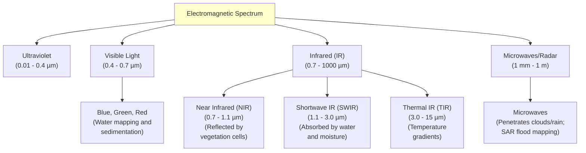
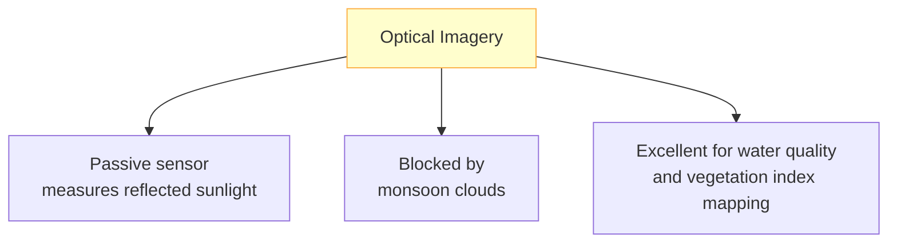
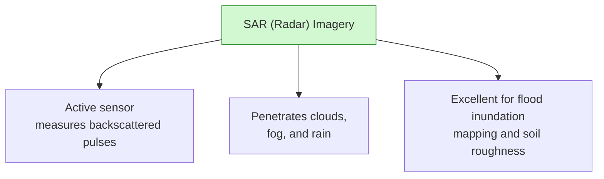

# Introduction to Remote Sensing

Remote sensing is the science of obtaining information about an object or phenomenon without making physical contact. In hydrology, spaceborne sensors allow us to monitor rivers, measure snow cover, map floods, and calculate soil moisture across vast, inaccessible catchments.

---

## 1. Physical Principles of Remote Sensing
Remote sensing relies on measuring **Electromagnetic Radiation (EMR)** that interacts with the Earth's surface. When EMR hits an object, three processes occur:

```text
               Incoming Radiation (Sun)
                     \      /
                      \    /
                       \  / (Reflection) - Detected by Satellites
                        \/
               +------------------+
               |  Earth Feature   |  <-- (Absorption) - Energy is converted to heat
               +------------------+
                        |
                        v  (Transmission) - Passes through feature
```

* **Reflection:** Radiation bounces off the surface. Satellites measure this reflected energy.

* **Absorption:** Radiation is absorbed by the object. This energy is converted to heat and re-emitted at thermal wavelengths.

* **Transmission:** Radiation passes through the object (e.g., light penetrating shallow, clear water).

---

## 2. The Electromagnetic Spectrum
The electromagnetic spectrum classifies EMR based on wavelength. Different bands interact differently with surface features:



---

## 3. Active vs. Passive Sensors
Satellite sensors are classified into two operational categories:

| Parameter | Passive Sensors (Optical/Thermal) | Active Sensors (Radar/SAR/LiDAR) |
| :--- | :--- | :--- |
| **Energy Source** | External (relies on reflected solar radiation or emitted heat). | Internal (sensor emits its own electromagnetic pulse). |
| **Night Operation** | No (for optical bands). Requires sunlight. | Yes. Can operate day and night. |
| **Atmospheric Impact** | High. Cannot see through clouds, fog, or smoke. | Zero. Microwaves penetrate cloud cover. |
| **Physical Property Measured** | Chemical/biological properties (chlorophyll, surface temperature). | Physical properties (roughness, slope, moisture, structure). |
| **Examples** | Sentinel-2 MSI, Landsat OLI, MODIS. | Sentinel-1 SAR, ALOS PALSAR, LiDAR. |

---

## 4. Optical vs. SAR Imagery in Hydrology
Understanding the differences between optical and SAR datasets is critical for selecting the right data model:





### Optical Water Signatures:

* Clear water absorbs almost all Near-Infrared (NIR) and Shortwave-Infrared (SWIR) energy, appearing black or dark in those bands.

* Turbid, sediment-laden water (common in Nepal during monsoon) reflects green and red light, appearing bright brown or cyan.

### SAR Water Signatures:

* Calm water bodies act as specular (mirror-like) reflectors. The radar pulse bounces away from the satellite, resulting in zero returned signal. Calm water appears **pitch black** in SAR images.

* Surrounding rough land scattering the radar pulse in all directions (diffuse scattering), appearing **bright gray**.

* This strong contrast makes SAR ideal for mapping flood extents.
