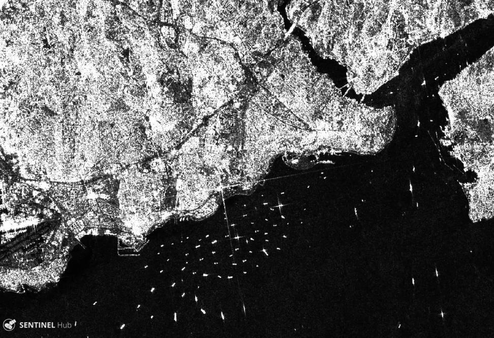
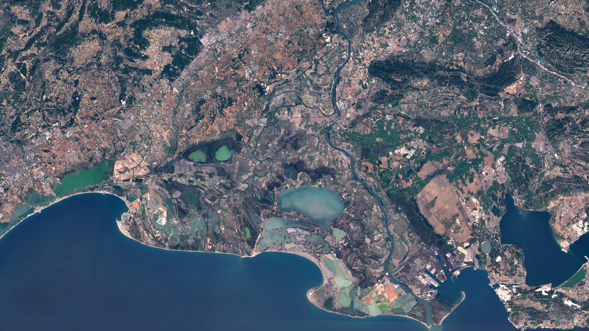
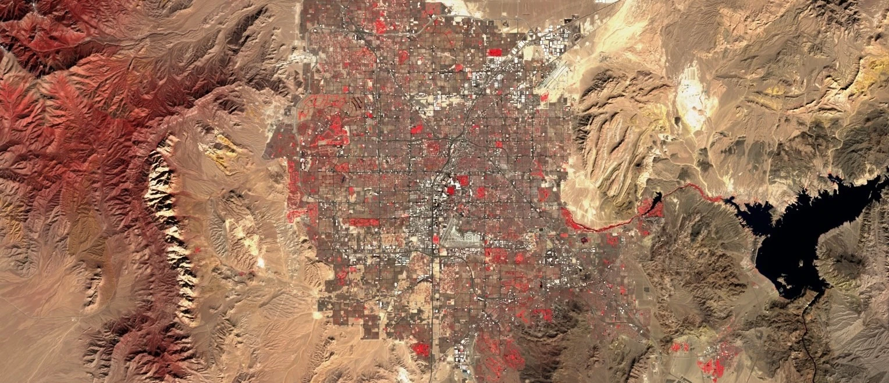
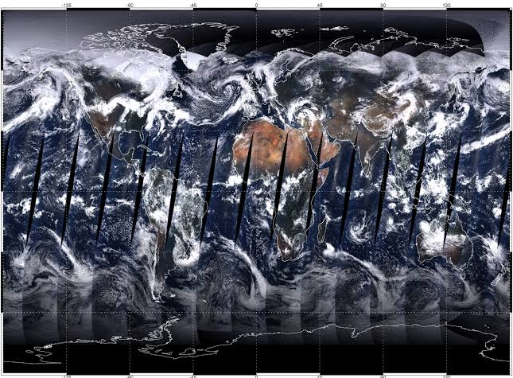
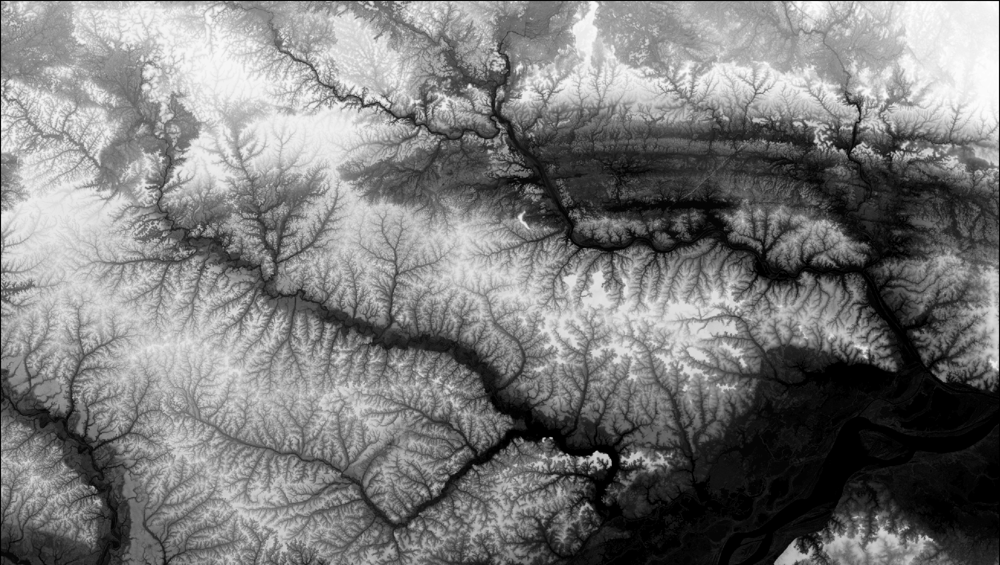
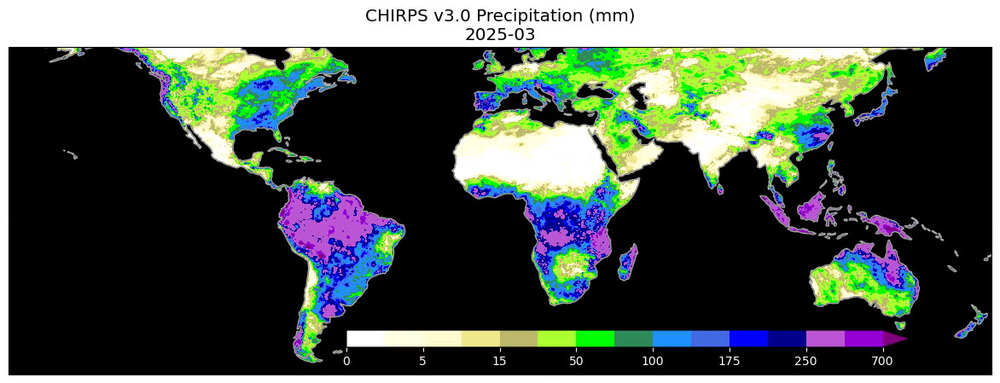
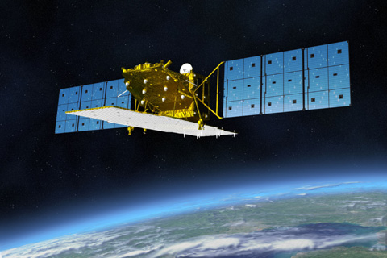
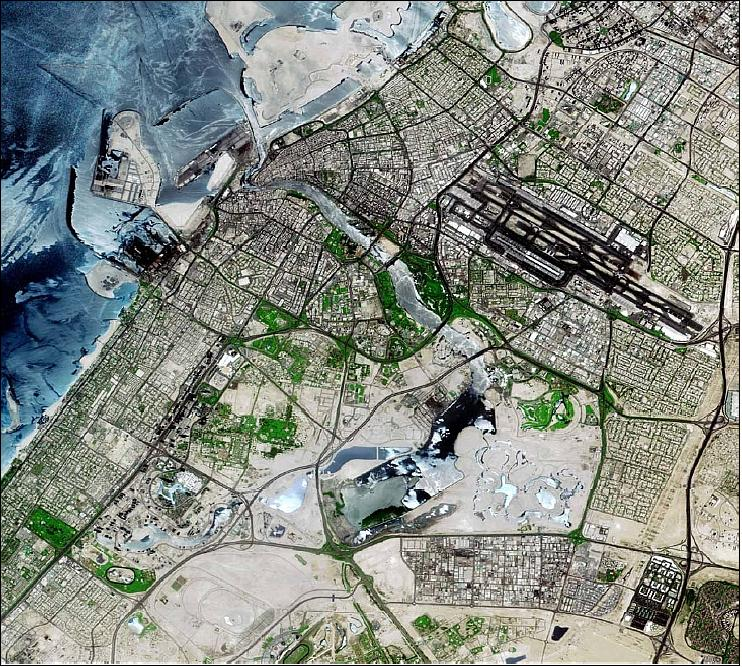
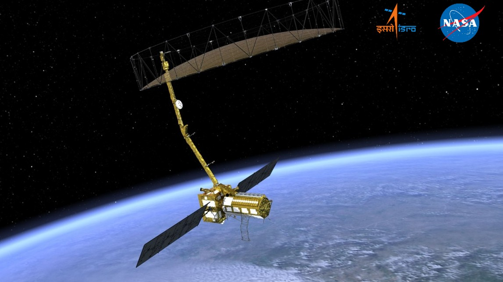

# Earth Observation Missions and Sensors

To retrieve hydrological datasets, we must understand the specific satellite platforms orbiting the Earth. This section details the core spaceborne sensors used by WECS for watershed management, flood mapping, and climate trend analysis.

---

## 1. Sentinel-1 (European Space Agency - ESA)
Sentinel-1 is a constellation of two polar-orbiting satellites carrying active C-band Synthetic Aperture Radar (SAR) sensors.

* **Sensor Type:** Active Radar (C-band, wavelength $\approx 5.6\text{ cm}$).

* **Spatial Resolution:** $10\text{ m}$ (in Interferometric Wide swath mode).

* **Temporal Resolution:** 6 to 12 days revisit.

* **Polarizations:** VV, VH, HH, HV.

* **Hydrological Role:** Flood inundation mapping. Because C-band radar penetrates cloud cover, Sentinel-1 is the primary tool used to map flood boundaries during the active monsoon season.

---

## 2. Sentinel-2 (European Space Agency - ESA)
Sentinel-2 is a constellation of two optical satellites carrying the Multispectral Instrument (MSI).

* **Sensor Type:** Passive Optical (13 spectral bands).

* **Spatial Resolution:**

  * $10\text{ m}$ (Blue, Green, Red, NIR bands).

  * $20\text{ m}$ (Red Edge, SWIR bands).

  * $60\text{ m}$ (Atmospheric correction bands).

* **Temporal Resolution:** 5 days revisit.

* **Hydrological Role:** Water body mapping, snow cover monitoring, vegetation health index generation (NDVI), and sediment monitoring.

---

## 3. Landsat 8 and 9 (NASA / USGS)
The Landsat program provides the longest continuous global record of the Earth's surface (since 1972). Landsat 8 and 9 carry the Operational Land Imager (OLI) and the Thermal Infrared Sensor (TIRS).

* **Sensor Type:** Passive Optical & Thermal.

* **Spatial Resolution:**

  * $15\text{ m}$ (Panchromatic band).

  * $30\text{ m}$ (Visible, NIR, SWIR bands).

  * $100\text{ m}$ (Thermal bands, resampled to $30\text{ m}$).

* **Temporal Resolution:** 8 to 16 days revisit.

* **Hydrological Role:** Historical watershed change detection, crop water requirement estimation, and reservoir surface temperature mapping.

---

## 4. MODIS (NASA Terra & Aqua)
The Moderate Resolution Imaging Spectroradiometer (MODIS) is designed for large-scale, daily environmental monitoring.

* **Sensor Type:** Passive Optical.

* **Spatial Resolution:** Coarse ($250\text{ m}$, $500\text{ m}$, $1000\text{ m}$).

* **Temporal Resolution:** Daily revisit.

* **Hydrological Role:** Daily snow cover tracking, evapotranspiration modeling, and monitoring regional-scale water index anomalies.

---

## 5. SRTM (Shuttle Radar Topography Mission)
An international research effort that obtained elevation data on a global scale.

* **Sensor Type:** Radar Interferometry (C-band and X-band).

* **Acquisition Date:** February 2000.

* **Spatial Resolution:** $30\text{ m}$ global grid.

* **Hydrological Role:** Baseline digital elevation dataset used for regional watershed boundary delineation and slope calculations.

---

## 6. CHIRPS (Climate Hazards Group InfraRed Precipitation)
A gridded, multi-decadal precipitation dataset.

* **Type:** Hybrid (combines satellite infrared estimates with point rain gauge data).

* **Spatial Resolution:** $0.05^{\circ}$ (approximately $5.5\text{ km}$ grid).

* **Temporal Resolution:** Daily, pentad (5-day), and monthly records.

* **Hydrological Role:** Long-term precipitation trend analysis, basin-wide water budget calculations, and regional drought modeling in areas with sparse weather station coverage.

---

## 7. ALOS/ALOS-2 (Japan Aerospace Exploration Agency - JAXA)
The Advanced Land Observing Satellite (ALOS) program carries active L-band Synthetic Aperture Radar (PALSAR) sensors.

* **Sensor Type:** Active L-band SAR (wavelength $\approx 23.6\text{ cm}$).

* **Spatial/Temporal Resolution:** $12.5\text{ m}$ to $30\text{ m}$ terrain products; 14-day revisit.

* **Hydrological Role:** L-band radar has longer wavelengths that penetrate dense forest canopies and vegetation, making it the premier sensor for soil moisture mapping, forest biomass monitoring, and high-relief digital elevation mapping (via the ALOS AW3D30 DEM).

---

## 8. GPM (Global Precipitation Measurement - NASA / JAXA)
A joint international satellite mission to provide next-generation global observations of rain and snow.

* **Sensor Type:** Active Dual-frequency Precipitation Radar (DPR) & Passive GPM Microwave Imager (GMI).

* **Spatial/Temporal Resolution:** Global coverage at $0.1^{\circ}$ grid spacing; half-hourly revisits.

* **Hydrological Role:** The Integrated Multi-satellitE Retrievals for GPM (IMERG) provides high-resolution near-real-time rainfall estimates, which are vital for operational flood forecasting, runoff routing, and disaster warning systems.

---

## 9. Resourcesat-2 and 2A (Indian Space Research Organisation - ISRO)
ISRO's operational remote sensing satellite constellation focused on resource management.

* **Sensor Type:** Passive Optical (AWiFS, LISS-III, and LISS-IV).

* **Spatial/Temporal Resolution:** AWiFS ($56\text{ m}$), LISS-III ($24\text{ m}$), LISS-IV ($5.8\text{ m}$); 5 to 24-day revisit.

* **Hydrological Role:** Widely used in South Asia for crop health monitoring, canal irrigation boundary mapping, surface water monitoring, and mapping seasonal snow cover depletion in the Himalayas.

---

## 10. Cartosat Constellation (Indian Space Research Organisation - ISRO)
A series of high-resolution optical and stereo earth observation satellites.

* **Sensor Type:** Passive Optical (Panchromatic and Multispectral Stereo).

* **Spatial/Temporal Resolution:** Sub-meter ($0.25\text{ m}$ to $1\text{ m}$) panchromatic, $2\text{ m}$ to $5\text{ m}$ multispectral; 5-day revisit.

* **Hydrological Role:** Stereo imagery is used to generate CartoDEM, a high-resolution $30\text{ m}$ digital elevation model optimized for the Indian subcontinent, used extensively for reservoir volume calculations, riverbank surveys, and drainage network planning.

---

## 11. NISAR (NASA-ISRO SAR - Joint Mission)
An upcoming joint L-band and S-band dual-frequency Synthetic Aperture Radar mission.

* **Sensor Type:** Active L-band and S-band dual-frequency SAR.

* **Spatial/Temporal Resolution:** $3\text{ m}$ to $10\text{ m}$ resolution; 12-day repeat orbit.

* **Hydrological Role:** NISAR will provide global, high-temporal observations of groundwater changes, high-resolution soil moisture maps, wetland boundary dynamics, and glacial lake velocity/expansion tracking to model Glacial Lake Outburst Flood (GLOF) risks.

---

## 12. Commercial High-Resolution Constellations
For localized, high-precision engineering projects or rapid emergency assessments, public agency datasets are often supplemented with commercial constellations.

* **Planet (PlanetScope & SkySat):**
  
    * **Sensor Type:** Passive Optical microsatellites.
    
    * **Resolution:** $3\text{ m}$ (PlanetScope) and $0.5\text{ m}$ (SkySat) spatial resolution; daily global revisit.
    
    * **Hydrological Application:** Fine-scale river bankline migration tracking, localized flood damage assessment, and monitoring micro-reservoirs or irrigation canals.

* **Vantor (WorldView Legion & Partner Networks):**
  
    * **Sensor Type:** High-resolution passive optical and virtual SAR network.
    
    * **Resolution:** Sub-meter ($< 30\text{ cm}$) optical and high-resolution radar; sub-daily revisits.
    
    * **Hydrological Application:** Flash-flood impact assessments, infrastructure vulnerability surveys (dams, bridges, power plants), and post-disaster rapid mapping.

* **Synspective (StriX Constellation):**
  
    * **Sensor Type:** X-band Active SAR (wavelength $\approx 3\text{ cm}$).
    
    * **Resolution:** Sub-meter to $3\text{ m}$ spatial resolution; rapid revisit schedules.
    
    * **Hydrological Application:** Day/night, cloud-independent urban inundation mapping, landslide risk monitoring, and subsidence detection.

* **Axelspace (AxelGlobe GRUS):**
  
    * **Sensor Type:** Passive Optical microsatellite constellation.
    
    * **Resolution:** $2.5\text{ m}$ spatial resolution; 1 to 3 days revisit.
    
    * **Hydrological Application:** Regional surface water monitoring, agricultural water demand index calculations, and reservoir siltation monitoring.

* **ICEYE / Capella Space:**
  
    * **Sensor Type:** Commercial X-band SAR.
    
    * **Resolution:** Sub-meter spatial resolution; hourly revisit capabilities.
    
    * **Hydrological Application:** Near-real-time flood disaster response, water boundary tracking under cloud cover, and infrastructure deformation monitoring.