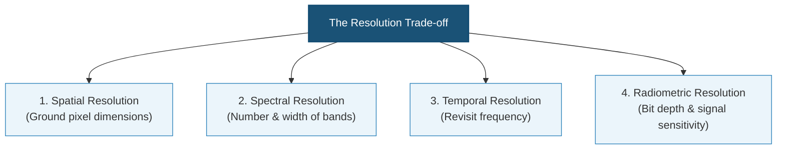
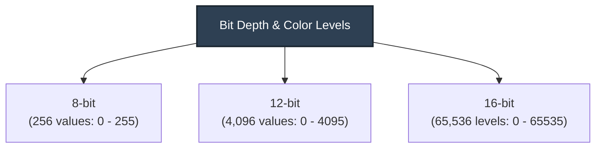

# Understanding Satellite Data Characteristics

Selecting the right dataset requires evaluating the four dimensions of satellite resolution: **Spatial**, **Spectral**, **Temporal**, and **Radiometric**. Understanding how these characteristics interact and the physical trade-offs involved is crucial for building accurate hydrological models.

!!! tip "Presentation Slides"
    You can download or view the lecture slides for this topic: [Satellite_Characteristics.pdf](presentations/03_Satellite_Characteristics.pdf)

---

## 1. The Resolution Trade-Off Triangle
In satellite sensor design, physical laws and data bandwidth limits prevent a single sensor from achieving maximum resolution across all four dimensions. Developers must balance these characteristics based on target applications:



* **Spatial vs. Temporal:** Satellites with very high spatial resolution (e.g., $30\text{ cm}$ commercial imagery) cover a small area per image swath. Consequently, it takes longer to re-image the same location (low temporal resolution). Conversely, weather satellites scan entire hemispheres every 15 minutes (high temporal resolution) but have pixels spanning several kilometers (low spatial resolution).

* **Spectral vs. Spatial:** Splitting incoming electromagnetic energy into hundreds of narrow wavelengths (hyperspectral) reduces the amount of light reaching each individual detector. To maintain a strong signal-to-noise ratio, the sensor must capture light over a larger area, resulting in larger ground pixel sizes (coarse spatial resolution).

---

## 2. Spatial Resolution & The Mixed Pixel Dilemma
Spatial resolution determines the smallest physical feature that can be resolved on the Earth's surface. 

```text
    10m Resolution (Sentinel-2)              30m Resolution (Landsat)
    +---+---+---+                            +-------+
    | P1| P2| P3|                            |       |
    +---+---+---+  <-- High Detail           |  P1   | <-- Lower Detail
    | P4| P5| P6|      Captures river        |       |     River is mixed with
    +---+---+---+      banks clearly.        +-------+     adjacent land.
```

### The mixed pixel problem:
When a pixel covers an area containing multiple surface types, the resulting digital number represents an average of all signatures within that boundary:

$$\text{Reflectance}_{\text{pixel}} = f_{\text{water}} \cdot R_{\text{water}} + (1 - f_{\text{water}}) \cdot R_{\text{land}}$$

Where $f_{\text{water}}$ is the fraction of the pixel covered by water, and $R$ is the characteristic reflectance. 

* If a river channel is $15\text{ m}$ wide, a $30\text{ m}$ Landsat pixel covering it will contain at least 50% land. 

* If the land reflectance dominates, the pixel will be classified as land, causing the river network to appear fragmented or disconnected in your model.

### Hydrological Scale Requirements:

* **Micro-Catchments & Streams (< 100 km²):** Require high spatial resolution ($\le 10\text{ m}$, e.g., Sentinel-2 or commercial PlanetScope) to delineate narrow riparian corridors and urban drainage patterns.

* **Large River Basins (> 10,000 km²):** Can be modeled effectively with medium resolution ($30\text{ m}$ to $250\text{ m}$, e.g., Landsat or MODIS), saving computation time.

---

## 3. Spectral Resolution & The Optical Signature of Water
Spectral resolution refers to the sensor's ability to divide the electromagnetic spectrum into discrete wavelengths (bands). Water has a highly distinct spectral signature compared to soil and vegetation:

```text
    Reflectance (%)
     |
  40 |       /--\ (Vegetation Peak)
     |      /    \               /--\ (Vegetation NIR Plateau)
  20 |     /      \             /    \
     |  --/ (Soil) \           /      \
   0 |=============\==========/========\===================
     |  Blue   Green   Red    NIR     SWIR
     |  [-----Visible-----]   [----Infrared----]
     |  ====== Water Signature (High absorption in NIR/SWIR) ======
```

* **Strong NIR/SWIR Absorption:** Pure water absorbs almost all near-infrared (NIR) and shortwave infrared (SWIR) light. Consequently, on NIR and SWIR band images, water bodies appear solid black, creating a sharp boundary with soil and vegetation, which reflect strongly in those wavelengths.

* **Visible Wavelength Scattering:** Suspended sediments (turbidity) scatter green and red light, while chlorophyll-a in algae absorbs blue and red light and reflects green. Analyzing these bands allows us to measure water quality parameters from space.

### Sensor Band Comparison Table

| Band Name | Landsat 8/9 OLI (Band # / Res) | Sentinel-2 MSI (Band # / Res) | Hydrological Significance |
| :--- | :--- | :--- | :--- |
| **Coastal Blue** | Band 1 ($30\text{ m}$) | Band 1 ($60\text{ m}$) | Shallow bathymetry, suspended sediment plumes. |
| **Blue** | Band 2 ($30\text{ m}$) | Band 2 ($10\text{ m}$) | Deep water penetration, water clarity mapping. |
| **Green** | Band 3 ($30\text{ m}$) | Band 3 ($10\text{ m}$) | Algal chlorophyll detection, NDWI numerator. |
| **Red** | Band 4 ($30\text{ m}$) | Band 4 ($10\text{ m}$) | Sediment load estimation, vegetation delineation. |
| **NIR** | Band 5 ($30\text{ m}$) | Band 8 ($10\text{ m}$) / 8a ($20\text{ m}$) | Water body boundary extraction, NDWI denominator. |
| **SWIR 1** | Band 6 ($30\text{ m}$) | Band 11 ($20\text{ m}$) | Soil moisture index calculation, snow vs. cloud. |
| **SWIR 2** | Band 7 ($30\text{ m}$) | Band 12 ($20\text{ m}$) | Saturated soil mapping, geological structures. |

---

## 4. Temporal Resolution & Orbital Configurations
Temporal resolution (revisit time) is the frequency at which a satellite sensor images the same location on Earth. It is governed by the satellite's orbit:

* **Sun-Synchronous Polar Orbits:**

    * **How they work:** Satellites pass from pole to pole while the Earth rotates underneath, crossing the equator at the same local solar time each day.

    * **Temporal Revisit:** Constrained by the swath width. For example, Landsat has a 16-day repeat cycle. Sentinel-2 utilizes two identical satellites (2A and 2B) phased 180 degrees apart in the same orbit to achieve a 5-day revisit.

    * **Off-Nadir Steering:** Commercial constellations (like PlanetScope) can tilt their cameras sideways (off-nadir) to view a target from an angle, reducing revisit times to less than 24 hours (though this introduces geometric distortion).

* **Geostationary Orbits:**

    * **How they work:** Satellites orbit directly above the equator at an altitude of $\sim 35,786\text{ km}$, matching the Earth's rotational speed. They remain stationary over a fixed point.

    * **Temporal Revisit:** Extremely high (every 10 to 15 minutes).

    * **Limitation:** Very low spatial resolution (1 to 4 kilometers). Primarily used for real-time weather monitoring and tracking regional storm movements.

---

## 5. Radiometric Resolution & Signal Quality
Radiometric resolution is the sensor's sensitivity to small differences in reflected or emitted energy. It is determined by the quantization bit depth:



* **Landsat 1-5 (8-bit):** Coarse detail. Reflectance is squeezed into 256 levels, which often causes dark water bodies and shadows to blend together into the same digital number value.

* **Sentinel-2 (12-bit):** Excellent separation of intermediate values. Stores 4,096 levels of data.

* **Landsat 8-9 (16-bit):** Ultra-high radiometric resolution, storing 65,536 levels. Allows mapping of subtle variations inside dark water bodies, such as plume currents and varying concentrations of suspended sediment.

---

## 6. Resolution Selection Matrix for Hydrology
Different hydrological applications demand different configurations. Choosing the wrong dataset can result in either model failure or excessive data processing overhead:

| Application | Spatial | Temporal | Spectral | Radiometric | Recommended Datasets |
| :--- | :--- | :--- | :--- | :--- | :--- |
| **Flood Inundation** | **High ($\le 10\text{ m}$)**<br/>To map flood limits in urban zones | **Very High ($< 2$ days)**<br/>To catch flood crest peak | **Moderate**<br/>Visible & NIR (or SAR C-band) | **Standard ($\ge 12\text{ bit}$)** | Sentinel-1 (SAR), Sentinel-2, PlanetScope |
| **Glacier & Snow Pack** | **Medium ($10 - 30\text{ m}$)**<br/>For rugged peaks | **Low ($10 - 16$ days)**<br/>Snow changes seasonally | **High**<br/>SWIR is required to separate snow from cloud | **High ($\ge 12\text{ bit}$)** | Landsat 8/9, Sentinel-2 |
| **Water Quality / Turbidity** | **High ($10\text{ m}$)**<br/>For lakes & wide rivers | **Medium ($5 - 10$ days)**<br/>For monitoring trends | **High**<br/>Narrow Red-edge bands for chlorophyll | **Very High ($16\text{ bit}$)**<br/>To detect low water reflectance | Sentinel-2 (MSI), Landsat 8/9 (OLI) |
| **Regional Evapotranspiration** | **Coarse ($500 - 1000\text{ m}$)**<br/>Matches watershed scales | **High ($1 - 8$ days)**<br/>To capture ET flux | **Thermal Infrared**<br/>Required for land surface temperature | **Standard ($\ge 12\text{ bit}$)** | MODIS (MOD16), Landsat TIRS |

---

## 7. Guided Class Exercises (15 Minutes)

### Scenario A: Selecting the Best Dataset
An engineering firm needs to monitor the weekly spatial extent of irrigation storage reservoirs in a small agricultural valley in Nepal. The largest reservoir is $80\text{ m}$ wide, and the smallest is $15\text{ m}$ wide.

1. **Calculate pixel coverage:** How many $30\text{ m}$ Landsat pixels would fit inside the smallest reservoir? How many $10\text{ m}$ Sentinel-2 pixels?

2. **Evaluate Temporal Revisit:** If cloud cover blocks 50% of the summer images, which satellite system offers a better chance of acquiring clear data during the monsoon season?

3. **Choose the System:** Which satellite would you recommend, and why?

??? check "Answer Key - Scenario A"

    1. **Calculate pixel coverage:**

        * Landsat ($30\text{ m}$): The smallest reservoir is $15\text{ m}$ wide, which is less than half a Landsat pixel width. No full Landsat pixel can fit inside it; it will be a mixed pixel.

        * Sentinel-2 ($10\text{ m}$): The reservoir is $15\text{ m}$ wide, which can contain at least one full $10\text{ m}$ pixel (since $15\text{ m} > 10\text{ m}$), although border pixels will still be mixed.

    2. **Evaluate Temporal Revisit:**

        * Landsat has a 16-day repeat cycle. With 50% cloud cover, the average clear revisit is 32 days.

        * Sentinel-2 (using both 2A and 2B) has a 5-day repeat cycle. With 50% cloud cover, the average clear revisit is 10 days. Therefore, Sentinel-2 offers a significantly higher chance of capturing clear data.

    3. **Choose the System:**

        * Sentinel-2 is recommended. It provides both the spatial resolution required to detect the $15\text{ m}$ reservoir (avoiding the mixed pixel problem) and the temporal resolution needed to bypass summer cloud cover during the monsoon.

### Scenario B: Understanding Band Signatures
A researcher wants to classify a mountain lake, but shadows cast by adjacent cliffs look identical to the water in visible bands.

1. How can the researcher use Near-Infrared (NIR) or Shortwave Infrared (SWIR) bands to distinguish terrain shadows from open water?

2. What role does radiometric resolution play in resolving details inside shadow zones?

??? check "Answer Key - Scenario B"

    1. **Terrain Shadows vs. Open Water:**

        * Open water absorbs almost all Near-Infrared (NIR) and Shortwave Infrared (SWIR) light. In contrast, while shadows also reduce reflectance, shadows cast on land surfaces (like vegetation or rock) still exhibit the spectral signature of the underlying feature in NIR/SWIR (vegetation will still show a small NIR rise).

        * Combining NIR with SWIR in indices like MNDWI separates water (positive values) from shadows on land (strongly negative/near-zero values).

    2. **Role of Radiometric Resolution:**

        * High radiometric resolution ($\ge 12\text{ bit}$) provides a wider range of digital numbers ($0-4095$ for 12-bit vs. $0-255$ for 8-bit). This allows the sensor to detect very small differences in the dark (low-reflectance) ranges, resolving fine terrain details within shadow zones rather than clipping them all to a single black value.
