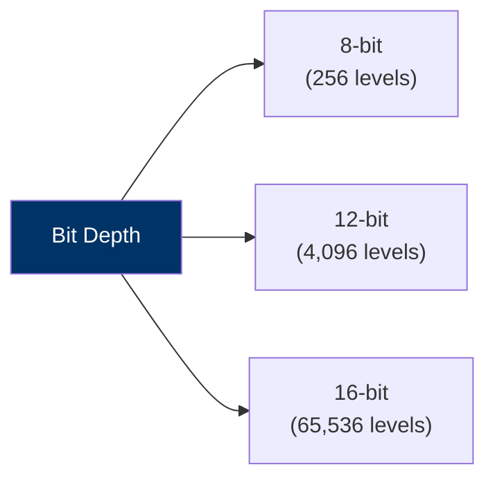

# Understanding Satellite Data Characteristics

Selecting the right dataset requires evaluating the four dimensions of satellite resolution: **Spatial**, **Spectral**, **Temporal**, and **Radiometric**. This section details these characteristics and explains the trade-offs involved.

---

## 1. Spatial Resolution
Spatial resolution is the ground size represented by a single pixel in a raster grid.

```text
    10m Resolution (Sentinel-2)              30m Resolution (Landsat)
    +---+---+---+                            +-------+
    | P1| P2| P3|                            |       |
    +---+---+---+  <-- High Detail           |  P1   | <-- Lower Detail
    | P4| P5| P6|      Captures river        |       |     River is mixed with
    +---+---+---+      banks clearly.        +-------+     adjacent land.
```

* **The Mixed Pixel Problem:** If a river channel is 15 meters wide and is imaged by a $30\text{ m}$ Landsat sensor, the pixels along the channel will contain a mixture of water and land signatures. This makes it difficult to extract precise water edges.

* **Implications:** While higher spatial resolution (e.g., $10\text{ m}$) provides more detail, it increases file sizes and processing times.

---

## 2. Spectral Resolution
Spectral resolution refers to the number and width of spectral bands a sensor can capture.

* **Bands:** The electromagnetic spectrum is divided into bands (channels).

* **Multispectral Sensors:** Capture a small number of broad bands (typically 10 to 15 bands, such as Sentinel-2 or Landsat).

* **Hyperspectral Sensors:** Capture hundreds of narrow, continuous bands, allowing detailed identification of mineral types and water contaminants.

---

## 3. Temporal Resolution
Temporal resolution (revisit time) is the time elapsed between consecutive image acquisitions over the same geographic location.

* **Orbital Path:** Polar-orbiting satellites capture the same location at fixed intervals (e.g., every 5 days for Sentinel-2). Geostationary satellites (like weather satellites) remain fixed relative to the Earth's rotation, capturing images every 15 minutes, but at a very coarse spatial resolution.

* **Implications:** Flood mapping requires high temporal resolution (daily observations) to capture the peak flood extent. Land cover mapping or forestry studies can use lower temporal resolutions (e.g., annual images).

---

## 4. Radiometric Resolution
Radiometric resolution is the sensitivity of the sensor to differences in signal strength. It is measured in bits, which determines the range of digital numbers (DN) representing the raw data:



* **8-bit:** Ranges from $0$ to $255$ gray values (common in legacy imagery).

* **12-bit:** Ranges from $0$ to $4095$ (used in Sentinel-2).

* **16-bit:** Ranges from $0$ to $65535$ (used in Landsat 8/9).

* **Implications:** Higher radiometric resolution allows the sensor to detect subtle differences in reflectance, such as separating shadow areas from water bodies or mapping varying sediment concentrations in turbid rivers.
