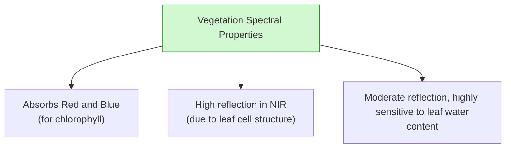
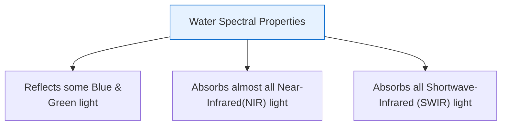

# Satellite Bands and Composites

Satellites capture the Earth's surface across multiple spectral bands. By combining these bands, we can create color composites that highlight specific environmental features. This section explains how to construct composites and use Near-Infrared (NIR) and Shortwave-Infrared (SWIR) bands to map hydrological features.

---

## 1. Natural and False Color Composites
To display satellite data in color, we assign specific bands to the three primary color channels (Red, Green, and Blue) of a computer display:

```text
    Spectral Band  ---------------> Display Channel
    [ Band A ]     ---------------> [ Red Channel   ]
    [ Band B ]     ---------------> [ Green Channel ]
    [ Band C ]     ---------------> [ Blue Channel  ]
```

### True Color Composite (Natural Color)

* **Configuration:** Red Band $\rightarrow$ Red, Green Band $\rightarrow$ Green, Blue Band $\rightarrow$ Blue.

  * *Sentinel-2:* Bands 4, 3, 2.

  * *Landsat 8:* Bands 4, 3, 2.

* **Appearance:** Mimics what the human eye sees. Useful for general visualization and identifying sediment plumes.

### Standard False Color Composite (Vegetation FCC)

* **Configuration:** NIR Band $\rightarrow$ Red, Red Band $\rightarrow$ Green, Green Band $\rightarrow$ Blue.

  * *Sentinel-2:* Bands 8, 4, 3.

  * *Landsat 8:* Bands 5, 4, 3.

* **Appearance:** Healthy vegetation appears bright red (due to high NIR reflection). Water appears dark blue or black. Soil appears gray or brown. This composite is ideal for delineating shorelines and assessing forest health.

---

## 2. NIR and SWIR Concepts in Hydrology
The key to mapping water and vegetation lies in the infrared spectrum:





---

## 3. Hydrology-Relevant Bands Comparison

The table below maps the corresponding band numbers for Sentinel-2 and Landsat 8/9:

| Spectral Band | Sentinel-2 Band | Landsat 8/9 Band | Primary Application in Hydrology |
| :--- | :--- | :--- | :--- |
| **Blue** | Band 2 ($10\text{ m}$) | Band 2 ($30\text{ m}$) | Bathymetry, mapping water depth in clear water. |
| **Green** | Band 3 ($10\text{ m}$) | Band 3 ($30\text{ m}$) | Mapping turbid/sediment-laden water, NDWI calculation. |
| **Red** | Band 4 ($10\text{ m}$) | Band 4 ($30\text{ m}$) | Soil mapping, vegetation chlorophyll absorption. |
| **Near-Infrared (NIR)** | Band 8 ($10\text{ m}$) | Band 5 ($30\text{ m}$) | Delineating water-land boundaries, calculating NDVI and NDWI. |
| **Shortwave-Infrared (SWIR-1)**| Band 11 ($20\text{ m}$)| Band 6 ($30\text{ m}$) | Soil moisture monitoring, snow-cloud separation, NDSI. |
| **Shortwave-Infrared (SWIR-2)**| Band 12 ($20\text{ m}$)| Band 7 ($30\text{ m}$) | Mapping structural damage, geological faults. |
