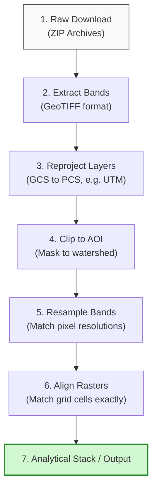

# Satellite Data Preparation Workflows

Raw satellite imagery cannot be used directly in hydrological models. It must undergo preprocessing to correct geometric shifts, align pixel grids, and mask out clouds. This section details the standard preparation pipeline.

---

## 1. Preprocessing Pipeline
The flowchart below outlines the steps required to prepare raw satellite downloads for spatial analysis:

---

## 2. Extraction and Folder Organization
Raw downloads contain multiple metadata files, xml structures, and separate single-band image files.

* **Best Practice:** Keep the raw zip files as a backup. Extract only the bands required for your study into a structured directory (e.g., `data/raster/raw_bands/`).

---

## 3. Clipping to Area of Interest (AOI)
Satellite scenes are large, covering areas up to $100\text{ km} 	imes 100\text{ km}$.

* **Method:** Use the **Clip Raster by Mask Layer** tool in QGIS to cut the satellite image to the exact boundary of your study watershed. This reduces file sizes and speeds up subsequent analysis.

---

## 4. Reprojection
Satellite data is typically downloaded in a Geographic CRS (e.g., EPSG:4326). Before running calculations, you must reproject the data to a Projected CRS (e.g., UTM Zone 45N, EPSG:32645).

* **Resampling Algorithms:** Reprojection changes the pixel grid, requiring the GIS to recalculate pixel values. Choose the appropriate resampling algorithm:

  * **Nearest Neighbor:** Assigns the value of the nearest source pixel. Use this for discrete classifications (e.g., land cover category IDs) to avoid creating false classes.

  * **Bilinear or Cubic:** Interpolates values based on surrounding pixels. Use this for continuous data (e.g., DEM elevation or NDWI gradients) to ensure smooth transitions.

---

## 5. Resampling and Raster Alignment

* **Resampling:** When combining bands with different resolutions (e.g., Sentinel-2 Band 8 at $10\text{ m}$ and Band 11 at $20\text{ m}$), you must resample them to a common grid size using the **Resample** tool.

* **Raster Alignment:** Even if two rasters share the same cell size and CRS, their cell edges may not align perfectly. If you run cell-by-cell math on misaligned rasters, the GIS will interpolate values, leading to coordinate drift. Use the **Align Rasters** tool in QGIS to snap the grids together.
