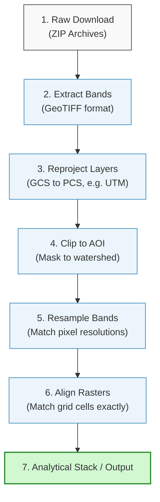

# Satellite Data Preparation Workflows

Raw satellite imagery cannot be used directly in hydrological models. It must undergo preprocessing to correct atmospheric distortion, mask out clouds, reproject to metrics, and align pixel grids. This section details the standard preparation pipeline.

---

## 1. Preprocessing Pipeline

The flowchart below outlines the steps required to prepare raw satellite downloads for spatial analysis:



---

## 2. Radiometric & Atmospheric Corrections (TOA vs. BOA)

Raw satellite images are distributed in digital numbers (DN) representing raw sensor counts. These must be calibrated to physical reflectance units:

* **Top of Atmosphere (TOA) Reflectance (Level-1):** Refers to the reflectance measured by the satellite sensor before correcting for atmospheric distortions. It includes scattering caused by dust, gas molecules, and aerosols.

* **Bottom of Atmosphere (BOA) Reflectance (Level-2A / Surface Reflectance):** Refers to the true reflectance measured at the Earth's surface. Atmospheric correction algorithms (such as Sen2Cor for Sentinel-2, or LaSRC for Landsat 8/9) remove the effects of **Rayleigh scattering** (gaseous molecules) and **Mie scattering** (aerosols/clouds).

* **Hydrological Implication:** 
  
  * Spectral water indices (MNDWI, NDWI) and vegetation indices (NDVI) must be calculated using BOA surface reflectance.
  
  * Under TOA calculations, atmospheric scattering artificially inflates reflectance in shorter wavelengths (blue and green), causing water bodies to appear brighter in visible bands and leading to severe classification errors.

---

## 3. Cloud, Shadow, and Quality Assessment (QA) Masking

Clouds and cloud shadows obscure surface details, causing data anomalies in time-series index analysis. These pixels must be masked using satellite metadata:

### Landsat 8/9 Quality Assessment (QA_Pixel)
Landsat files include a 16-bit `QA_Pixel` band. Specific bits indicate features:

* **Bit 3:** Cloud Shadow (set to 1)

* **Bit 4:** Snow (set to 1)

* **Bit 5:** Cloud (set to 1)

To extract clear-sky pixels in QGIS, a bitwise expression is applied via the **Raster Calculator** to filter out cells where these bits are set.

---

### Sentinel-2 Scene Classification Layer (SCL)
Sentinel-2 Level-2A data includes a pre-calculated $20\text{ m}$ categorical raster called the `SCL` band. Significant class codes include:

* **0:** No Data

* **3:** Cloud Shadows

* **8:** Clouds (Medium Probability)

* **9:** Clouds (High Probability)

* **11:** Snow

Hydrologists build a binary mask to exclude these SCL values before running surface water analyses.

---

## 4. Workspace & Folder Organization

A structured directory system is crucial to managing multi-band satellite assets. The standard WECS directory layout is structured as follows:

```text
project_root/
├── data/
│   ├── raw/                  <-- Unaltered zip downloads
│   ├── processed/
│   │   ├── bands/            <-- Extracted single-band GeoTIFFs
│   │   ├── masked/           <-- Cloud/shadow masked bands
│   │   └── aligned/          <-- Reprojected, clipped, aligned bands
│   └── output/               <-- Final indices (NDVI, NDWI)
```

* **Storage Saving Rule:** Keep the raw `.zip` archives as a read-only archive backup. Extract only the specific bands required for calculations (e.g., Sentinel-2 Band 3 Green, Band 8 NIR, and Band 11 SWIR) into the processed workspace to save storage.

---

## 5. Clipping to Area of Interest (AOI)

Satellite scenes cover large areas (e.g., $100\text{ km} \times 100\text{ km}$ for Sentinel-2). Processing a full granule consumes unnecessary memory and time.

* **Workflow:** Use QGIS's **Clip Raster by Mask Layer** tool (based on the `gdalwarp` engine) to crop bands to the watershed shapefile boundary.

* **Performance Impact:** Clipping a Sentinel-2 band from a full scene ($500\text{ MB}$) to a typical Nepalese river catchment boundary ($10\text{ km} \times 10\text{ km}$) reduces the file size to under $5\text{ MB}$, accelerating processing speeds by up to 99%.

---

## 6. Map Reprojection & Resampling Algorithms

Satellite datasets are default-projected in a geographic coordinate reference system (such as WGS 84, EPSG:4326) where units are degrees. Distance and area measurements fluctuate with latitude in this system.

* **Reprojection:** For hydrological modeling, rasters must be reprojected to a projected coordinate system using metric units (e.g., WGS 84 / UTM Zone 45N, EPSG:32645 in central Nepal) using the **Warp (Reproject)** tool.

---

### Resampling Math
During reprojection, the pixel grid orientation changes, requiring the software to interpolate new cell values. Choose the appropriate resampling algorithm:

* **Nearest Neighbor:** Copies the raw value of the closest source pixel.
  
  * *Use Case:* Always use this for **discrete categorical data** (e.g., LULC classifications, SCL bands, cloud masks). Using interpolation on classification codes would create non-existent classes (e.g., averaging class 3 forest and class 5 water would yield class 4 urban).

* **Bilinear Interpolation:** Computes a distance-weighted average of the $2 \times 2$ surrounding cells.
  
  * *Use Case:* Best for **continuous scientific grids** (e.g., DEM elevations, land surface temperature). This yields a smoother surface with fewer pixel edge artifacts.

* **Cubic Convolution:** Computes a weighted average of the $4 \times 4$ surrounding cells.
  
  * *Use Case:* Provides high-fidelity smoothing for continuous data, though it requires more computation time.

---

## 7. Raster Grid Alignment & Cell Drift

Even if multiple rasters share the same cell resolution ($10\text{ m}$) and projection (UTM Zone 45N), their pixel borders might not line up if they have different origins:

```text
Grid A: | 0.0 | 10.0 | 20.0 |
Grid B: | 2.5 | 12.5 | 22.5 | <-- 2.5m offset
```

* **The Alignment Problem:** Running cell-by-cell math (like subtraction for indices) on misaligned grids forces the GIS to interpolate values on-the-fly. This creates spatial blur, offsets, and gradual coordinate drift.

* **The Solution:** Use the **Align Rasters...** tool in QGIS:
  
  1. Add the clipped and reprojected bands to the input list.
  
  2. Select one band (e.g., Band 3 Green) as the reference raster template.
  
  3. Specify output paths, cell size ($10\text{ m}$), and set the resampling method.
  
  4. QGIS snaps all grids to the exact same cell bounds and origin, enabling mathematically valid index calculations.

---

## 8. Guided Class Exercises

### Exercise 1: Formulating a Cloud-Mask Expression
A researcher is working with Sentinel-2 Level-2A data during the monsoon season. They need to extract a clean-sky green band to map a river channel, using the `SCL` band to mask out cloud shadows (value 3), clouds (values 8, 9), and snow/ice (value 11).

1. In the QGIS Raster Calculator, write a logical expression to create a binary mask raster where `1` represents clear-sky land/water and `0` represents clouds, shadows, or snow.

2. Write the final expression to apply this mask to the green band (`B03`), setting masked pixels to `NoData` (null).

??? check "Answer Key - Exercise 1"

    1. **Creating the Binary Mask:**
    
        To isolate clear pixels, we set SCL values of 3, 8, 9, and 11 to 0, and all other valid pixels to 1. The logical expression is:
        
        `("SCL@1" != 3) AND ("SCL@1" != 8) AND ("SCL@1" != 9) AND ("SCL@1" != 11)`
        
        * This outputs a grid of `1` (pass) and `0` (mask).
        
    2. **Applying the Mask to the Green Band (B03):**
    
        We multiply the green band by the binary mask. To set masked pixels to `NoData` (instead of 0, which would distort statistics), we divide by the mask:
        
        `("B03@1" * (("SCL@1" != 3) AND ("SCL@1" != 8) AND ("SCL@1" != 9) AND ("SCL@1" != 11))) / (("SCL@1" != 3) AND ("SCL@1" != 8) AND ("SCL@1" != 9) AND ("SCL@1" != 11))`
        
        * When the mask is `1`, the cell evaluates to `B03 / 1 = B03`.
        
        * When the mask is `0`, the cell evaluates to `0 / 0`, which QGIS outputs as `NoData` (null).

---

### Exercise 2: Troubleshooting Spatial Alignment and Resampling Drift
A GIS analyst downloads Sentinel-2 Band 3 Green ($10\text{ m}$ resolution) and Band 11 SWIR ($20\text{ m}$ resolution) to calculate MNDWI. In the Raster Calculator, they write the expression:

`("B03" - "B11") / ("B03" + "B11")`

Upon inspecting the output, the analyst notices that the river boundaries are blurred and have offset "double-edge" artifacts.

1. Identify the two spatial configuration errors the analyst made before running the raster calculation.

2. Detail the exact steps in QGIS to resolve these errors using the **Align Rasters** tool.

3. Specify which resampling algorithm should be used for Band 11 during the alignment, and justify your choice.

??? check "Answer Key - Exercise 2"

    1. **Identified Errors:**
    
        * **Resolution Mismatch:** Band 3 has a $10\text{ m}$ grid size, while Band 11 has a $20\text{ m}$ grid size. Calculating the index directly forced on-the-fly resampling of the SWIR band, leading to poor boundary delineation.
        
        * **Grid Misalignment:** The pixel origins and bounds of the two bands were not aligned, causing offset errors at pixel interfaces.
        
    2. **Correction Steps in QGIS:**
    
        * Open QGIS and navigate to **Raster** > **Align Rasters...** from the main menu.
        
        * In the Align Rasters dialog, click the **Add** button. Add `B11_20m.tif` to the input list. Set the output path (e.g., `data/processed/aligned/B11_10m.tif`).
        
        * Select **Bilinear** as the resampling method for the continuous band.
        
        * Under **Parameters**, select the $10\text{ m}$ `B03_10m.tif` raster as the reference raster template. This automatically sets the target cell size to $10\text{ m}$ and aligns the grid origin and bounding coordinates exactly.
        
        * Click **OK** to execute. QGIS will generate a new $10\text{ m}$ SWIR band aligned with the Green band, which can then be used in the Raster Calculator.
        
    3. **Selected Resampling Algorithm:**
    
        * **Bilinear Interpolation** (or **Cubic Convolution**) must be used.
        
        * **Justification:** Band 11 contains continuous spectral reflectance values. Bilinear interpolation averages surrounding values, creating a smooth surface transition.
        
        * *Caution:* Using Nearest Neighbor on continuous bands would create staircase pixel edges, exacerbating noise along water-land boundaries.
