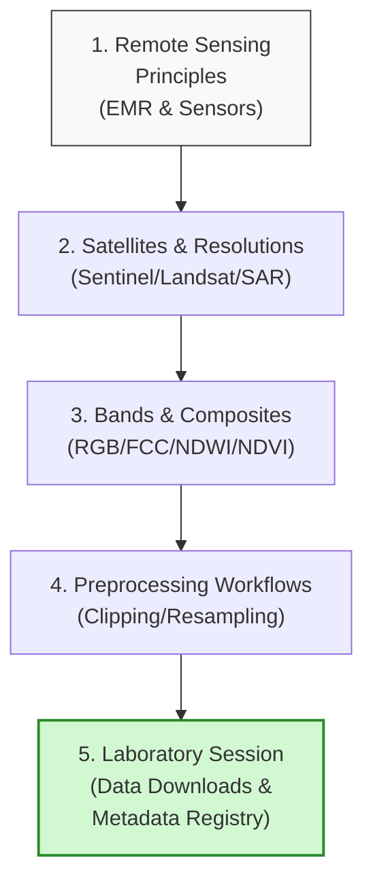

# Remote Sensing & Earth Observation for Hydrology

Welcome to the second module of the training program. This module shifts focus from desktop GIS systems to the spaceborne sensors orbiting the Earth. We will cover the principles of **Remote Sensing (RS)** and **Earth Observation (EO)**, exploring how multi-spectral and radar satellite missions capture environmental characteristics.

We will focus on how to locate, download, preprocess, and analyze satellite observations to extract crucial hydrological variables such as snow extent, surface water boundaries, soil moisture indices, and digital terrain parameters.

---

## Learning Objectives
By the end of today's sessions, you will be able to:

* **Explain** the principles of electromagnetic reflection and absorption as they relate to water, soil, and vegetation.

* **Contrast** the features, applications, and boundaries of optical satellite sensors (e.g., Sentinel-2, Landsat) vs. Synthetic Aperture Radar (SAR) sensors (e.g., Sentinel-1).

* **Evaluate** spatial, spectral, temporal, and radiometric resolutions to choose the optimal satellite dataset for specific catchment studies.

* **Understand** multi-spectral band composites (True Color and False Color) to visually isolate hydrological features.

* **Explain** raster preprocessing workflows, including coordinate projection, clipping, cell resampling, and grid alignment.

* **Explain** how to extract surface water boundaries using index equations like the Normalized Difference Water Index (NDWI).

---

## Day 2 Learning Roadmap

---

## Topics and Schedule

* **[Topic 1: Introduction to Remote Sensing](01_intro_remote_sensing.md)**
  Covers physical principles, the electromagnetic spectrum, active vs. passive sensors, and optical vs. SAR properties.

* **[Topic 2: Earth Observation Missions and Sensors](02_eo_missions.md)**
  Familiarization with Sentinel-1/2, Landsat, MODIS, SRTM DEMs, and CHIRPS precipitation grids.

* **[Topic 3: Understanding Satellite Data Characteristics](03_satellite_characteristics.md)**
  An in-depth breakdown of the four resolutions (spatial, spectral, temporal, radiometric) and their trade-offs.

* **[Topic 4: Satellite Bands and Composites](04_bands_composites.md)**
  Details band math, True Color, False Color (NIR-Red-Green), and spectral absorption properties of water and soil.

* **[Topic 5: Accessing Open Satellite Data](05_accessing_data.md)**
  A practical guide to data hubs: CDSE (Copernicus), USGS EarthExplorer, and NASA Earthdata database.

* **[Topic 6: Satellite Data Preparation Workflows](06_preparation_workflows.md)**
  Preprocessing workflows: downloading, clipping AOIs, grid alignment, resampling, and reprojecting.

* **[Topic 7: DEMs and Terrain Data](07_dem_terrain.md)**
  Deep-dive into DTM vs. DSM, terrain derivations (slope, aspect, hillshade), ALOS/Copernicus, and mountain shadow limits.

* **[Topic 8: Remote Sensing Applications in Hydrology](08_applications_hydrology.md)**
  Calculates NDWI, NDVI, NDSI, and SAR backscatter threshold masks for floods, snow cover, and erosion.

* **[Topic 9: Practical Session](09_practical_session.md)**
  Hands-on exercises: registering account credentials, searching public portals, online band visualizations, querying STAC APIs, and downloading raw bands and DEM grids.

* **[Topic 10: Mini Assignment](10_mini_assignment.md)**
  Guidelines for selecting a target basin, downloading its raw Sentinel-2 and DEM datasets, organizing folders, and compiling a metadata registry spreadsheet.

---

## Expected Outputs for Today
At the end of Day 2, you will submit a zipped folder containing:

1. Downloaded raw **Sentinel-2 Green (Band 3) and NIR (Band 8)** datasets.

2. Downloaded raw **Digital Elevation Model (DEM)** tiles covering the target basin.

3. A completed **Basin Metadata Registry spreadsheet** (CSV or Excel) detailing coordinates, acquisition dates, cloud cover, sensor platform, and file sizes.

4. A screenshot of a structured, local workspace directory tree containing the downloaded raw datasets.
