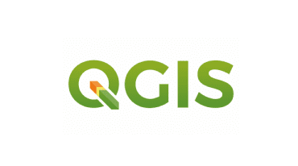
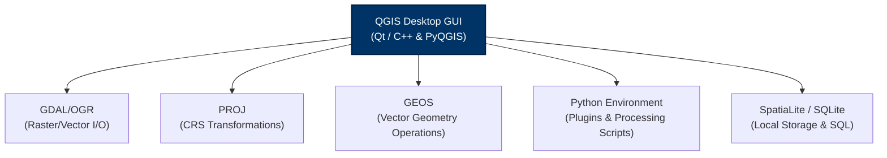
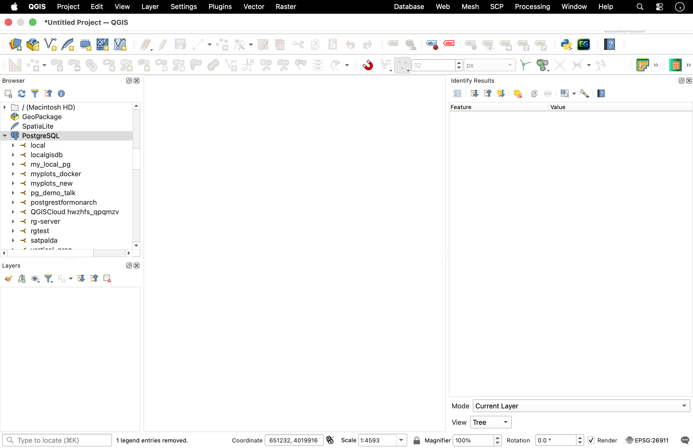

# Introduction to QGIS

QGIS (formerly known as Quantum GIS) is a professional, open-source Geographic Information System (GIS) application that supports viewing, editing, and analyzing spatial data. Licensed under the GNU General Public License (GPL) and managed as an official project of the **Open Source Geospatial Foundation (OSGeo)**, QGIS is a robust desktop platform utilized by water resources departments, research institutes, and engineering firms worldwide. 

This section provides a comprehensive guide to QGIS architecture, release paradigms, software installations, coordinate engines, vector digitizing setups, and project debugging tools.


---

## 1. QGIS Release Cycles and standardizing Workflows

QGIS development progresses rapidly, with new updates released regularly. To maintain project stability, WECS standardizes workflows on specific release categories:

* **Long Term Release (LTR):** Released once a year, receiving backported bug fixes and stability updates for 12 months. **WECS standardizes all official modeling pipelines on LTR versions (e.g., QGIS 3.34 LTR)**. This ensures that plugins do not break midway through a basin study and that processing results remain consistent across different team members.

* **Latest Release (LR):** Released every four months, introducing cutting-edge features and new tools. These are geared toward testing and developer exploration but are discouraged for operational production lines.

---

## 2. Multi-Platform Installation and Environment Setup

Installing QGIS varies across operating systems. Proper installation is critical to ensure that external dependency engines (like SAGA or GRASS) link correctly:

### Windows Installation (OSGeo4W vs. Standalone)

* **Standalone MSI Installer (Recommended for beginners):** A single executable package containing QGIS and its primary libraries.

* **OSGeo4W Network Installer (Recommended for power users/IT):** A command-line package manager for Windows. It allows you to manage multiple versions of QGIS, GDAL, GRASS, and Python dependencies, updating individual packages without reinstalling the entire program.

<iframe width="560" height="315" src="https://www.youtube.com/embed/Ku3VXoqrzUU?si=DfAYNKI4sUlTZgKs" title="YouTube video player" frameborder="0" allow="accelerometer; autoplay; clipboard-write; encrypted-media; gyroscope; picture-in-picture; web-share" referrerpolicy="strict-origin-when-cross-origin" allowfullscreen></iframe>

### macOS Installation and Path Configuration

* **DMG Package:** Standard installer format. Drag QGIS to the `/Applications` folder.

* *macOS Path Security Warning:* On modern macOS versions (Ventura/Sonoma), gatekeeper restrictions may block external SAGA or GRASS binaries from executing inside the Processing Toolbox. You must grant execution permissions in **System Settings** > **Privacy & Security** if a "Developer cannot be verified" pop-up appears, or configure paths using homebrew packages.

<iframe width="560" height="315" src="https://www.youtube.com/embed/KPF3jxx3HrQ?si=0rFssPxASq3oAenX" title="YouTube video player" frameborder="0" allow="accelerometer; autoplay; clipboard-write; encrypted-media; gyroscope; picture-in-picture; web-share" referrerpolicy="strict-origin-when-cross-origin" allowfullscreen></iframe>

### Linux Installation (Debian/Ubuntu/Flatpak)

* Standard repository distributions are often outdated. Always add the official QGIS repository to your package list:
  ```bash
  sudo add-apt-repository ppa:ubuntugis/ubuntugis-unstable
  sudo apt update
  sudo apt install qgis qgis-plugin-grass
  ```

<iframe width="560" height="315" src="https://www.youtube.com/embed/VKDLoqH9keI?si=BLEMUxgP2OFP2ytv" title="YouTube video player" frameborder="0" allow="accelerometer; autoplay; clipboard-write; encrypted-media; gyroscope; picture-in-picture; web-share" referrerpolicy="strict-origin-when-cross-origin" allowfullscreen></iframe>

* Alternatively, utilize the **Flatpak** sandbox distribution to run isolated QGIS setups with pre-bundled dependencies.

---

## 3. QGIS Architecture and the OSGeo Stack

QGIS is not built as a monolithic application. Instead, it serves as a powerful graphical user interface (GUI) wrapper that integrates a suite of underlying open-source libraries and engines:



* **GDAL/OGR (Geospatial Data Abstraction Library):** The engine that reads and writes spatial file formats. GDAL handles raster formats (e.g., GeoTIFF, NetCDF, ArcInfo ASCII Grid), while OGR handles vector formats (e.g., GeoPackage, Esri Shapefile, KML, GeoJSON). If QGIS cannot open a specific file, it is usually because the underlying GDAL/OGR library lacks support for that format.

* **PROJ:** The coordinate library responsible for performing datum conversions and map projections. When you load a raster in one projection and display it on-the-fly in another, PROJ performs the mathematical coordinate translations behind the scenes.

* **GEOS (Geometry Engine Open Source):** The library that handles vector topology operations, such as calculating buffers, intersections, spatial unions, and centroid positions.

* **Qt:** The C++ cross-platform framework used to render the QGIS user interface (windows, panels, dialog boxes, and the map canvas).

* **Python/PyQGIS:** The programming environment that exposes the QGIS API. This allows developers to write custom plugins, automate workflows, and execute script-based analysis.

---

## 4. QGIS Interface Panels and Toolbars

The default QGIS workspace is highly modular and customizable. Panels and toolbars can be dragged, docked, resized, or hidden depending on your workflow requirements.


### The Primary Interface Areas

* **Menu Bar:** Provides categorized access to all core features. For hydrologists, the **Vector**, **Raster**, **Database**, and **Processing** menus are the most frequently used.

* **Toolbars:** Collections of icons providing one-click shortcuts to common tasks. Key toolbars include:

  * *Project Toolbar:* Creating, opening, saving, and printing layouts.

  * *Map Navigation Toolbar:* Panning, zooming, and refreshing the view.

  * *Attributes Toolbar:* Selecting features, opening attribute tables, and identifying pixel/vector values.

* **Layers Panel (Layer Tree):** Lists all datasets loaded into the active project. Layer drawing follows a top-down hierarchy: layers at the top of the list are rendered on top of layers below them in the map canvas. In hydrologic maps, vector streams and point rain gauges must be placed above raster DEMs or hillshades to remain visible.

* **Browser Panel:** A built-in file navigator designed specifically for geospatial data. It allows you to:

  * Browse local directory trees.

  * Connect to database servers (PostgreSQL/PostGIS, SpatiaLite).

  * Establish web services (WMS/WMTS for map tiles, WFS for vectors, WCS for rasters).

  * Set up directory shortcuts (**Favorites**) for rapid workspace access.

* **Map Canvas:** The central visualization window where spatial data is rendered. You can zoom, pan, select, and measure distances directly on this canvas.



### Useful Secondary Panels

To toggle panels on/off, right-click anywhere on the menu bar or toolbars and check the desired panel:

* **Layer Styling Panel:** A real-time styling tool that lets you adjust symbols, transparency, color ramps, and labels without closing dialog windows.

* **Status Bar (Bottom of Interface):** Displays active coordinates, map scale, magnifier values, rotation angle, and the **active project CRS** (represented by an EPSG code, e.g., `EPSG:32645`). Clicking this EPSG code opens the Project CRS properties immediately.

---

## 5. Coordinate Engines and On-the-Fly Projection

A common point of confusion is the distinction between a **Layer's CRS** and the **Project's CRS**:

* **Layer CRS:** The permanent, native coordinate reference system in which the raw dataset coordinates are stored on disk (e.g., GPS coordinates recorded in latitude/longitude degrees).

* **Project CRS:** The coordinate system used by the Map Canvas to display your spatial data on screen.

### On-the-Fly (OTF) Reprojection

QGIS utilizes an **On-the-Fly (OTF)** coordinate reprojection engine. When you load a layer with one projection (e.g., WGS 84 / EPSG:4326) into a project set to another (e.g., UTM Zone 45N / EPSG:32645), QGIS calculates the coordinate translation values in memory using the **PROJ** library. This displays the layers aligned on screen without modifying the original data files.

> [!WARNING]
> While OTF reprojection is excellent for map visualization, running analytical tools (like Buffering or Area calculations) on layers where the Layer CRS does not match the Project CRS can result in extreme calculation errors or silent tool failures. Always reproject layers physically to a projected metric system before geoprocessing.

---

## 6. Creating Layers, Snapping, and Basic Digitizing

Digitizing is the process of drawing vector shapes manually on screen (e.g., tracing a reservoir boundary over satellite base maps).

### Creating a New Vector Layer:

1. Go to **Layer** > **Create Layer** > **New GeoPackage Layer...**.

2. Set the database name to your local project database (e.g., `data/processed/vector/basin_assets.gpkg`).

3. Define the **Table Name** (e.g., `basin_intakes`).

4. Select the **Geometry Type** (Point, Line, Polygon, Multipoint).

5. Set the CRS to **EPSG:32645 (WGS 84 / UTM Zone 45N)**.

6. Under **New Field**, add attribute columns (e.g., `intake_name` as Text, `discharge_lps` as Decimal). Click **OK**.

### Snapping Configurations (Topological Editing)

To prevent digitizing errors like sliver polygons, gaps, or overlapping line segments, you must configure snapping rules:

1. Enable the Snapping Toolbar via **Project** > **Snapping Options...** (or click the magnet icon).

2. Set snapping parameters:

   * **Target:** Snap to Vertex, Segment, or Area.

   * **Tolerance:** Set the snapping search radius (e.g., $10\text{ pixels}$ or $2\text{ meters}$).

   * **Avoid Overlaps:** Check this option to prevent drawing new polygons that cover existing boundaries.

   * **Topological Editing:** Maintains shared boundary paths when editing vertex coordinates.

---

## 7. The Processing Framework and Toolbox

The **Processing Toolbox** is the central hub for running geoprocessing algorithms. It integrates native QGIS tools with external geospatial software suites.

* **Accessing:** Toggle the panel via **Processing** > **Toolbox** (or press `Ctrl+Alt+T`).

### Native vs. Third-Party Algorithms

Algorithms are grouped by provider, allowing you to use analytical routines from multiple platforms in a single interface:

* **QGIS (Native):** C++ algorithms optimized for speed and stability, covering basic vector editing, raster extraction, and database management.

* **GDAL/OGR:** Utilities for raster warping (reprojecting), translation, contour generation, and raster-to-vector conversions.

* **GRASS GIS:** A comprehensive GIS package containing specialized modules for hydrology, such as watershed delineation (`r.watershed`), stream network ordering (`r.stream.order`), and flood risk modeling.

* **SAGA GIS (System for Automated Geoscientific Analyses):** Famous for terrain analysis modules, including Wang & Liu sink filling, wetness index calculation (TWI), and terrain ruggedness index (TRI).

```text
    +---------------------------------------------------------+
    |                  QGIS Processing Toolbox                |
    +---------------------------------------------------------+
          |                  |                  |
          v                  v                  v
    [Native QGIS]       [GDAL/OGR]        [GRASS / SAGA]
    Vector Buffers,     Reprojecting,     r.watershed,
    Raster Math         Polygonizing      Wang & Liu fill
```

### The Processing History Log

QGIS maintains a complete audit trail of every analytical tool executed:

* Access it via **Processing** > **History** (or `Ctrl+Alt+H`).

* The log lists the parameters used, runtime details, and output locations. This is an essential reference for documenting methodology, troubleshooting tool failures, or replicating workflows in python scripts.

---

## 8. Project Management and the Project File Structure

A QGIS Project file (`.qgs` or zipped `.qgz`) acts as a configuration index. **It does not contain any spatial data.** Instead, it is a structured XML file that stores pointers and visualization properties:

```xml
<qgis projectname="Bagmati Hydrology" version="3.34.0">
  <homePath path="."/>
  <spatialrefsys>
    <wkt>PROJCRS["WGS 84 / UTM zone 45N"...]</wkt>
    <projid>EPSG:32645</projid>
  </spatialrefsys>
  <maplayers>
    <maplayer geometry="Line" type="vector">
      <datasource>./data/vector/streams.gpkg|layername=rivers</datasource>
      <renderer-v2 type="singleSymbol">...</renderer-v2>
    </maplayer>
  </maplayers>
</qgis>
```

### Stored Information:
1. **Data Sources:** Paths to raster and vector files.
2. **Symbology & Style Rules:** Color ramps, scale-dependent visibility, transparency, and labeling rules.
3. **Project Projection:** The coordinate reference system (CRS) applied to the map canvas.
4. **Print Layouts:** Configured map frames, legends, grid lines, and scale bars.

### Relative vs. Absolute File Paths

QGIS projects can store data links in two ways:

* **Absolute Paths:** Stores the full system path (e.g., `C:/Users/Name/Documents/Project/data/streams.shp`). If you move the project folder or share it with a colleague, all links will break, and QGIS will prompt you with a "Handle Bad Layers" dialog.

* **Relative Paths (Recommended):** Stores paths relative to the project file's location (e.g., `./data/streams.shp`). This allows you to copy or share the parent project folder to any computer without breaking database connections.

* *Configuration:* Set this by navigating to **Project** > **Properties** > **General** > **Save Paths** and select **Relative**.

---

## 9. Locator Bar Shortcuts and Interface Debugging

QGIS contains helpful shortcuts and logs to trace workspace execution issues:

### The Locator Bar (Bottom-Left Search Box)

The Locator bar (`Ctrl+K`) allows you to run actions, load layers, or open geoprocessing algorithms quickly using text queries:

* Find layers: `l [layername]`

* Open algorithm: `a [toolname]` (e.g., `a buffer`)

* Execute calculator expressions: `= 1245.8 / 1000`

### Tracing Workspace Failures using Log Messages

When raw data files do not import or coordinates display incorrectly, check the **Log Messages Panel**:

1. Go to **View** > **Panels** and check **Log Messages**.

2. The panel organizes log entries into specific tabs:

   * **GDAL:** Traces issues reading raster/vector file structures or database codecs.

   * **Proj:** Highlights datum conversion errors or missing coordinate transform grid shifts.

   * **Processing:** Lists detailed warning flags from external GRASS or SAGA tools.

---

## 10. Configurations and Global Options

To customize QGIS for hydrologic workflows, check these global options in **Settings** > **Options**:

* **Default CRS for New Projects:** Set a standard CRS (e.g., WGS 84 / UTM Zone 45N) so that every new project initializes with the correct metric coordinate system automatically.

* **Environment Settings:** Configure search paths for external applications like GRASS or SAGA to prevent processing errors.

* **Data Sources:** Set default action settings for handling data with missing CRS information (e.g., prompt for coordinate systems immediately).

* **User Profiles:** Create isolated user profiles via **Settings** > **User Profiles**. This is ideal for managing distinct workspace styling, active plugins, and database credentials for separate projects.
