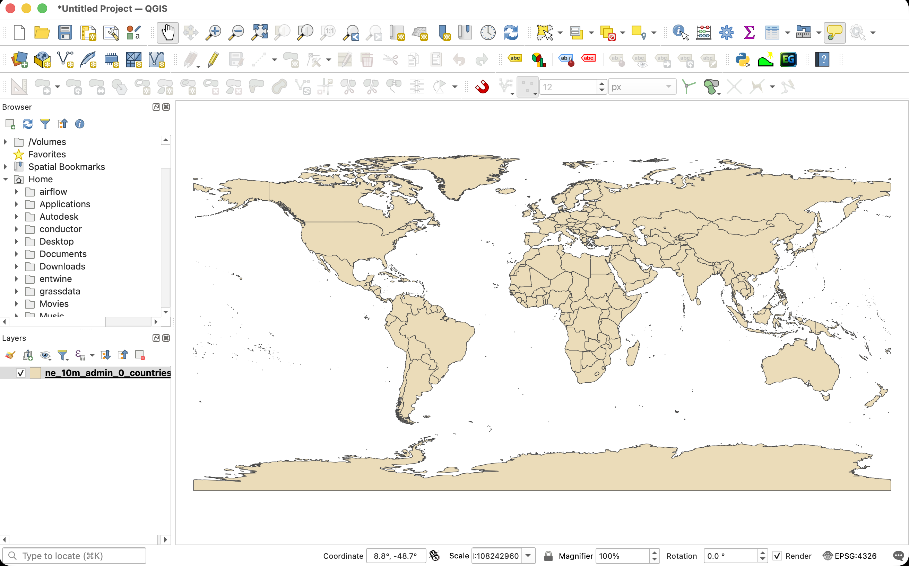
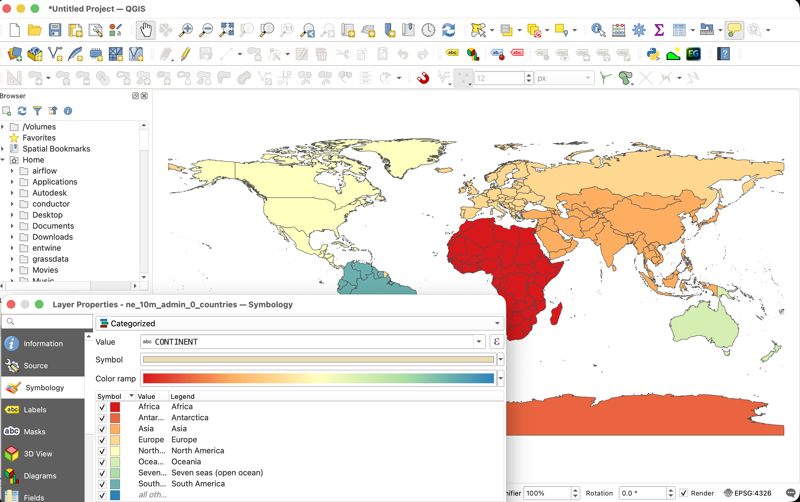
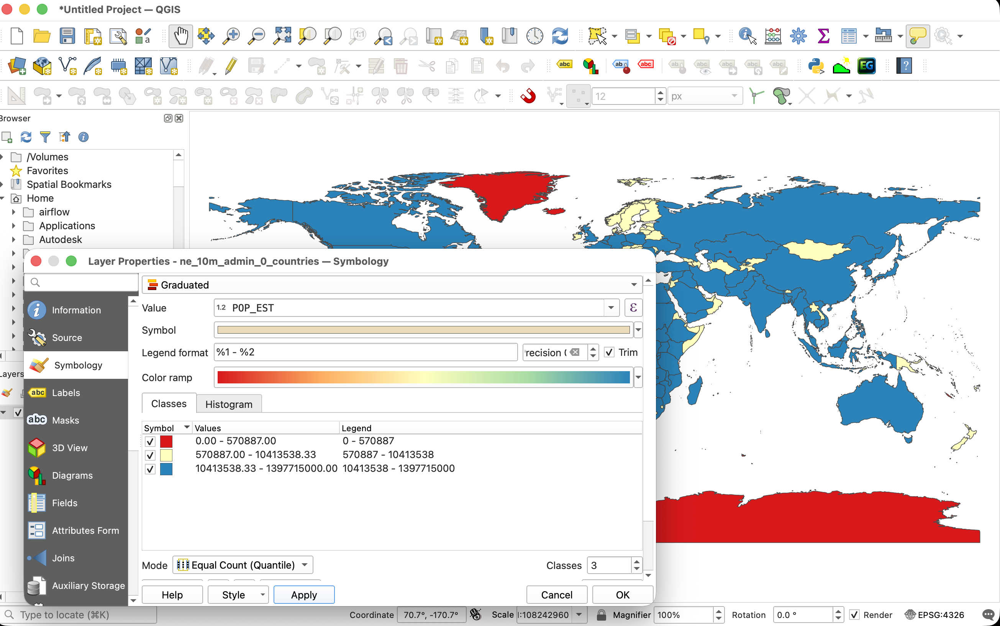
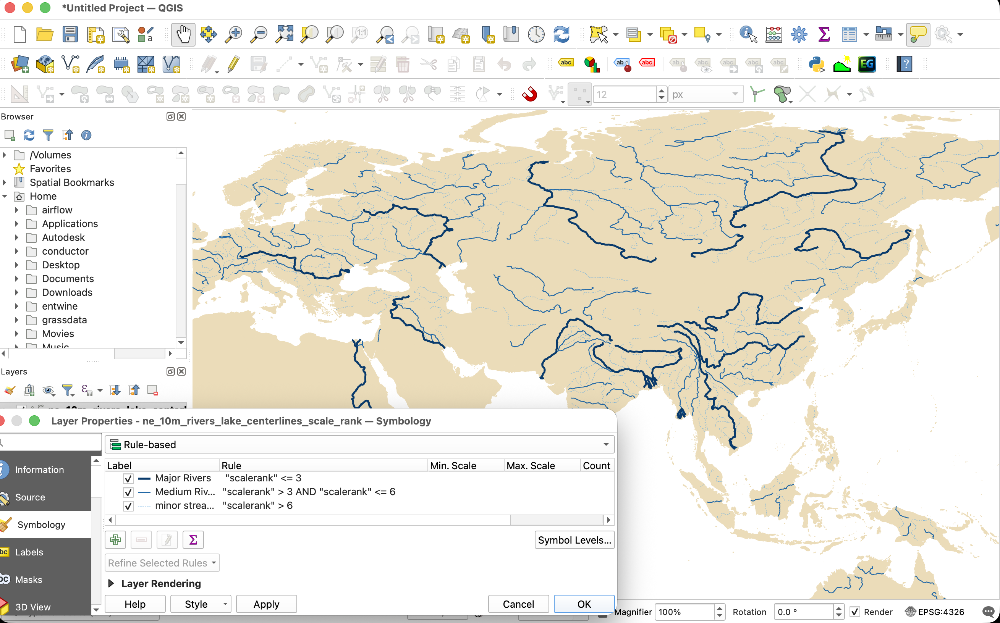

# Layer Symbology, Styling, and Labeling

This section guides you through the principles of cartographic design and layer styling in QGIS. You will learn how to transform raw vector coordinates into thematic maps using **Natural Earth** vector datasets (representing global administrative boundaries, hydrology systems, and cities).

---

## 1. Cartographic Design Principles and Natural Earth

Before applying color or line styles, it is essential to understand visual variables and hierarchy:

```text
    VISUAL VARIABLES
    +---------+  +---------+  +---------+  +---------+
    |  Color  |  |  Size   |  | Texture |  |  Shape  |
    | (Hue)   |  | (Width) |  | (Fill)  |  | (Point) |
    +---------+  +---------+  +---------+  +---------+
```

* **Color Hues:** Represent qualitative data categories (e.g., green for forest, red for urban, blue for water).

* **Color Value / Saturation:** Represents quantitative data ordering (e.g., light blue for shallow water, dark blue for deep ocean channels).

* **Visual Hierarchy:** Major rivers must stand out more than minor tributaries; country capitals must be visually distinct from minor villages.

### Introducing Natural Earth Data

**Natural Earth** is a public domain map dataset available at three coordinate scales: 1:10m (high resolution), 1:50m (medium resolution), and 1:110m (coarse resolution). 

All of these datasets are pre-packaged for you and available locally in the project directory under the [docs/data/Natural_Earth_quick_start/](file:///Users/krishnaglodha/Documents/work/wb/QGIS-WECS/docs/data/Natural_Earth_quick_start/) folder. 

We will refer to the following standard datasets in our exercises:

*   **Global Countries:** `ne_110m_admin_0_countries` (Global political land boundaries)

    *   **Local Project Folder:** [docs/data/Natural_Earth_quick_start/110m_cultural/](file:///Users/krishnaglodha/Documents/work/wb/QGIS-WECS/docs/data/Natural_Earth_quick_start/110m_cultural/)

    *   **Direct Download (.zip):** [ne_110m_admin_0_countries.zip](https://naciscdn.org/naturalearth/110m/cultural/ne_110m_admin_0_countries.zip)

    *   **Information Page:** [1:110m Cultural Vectors](https://www.naturalearthdata.com/downloads/110m-cultural-vectors/)

*   **Rivers & Lake Centerlines:** `ne_10m_rivers_lake_centerlines` (Stream centerlines and drainage networks)

    *   **Local Project Folder:** [docs/data/Natural_Earth_quick_start/10m_physical/](file:///Users/krishnaglodha/Documents/work/wb/QGIS-WECS/docs/data/Natural_Earth_quick_start/10m_physical/)

    *   **Direct Download (.zip):** [ne_10m_rivers_lake_centerlines.zip](https://naciscdn.org/naturalearth/10m/physical/ne_10m_rivers_lake_centerlines.zip)

    *   **Information Page:** [1:10m Rivers & Lake Centerlines](https://www.naturalearthdata.com/downloads/10m-physical-vectors/10m-rivers-lake-centerlines/)

*   **Populated Places:** `ne_10m_populated_places` (Point markers for global cities and capitals)

    *   **Local Project Folder:** [docs/data/Natural_Earth_quick_start/10m_cultural/](file:///Users/krishnaglodha/Documents/work/wb/QGIS-WECS/docs/data/Natural_Earth_quick_start/10m_cultural/)

    *   **Direct Download (.zip):** [ne_10m_populated_places.zip](https://naciscdn.org/naturalearth/10m/cultural/ne_10m_populated_places.zip)

    *   **Information Page:** [1:10m Populated Places](https://www.naturalearthdata.com/downloads/10m-cultural-vectors/10m-populated-places/)

---

## 2. Core Symbology Types in QGIS

QGIS supports several styling engines for vector layers, accessible by right-clicking a layer and selecting **Properties** > **Symbology** or using the **Layer Styling Panel** (`F7`).

### Single Symbol (Qualitative Representation)

Renders all features in the layer using the exact same symbol properties (fill color, border stroke, transparency).

* **Application:** Styling landmasses or waterbodies uniformly.

* *Exercise:* Load `ne_110m_admin_0_countries`. Set the symbol type to **Simple Fill**. Change the fill color to a neutral pastel sand color (e.g., Hex `#ebdcb9`) and the stroke color to a dark gray (`#4a4a4a`) with a line width of $0.2\text{ mm}$. This creates a clean base map layer.



### Categorized Symbology (Qualitative Classification)

Splits features into separate color bins based on unique nominal or text values in an attribute column.

* **Application:** Styling land cover maps or geological zones.

* *Exercise:* In the Layer Styling panel, change the styling dropdown from **Single Symbol** to **Categorized**. Set the **Value** column to `CONTINENT`. Under the color ramp menu, select a qualitative ramp (e.g., *Pastel* or *Spectral*). Click **Classify** at the bottom. QGIS will generate a distinct fill color for each continent.



### Graduated Symbology (Quantitative Classification)

Styles features using a color ramp based on numeric values. You must select a classification method to bin the continuous data:

```text
    CLASSIFICATION METHOD COMPARISON
    Equal Interval : [=== 0-25 ===][=== 25-50 ===][=== 50-75 ===] (Equal ranges)
    Quantiles      : [= 0-10 =][=== 10-35 ===][====== 35-100 ======] (Equal count per bin)
    Jenks (Natural): [== 0-15 ==][==== 15-60 ====][=== 60-100 ===] (Breaks at natural gaps)
```

* **Equal Interval:** Divides the range of attribute values into equal-sized sub-ranges. Best for showing absolute thresholds, but can result in empty classes if data is clustered.

* **Quantiles:** Places an equal number of features in each class bin. Excellent for highlighting rankings or relative differences, but can distort data spreads.

* **Natural Breaks (Jenks):** Computes class boundaries based on natural groupings and variances inherent in the dataset. Minimizes variance within classes while maximizing difference between classes. This is the standard method for thematic maps.

* *Exercise:* Load `ne_110m_admin_0_countries`. Change the symbology type to **Graduated**. Set **Value** to the country population field `POP_EST`. Select a sequential color ramp (e.g., *YlOrRd* - Yellow to Red). Set the **Mode** to **Natural Breaks (Jenks)** and **Classes** to `5`. Click **Classify** to visualize global population density.



---

## 3. Advanced Rule-Based Symbology

Rule-based symbology uses SQL-like expressions to filter features, allowing you to define distinct symbols for different subsets of data within a single layer.

* **Application:** Styling river networks so that stroke thickness increases dynamically with river discharge or scale hierarchy.

### Exercise: Styling Rivers by Scalerank

Natural Earth river layers (`ne_10m_rivers_lake_centerlines`) include a `scalerank` attribute (where $0$ represents major continental rivers and larger values represent smaller tributaries). We will write rules to scale line widths based on this rank:

1. Right-click the river layer and open the **Symbology** properties.

2. Change the styling dropdown to **Rule-based**.

3. Create three distinct styling rules:

   * **Rule 1: Major Rivers**
     * *Double-click the rule list item.*
     * *Label:* Major Rivers
     * *Filter expression:* `"scalerank" <= 3`
     * *Symbol:* Stroke Width $= 0.8\text{ mm}$, color $= \text{Dark Blue } (\text{Hex } \#0a3b6c)$

   * **Rule 2: Medium Rivers**
     * *Click the green '+' to add a rule.*
     * *Label:* Medium Rivers
     * *Filter expression:* `"scalerank" > 3 AND "scalerank" <= 6`
     * *Symbol:* Stroke Width $= 0.4\text{ mm}$, color $= \text{Medium Blue } (\text{Hex } \#2268a6)$

   * **Rule 3: Minor Streams**
     * *Add another rule.*
     * *Label:* Minor Streams
     * *Filter expression:* `"scalerank" > 6`
     * *Symbol:* Stroke Width $= 0.15\text{ mm}$, Stroke Style $= \text{Dash Line}$, color $= \text{Light Blue } (\text{Hex } \#5ea8e2)$

4. Click **Apply**. Zoom in to observe how the river thickness adjusts logically as you traverse the drainage basin from headwaters to main channels.



---

## 4. Raster Layer Styling

Rasters store gridded continuous or categorical data (e.g., elevation, temperature, spectral imagery, land cover). QGIS provides multiple engines to render these cells into geographic representations.

We will use the local Digital Elevation Model (DEM) dataset:

*   **DEM Dataset:** `output_hh.tif` (with elevation values ranging from $600$ to $7000$ meters)
*   **Local Project File:** [docs/data/Natural_Earth_quick_start/DEM/output_hh.tif](file:///Users/krishnaglodha/Documents/work/wb/QGIS-WECS/docs/data/Natural_Earth_quick_start/DEM/output_hh.tif)

Open the **Layer Styling Panel** (`F7`) and select the raster layer to see the rendering options. Here are the key raster styling engines in QGIS:

### Singleband Gray (Continuous Grayscale)

Renders a single band as a continuous gradient from black to white (or vice versa).

* **Application:** Grayscale DEMs, single satellite bands (e.g., infrared), or index results (e.g., NDVI).

* *Exercise:* Load `output_hh.tif`. In the styling panel, set the **Render type** to **Singleband gray**. Under **Color gradient**, select **Black to White** or **White to Black**. In **Min / Max Value Settings**, select **Min / Max** and click **Estimate** (or manually input `600` and `7000`). Set **Contrast enhancement** to **Stretch to MinMax** to stretch the full dynamic range of elevations across the visible black-to-white spectrum.

### Singleband Pseudocolor (Continuous Color Ramp)

Maps pixel values to a continuous color ramp based on values.

* **Application:** Standard method for visual representation of elevations, bathymetry, temperature, or precipitation.

* *Exercise:* Set the **Render type** to **Singleband pseudocolor**. Choose a color ramp (e.g., *Terrain* or *Cividis*). Set the **Interpolation** mode to **Linear** (smooth gradient transition between values) or **Discrete** (blocks of flat color for elevation zones). Set **Min** to `600` and **Max** to `7000`. Click **Classify** to apply the color ramps across the elevation scale.

### Hillshade (Shaded Relief representation)

Calculates live topographic illumination on-the-fly, generating shadows and light values to simulate three-dimensional terrain without modifying the source data.

* **Application:** Visualizing slopes, ridges, valleys, and terrain texture.

* *Exercise:* Set the **Render type** to **Hillshade**. Leave **Altitude** at $45^\circ$ and **Azimuth** at $315^\circ$ (standard cartographic sun positioning from the northwest). Toggle the **Multidirectional** option to compute illumination from multiple angles for more realistic shadows in rugged terrain.
  
  * *Pro Tip (Blending layers):* Place the hillshade layer *below* a Singleband Pseudocolor elevation layer. Select the elevation layer, open **Layer Rendering** (at the bottom of the Styling panel), and set the **Blending mode** to **Multiply** (or set transparency to $40\%$). This blends the color ramp with the shaded terrain relief for a stunning 3D physical map!

### Contours (Dynamic Elevation Lines)

Dynamically calculates and draws contour lines at a specified interval on top of the raster cell grid on-the-fly.

* **Application:** Showing elevation steps and slope steepness without vectorizing the raster.

* *Exercise:* Set the **Render type** to **Contours**. Set the **Interval** to `500` (this draws a line every 500 meters of elevation change). Choose a line symbol, color (e.g., dark brown `#5c4033`), and thickness ($0.2\text{ mm}$). Set the **Index Contour Interval** to `2500` (every 5th line will be thicker, e.g., $0.5\text{ mm}$ line width) to establish visual contour hierarchy.

### Paletted / Unique Values

Assigns a distinct color to each integer pixel value in the dataset.

* **Application:** Styling discrete categorical datasets such as land cover, soil type classes, or political zone codes.

* **Note:** Not suitable for continuous datasets like our DEM (since there would be thousands of unique floating-point values).

---

## 5. Typography, Labeling, and Text Buffers

Labels display alphanumeric text directly on the map screen. Bad label placement can ruin an otherwise excellent layout. In QGIS, configuration is handled under the **Labels** tab in Layer Properties.

### Label Formatting and Expressions

* **Text Wrapping:** You can wrap labels onto multiple lines by defining a wrap character (e.g., space or comma).

* **Rule-based Labeling:** Allows you to only label features that meet specific criteria. For example, labeling only large cities.

* *Exercise:* Load `ne_10m_populated_places`. Change the label setting from **No Labels** to **Single Labels**. Set the **Value** column to the name field `name`.

### Readability and Text Buffers (Halos)

Labels drawn on top of multi-colored backgrounds (like hillshades, satellite imagery, or dense country maps) can quickly become illegible. 

* **The Text Buffer:** Draws a thin, solid, or semi-transparent outline around the text to separate it from background clutter.

* *Exercise:* In the Populated Places label properties, click the **Buffer** sub-tab. Check the box to **Draw text buffer**. Set the buffer **Size** to $1.2\text{ mm}$ and color to solid white (`#ffffff`). The black text will now stand out clearly regardless of underlying map features.

### Advanced Label Placement Rules

Placement configuration is critical for different geometry types:

* **Point Layers:** QGIS allows setting an offset from the point marker. The default **Cartographic** placement puts the label offset slightly to the top-right, which is the standard reading convention.

* **Line Layers (Rivers):** Set the placement to **Curved**. Under **Line Orientation**, check **Follow line direction**. This bends the text label to match the natural curves of the river centerline.

* **Polygon Layers:** Set the placement to **Horizontal** or **Free (Angled)**. Set the anchor point to the **Centroid** of the polygon.

---

## 6. Exporting and Saving Style Configurations

Once you have styled a layer, you should preserve it so you can apply it to other datasets or share it with colleagues.

### Export Formats

* **QGIS Layer Style File (`.qml`):** An XML file containing all styling rules, colors, symbol properties, classification thresholds, and label settings. It references the layer structure but does not store the data.

* **SLD (Styled Layer Descriptor):** An OGC-standard XML format for styling map layers, useful when publishing layers to web GIS servers like GeoServer.

### Saving Styles Inside GeoPackages

When working with GeoPackage databases (`.gpkg`), you can save layer styles directly into the database container:

1. Double-click your styled layer and scroll to the bottom of the dialog window.

2. Click **Style** > **Save Style...**.

3. Set the save target to **In Database (GeoPackage)**.

4. Give the style a name and check the box to make it the **Default Style** for this database table. The next time you load this table into any new QGIS project, it will render with your configured symbology automatically.
