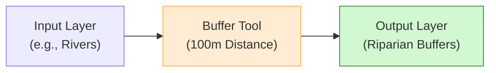

# Vector Geoprocessing

Vector geoprocessing involves performing spatial operations on coordinate geometry layers (points, lines, and polygons) to create new datasets.

---

## 1. Core Geoprocessing Operations

* **Buffer:** Creates a zone of a specified distance around features. Useful for delineating riparian conservation zones (e.g., a $100	ext{ m}$ buffer around streams).

* **Clip:** Functions as a cookie-cutter. It cuts a vector layer to the exact boundary of another polygon layer (e.g., clipping a road network to a district boundary).

* **Dissolve:** Merges adjacent polygons that share the same attribute value (e.g., dissolving district boundaries to create a province boundary layer).

* **Intersect:** Extracts overlapping geometries, keeping attributes from both layers.

---

## 2. Geoprocessing Flowchart

