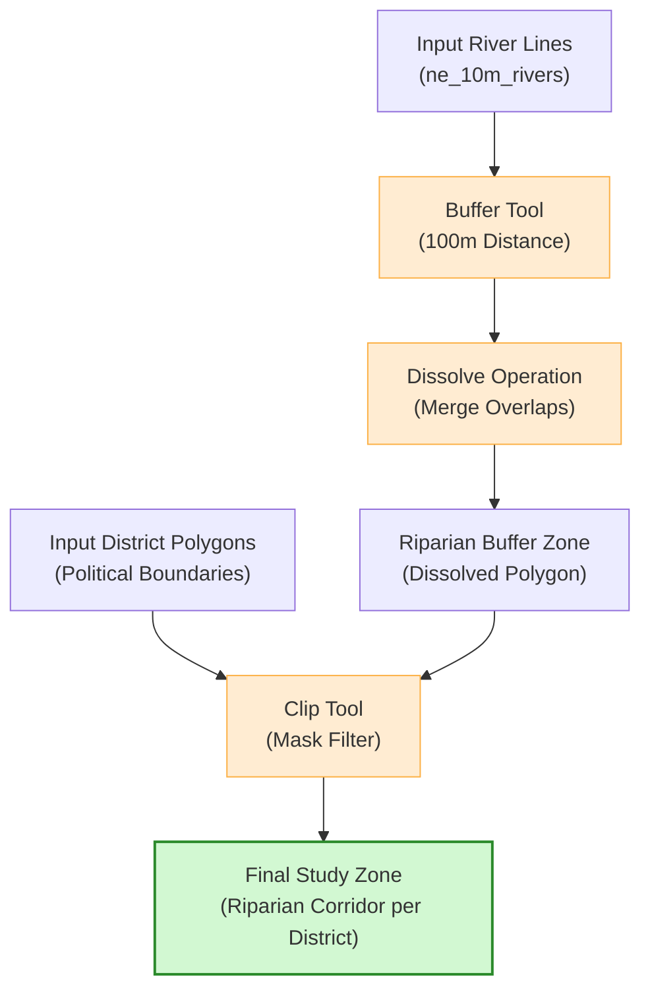

# Vector Geoprocessing Operations

Vector geoprocessing involves performing spatial algorithms on vector layers (points, lines, and polygons) to analyze proximity, intersection, containment, and geographic overlap. These operations are fundamental to catchment analysis, riparian zoning, and infrastructure planning.

---

## 1. Core Geoprocessing Algorithms

QGIS groups geoprocessing tools under the **Vector** > **Geoprocessing Tools** menu. Each tool performs a specific spatial boolean operation:

```text
    GEOPROCESSING OVERVIEW
    +-----------------+-----------------+-----------------+
    |     BUFFER      |      CLIP       |    DISSOLVE     |
    |    (Proximity)  | (Cookie Cutter) | (Merge Borders) |
    |      O -> ( )   |    [o] -> o     |   [ ]|[ ] -> [ ]|
    +-----------------+-----------------+-----------------+
    |    INTERSECT    |   DIFFERENCE    |      UNION      |
    |  (Overlap Only) | (Subtract Area) |  (All Combined) |
    |   (A)x(B) -> x  |   (A)-(B) -> ( )|   (A)+(B) -> AB |
    +-----------------+-----------------+-----------------+
```

### Buffer (Proximity Analysis)

Creates a polygon surrounding a feature at a specified distance.

* **Fixed-Distance Buffer:** Applies a constant search radius (e.g., $100\text{ meters}$) around all features. Used for defining standard riparian protection zones or environmental buffers around active landslides.

* **Variable-Distance Buffer:** Uses numeric values from an attribute field to determine the radius for each feature. For example, a river buffer where the distance is dictated by stream order (e.g., $200\text{ m}$ for main channels, $50\text{ m}$ for minor tributaries).

* **Dissolve Option:** Merges overlapping buffer polygons into a single continuous shape, preventing redundant calculations in overlapping areas.

### Clip (Spatial Boundary Extraction)

Functions as a spatial cookie-cutter. It trims the features of an input layer (points, lines, or polygons) to the exact boundary of a masking polygon layer.

* **Hydrological Application:** Trimming a regional road network dataset to the exact polygon boundary of a specific river basin.

* **Attributes:** The output layer retains only the attributes of the input layer; mask layer attributes are not joined.

### Dissolve (Boundary Aggregation)

Merges adjacent polygons that share an identical attribute value, removing the boundary lines between them.

* **Hydrological Application:** Dissolving minor sub-catchment polygons that share a main river system identifier to compile major river basin boundaries.

### Intersect (Spatial Boolean AND)

Overlay analysis that extracts only the overlapping portions of two input layers.

* **Hydrological Application:** Intersecting a landuse polygon layer with a soil classification polygon layer to generate a combined layer mapping both factors.

* **Attributes:** The output layer contains features that exist in both inputs and carries all attribute columns from both layers.

### Difference (Spatial Subtraction / NOT)

Subtracts the area of an overlay layer from the input layer.

* **Hydrological Application:** Subtracting lake/reservoir water surface polygons from a watershed district polygon to calculate net dry land area.

### Union (Spatial Boolean OR)

Combines the boundaries and attribute tables of both layers across their entire extent, generating new split features where they overlap.

---

## 2. Geoprocessing Flowchart

The following diagram illustrates a standard spatial corridor routing workflow using geoprocessing modules:



---

## 3. Topology Validation and Troubleshooting Geometry Errors

Geoprocessing tools require clean geometric inputs. When importing third-party files or digitizing boundaries, datasets often contain hidden topological errors that cause geoprocessing algorithms to fail, hang, or output empty layers.

### Common Geometry Errors:

* **Self-Intersections (Bowties):** A polygon boundary crosses over itself, creating a loop. This is the most common cause of "Geoprocessing failed: Geometry is invalid" errors.

* **Duplicate Nodes:** Two coordinate vertices placed at the exact same location in a sequence.

* **Sliver Polygons:** Tiny, narrow gap spaces created between adjacent boundaries during manual editing.

* **Holes and Overlaps:** Unintentional gap areas where adjacent polygons should snap together.

### How to Check and Repair Geometries in QGIS:

1. **Verify Validity:** Search for **Check Validity** in the Processing Toolbox. Run it on your layer. It will output three temporary layers: *Valid Output*, *Invalid Output*, and *Error Locations*.

2. **Automated Repair:** Search for the **Fix Geometries** tool in the Processing Toolbox. This native QGIS tool runs automated topological repair routines (resolving self-intersections, repairing bowties, and closing unclosed rings).

3. **Snap Geometries:** Set up snapping rules in **Project** > **Snapping Options...** to ensure vertices align automatically during editing, preventing sliver creation.
