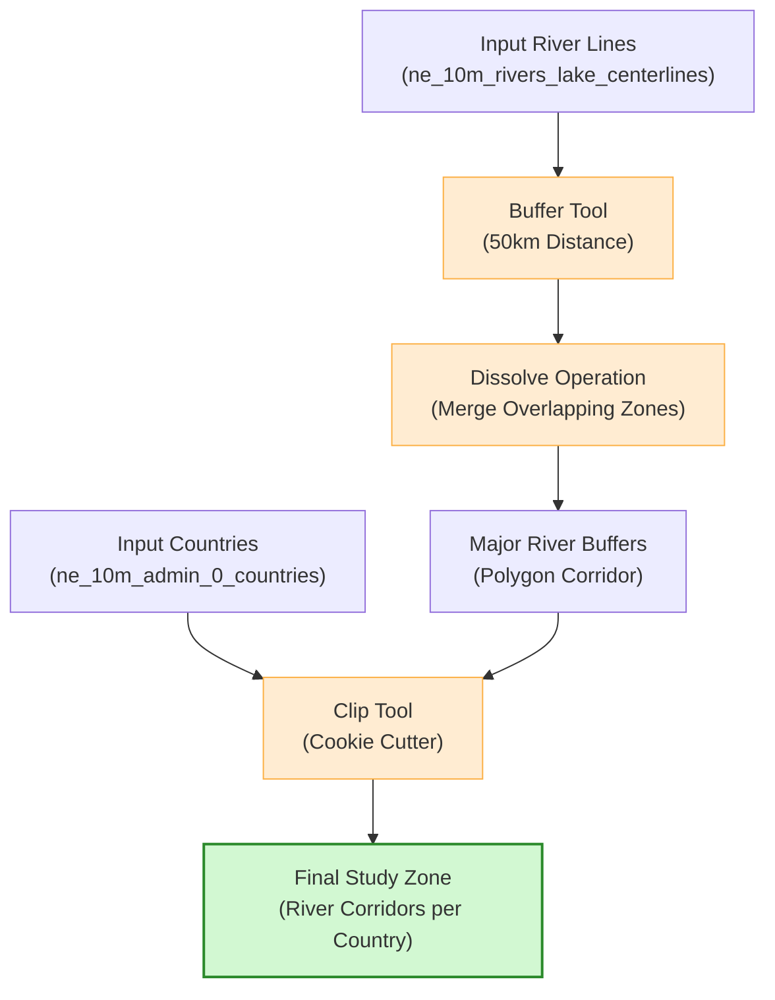

# Vector Geoprocessing Operations

Vector geoprocessing involves performing spatial algorithms on vector layers (points, lines, and polygons) to analyze proximity, intersection, containment, and geographic overlap. These operations are fundamental to catchment analysis, riparian zoning, and infrastructure planning.

In this section, we will utilize the **Natural Earth** vector datasets located in the following folders:

*   **Cultural 10m Data:** [docs/data/Natural_Earth_quick_start/10m_cultural/](file:///Users/krishnaglodha/Documents/work/wb/QGIS-WECS/docs/data/Natural_Earth_quick_start/10m_cultural/)
*   **Physical 10m Data:** [docs/data/Natural_Earth_quick_start/10m_physical/](file:///Users/krishnaglodha/Documents/work/wb/QGIS-WECS/docs/data/Natural_Earth_quick_start/10m_physical/)

---

## 1. Core Geoprocessing Algorithms

QGIS groups geoprocessing tools under the **Vector** > **Geoprocessing Tools** menu. Each tool performs a specific spatial boolean operation:

```text
    GEOPROCESSING OVERVIEW
    +-----------------+-----------------+-----------------+
    |     BUFFER      |      CLIP       |    DISSOLVE     |
    |    (Proximity)  | (Cookie Cutter) | (Merge Borders) |
    |      O -> ( )   |    [o] -> o     |   [ ]|[ ] -> [ ]|
    +-----------------+-----------------+-----------------+
    |    INTERSECT    |   DIFFERENCE    |      UNION      |
    |  (Overlap Only) | (Subtract Area) |  (All Combined) |
    |   (A)x(B) -> x  |   (A)-(B) -> ( )|   (A)+(B) -> AB |
    +-----------------+-----------------+-----------------+
```

* **Buffer (Proximity):** Creates a polygon surrounding features at a specified distance.
* **Clip (Spatial Filter):** Trims the features of an input layer to the exact boundary of a masking polygon layer (cookie-cutter).
* **Dissolve (Aggregation):** Merges adjacent polygons that share an identical attribute value, removing the border lines between them.
* **Intersect (Boolean AND):** Extracts only the overlapping portions of two input layers, joining attributes from both.
* **Difference (Boolean NOT):** Subtracts the area of an overlay layer from the input layer.
* **Union (Boolean OR):** Combines the boundaries and attribute tables of both layers across their entire extent.

---

## 2. Step-by-Step Geoprocessing Exercises (Natural Earth)

The following exercises guide you through performing core vector geoprocessing operations using the localized Natural Earth datasets.

### Exercise 1: Buffer Major River Channels
Delineate a regional environmental protection buffer zone around the world's major river networks.

1. Load `ne_10m_rivers_lake_centerlines` (physical line layer) into QGIS.
2. Select only the major continental rivers: Go to **Select by Expression** (`Ctrl+F3`) and select features using: `"scalerank" <= 2`.
3. Open **Vector** > **Geoprocessing Tools** > **Buffer**.
4. Set the parameters:
   * **Input Layer:** `ne_10m_rivers_lake_centerlines` (check the box **Selected features only**).
   * **Distance:** `50` (set unit to **Kilometers**).
   * **Segments:** `5` (controls vertex smoothness).
   * Check the box **Dissolve result** to merge overlapping buffers from adjacent river sections.
   * **Buffered:** Save the dissolved output as a layer named `major_rivers_buffer_50km`.
5. Click **Run**. A continuous buffer corridor will appear surrounding the main river basins.

### Exercise 2: Clip the Road Network to Country Boundaries
Extract only the roads that lie within a specific country (e.g., Nepal) from the massive global roads shapefile.

1. Load `ne_10m_admin_0_countries` (cultural polygon layer) and `ne_10m_roads` (cultural line layer) into QGIS.
2. Filter the country layer for Nepal: Click `ne_10m_admin_0_countries`, open **Select by Expression**, and run: `"NAME" = 'Nepal'`.
3. Go to **Vector** > **Geoprocessing Tools** > **Clip**.
4. Set the parameters:
   * **Input Layer:** `ne_10m_roads` (the global network to cut).
   * **Overlay Layer:** `ne_10m_admin_0_countries` (check **Selected features only** to use the Nepal boundary).
   * **Clipped:** Save the output as a table in your GeoPackage named `nepal_clipped_roads`.
5. Click **Run**. The resulting layer will map only roads within Nepal.

### Exercise 3: Dissolve State Boundaries to Compile Country Borders
Rebuild nation borders by dissolving internal state/provincial lines.

1. Load `ne_10m_admin_1_states_provinces` (cultural polygon layer) into QGIS.
2. Go to **Vector** > **Geoprocessing Tools** > **Dissolve**.
3. Set the parameters:
   * **Input Layer:** `ne_10m_admin_1_states_provinces`.
   * **Dissolve field(s):** Click `...` and check `admin` or `adm0_a3` (the attribute representing the parent country code).
   * **Dissolved:** Save the output as `dissolved_country_borders`.
4. Click **Run**. Observe that internal provincial boundaries are merged, leaving only compiled country outlines.

### Exercise 4: Intersect Urban Footprints with Country Boundaries
Identify where urban developments overlap with country lines and append national metadata to the urban polygons.

1. Load `ne_10m_urban_areas` (cultural polygon layer) and `ne_10m_admin_0_countries` (cultural polygon layer).
2. Go to **Vector** > **Geoprocessing Tools** > **Intersection**.
3. Set the parameters:
   * **Input Layer:** `ne_10m_urban_areas`.
   * **Overlay Layer:** `ne_10m_admin_0_countries`.
   * **Intersection:** Save the output as `urban_intersection_countries`.
4. Click **Run**. Open the output's attribute table. Every urban polygon now carries both its local name and the country attributes (`NAME`, `CONTINENT`, `ISO_A3`) of the country it intersects.

### Exercise 5: Difference Lakes from Country Polygons
Calculate the net land area of countries by subtracting major waterbodies from country polygons.

1. Load `ne_10m_admin_0_countries` (cultural polygon layer) and `ne_10m_lakes` (physical polygon layer).
2. Go to **Vector** > **Geoprocessing Tools** > **Difference**.
3. Set the parameters:
   * **Input Layer:** `ne_10m_admin_0_countries` (source land boundaries).
   * **Difference Layer:** `ne_10m_lakes` (waterbodies to subtract).
   * **Difference:** Save the output as `landmass_excluding_lakes`.
4. Click **Run**. The output layer will contain land outlines with holes where major lakes were located.

---

## 3. Geoprocessing Workflow Flowchart

The following diagram illustrates the workflow of combining these algorithms to extract study corridors from Natural Earth datasets:



---

## 4. Topology Validation and Troubleshooting Geometry Errors

Geoprocessing tools require clean geometric inputs. When importing third-party files or digitizing boundaries, datasets often contain hidden topological errors that cause geoprocessing algorithms to fail, hang, or output empty layers.

### Common Geometry Errors:

* **Self-Intersections (Bowties):** A polygon boundary crosses over itself, creating a loop. This is the most common cause of "Geoprocessing failed: Geometry is invalid" errors.

* **Duplicate Nodes:** Two coordinate vertices placed at the exact same location in a sequence.

* **Sliver Polygons:** Tiny, narrow gap spaces created between adjacent boundaries during manual editing.

* **Holes and Overlaps:** Unintentional gap areas where adjacent polygons should snap together.

### How to Check and Repair Geometries in QGIS:

1. **Verify Validity:** Search for **Check Validity** in the Processing Toolbox. Run it on your layer. It will output three temporary layers: *Valid Output*, *Invalid Output*, and *Error Locations*.

2. **Automated Repair:** Search for the **Fix Geometries** tool in the Processing Toolbox. This native QGIS tool runs automated topological repair routines (resolving self-intersections, repairing bowties, and closing unclosed rings).

3. **Snap Geometries:** Set up snapping rules in **Project** > **Snapping Options...** to ensure vertices align automatically during editing, preventing sliver creation.
