# QGIS Workflows & Spatial Data Management

Welcome to Day 3 of the Hydrological Modelling Training Plan. Today, we transition from spatial concepts and raw satellite data to hands-on desktop GIS operational workflows. Using **QGIS Desktop**, you will master spatial data management, cartographic styling, tabular calculations, geoprocessing algorithms, spatial queries, and database integrations.

---

## Learning Objectives

By the end of today's sessions, you will be able to:

* **Navigate** the QGIS user interface, configure directories, manage file paths (Relative vs. Absolute), and troubleshoot project backup files (`.qgz~`).

* **Apply** professional cartographic symbology (single symbol, categorized, graduated, rule-based) and label rendering for vectors, as well as configure raster color ramps, hillshades, contours, and transparency blending.

* **Perform** table schema adjustments, typecasting, field calculations (physical vs. virtual fields), tabular joins, and write advanced relational aggregate query expressions.

* **Run** core vector geoprocessing tools (buffering, clipping, dissolving, intersections, difference) and validate/repair topological geometry errors.

* **Process** raster datasets using map algebra (Raster Calculator), reproject/resample grid grids, reclassify continuous grids, and execute raster-vector conversions (polygonize/rasterize).

* **Query** spatial datasets using OGC spatial predicates, spatial joins, zonal statistics (on administrative boundaries and custom digitized polygons), and proximity/hub distance matrices.

* **Integrate** OGC web services (WMS, WMTS, WFS, WCS) and modern RESTful OGC APIs (Features, Tiles, Coverages, EDR) into your QGIS workspace.

* **Deploy** a local PostGIS database using Docker Compose, import vector datasets, and write spatial SQL queries to run server-side geoprocessing.

---

## Course Syllabus & Roadmap

The day is structured into 12 comprehensive topics:

```mermaid
graph TD
    M1["1. Intro to QGIS Desktop<br/>(Interface & Projections)"] --> M2["2. Plugins & Extensions<br/>(PyQGIS & Core Plugins)"]
    M2 --> M3["3. Workspace & Data <br> Management<br/>(Relative Paths & <br> GeoPackages)"]
    M3 --> M4["4. Symbology & Styling<br/>(Vector Styles & Raster Renders)"]
    M4 --> M5["5. Attribute Data Operations<br/>(Calculations & <br> Virtual Fields)"]
    M5 --> M6["6. Vector Geoprocessing<br/>(Spatial Overlays & <br> Validations)"]
    M6 --> M7["7. Raster Processing<br/>(Map Algebra & <br> Resampling)"]
    M7 --> M8["8. Spatial Queries & <br> Neighborhoods<br/>(Predicates & <br> Zonal Stats)"]
    M8 --> M9["9. Web GIS & <br> OGC Services<br/>(WMS/WFS & <br> Modern OGC APIs)"]
    M9 --> M10["10. Spatial Databases<br/>(PostGIS Docker & <br> SQL Queries)"]
    M10 --> M11["11. Practical Lab Session<br/>(10 Guided Exercises)"]
    M11 --> M12["12. Mini-Assignment<br/>(GIS Database Compilation)"]

    %% Premium styled flowchart nodes
    style M1 fill:#e3f2fd,stroke:#1565c0,stroke-width:2px
    style M2 fill:#e3f2fd,stroke:#1565c0,stroke-width:2px
    style M3 fill:#e8f5e9,stroke:#2e7d32,stroke-width:2px
    style M4 fill:#f3e5f5,stroke:#6a1b9a,stroke-width:2px
    style M5 fill:#fff3e0,stroke:#d84315,stroke-width:2px
    style M6 fill:#fff3e0,stroke:#d84315,stroke-width:2px
    style M7 fill:#efebe9,stroke:#4e342e,stroke-width:2px
    style M8 fill:#fce4ec,stroke:#c2185b,stroke-width:2px
    style M9 fill:#e0f2f1,stroke:#00695c,stroke-width:2px
    style M10 fill:#e0f7fa,stroke:#00838f,stroke-width:2px
    style M11 fill:#f9fbe7,stroke:#9e9d24,stroke-width:2px
    style M12 fill:#d2f8d2,stroke:#2b8a2b,stroke-width:3px
```

### Day 3 Course Materials:

1. **[01: Introduction to QGIS Desktop](01_intro_qgis.md)**: Interface navigation, panels, projection settings, and coordinate display panels.

2. **[02: QGIS Plugins and Extensions](02_plugins_extensions.md)**: Installing core plugins, geoprocessing toolboxes, and an introduction to the PyQGIS Python console.

3. **[03: Geospatial Data Management and Organization](03_geospatial_data_management.md)**: Project relative path settings, project backup file recovery, folder architectures, metadata cataloging, Shapefiles vs. GeoPackages, Browser Panel operations, DB Manager client, and workspace consolidation (Package Layers).

4. **[04: Layer Symbology, Styling, and Labeling](04_layer_styling.md)**: Cartographic styling (Categorized, Graduated, Rule-Based), raster styling (Singleband gray, Pseudocolor, Hillshade, Contours), typography, and labeling outline text buffers.

5. **[05: Attribute Data and Table Operations](05_attribute_tables.md)**: Schema structures, data types, geometry calculators, conditional logic `CASE` queries, virtual vs. physical fields, advanced aggregates, and tabular joins.

6. **[06: Vector Geoprocessing Operations](06_vector_geoprocessing.md)**: Buffering, clipping, dissolving, intersections, difference overlays, and fixing geometry self-intersections or bowtie errors.

7. **[07: Raster Processing and Map Algebra](07_raster_processing.md)**: Cell dimensions, Raster Calculator masking, warping, Bilinear resampling, reclassify by table, and polygonize/rasterize conversions.

8. **[08: Spatial Queries and Neighborhood Analysis](08_spatial_queries.md)**: Spatial predicates, select by location, spatial joins (one-to-one, summarized), zonal statistics overlay (on administrative bounds and custom digitized polygons), and hub distance matrices.

9. **[09: Web GIS and OGC Services](09_web_gis_ogc.md)**: Remote servers, WMS/WMTS/WFS/WCS streaming protocols, modern RESTful OGC APIs (Features, Tiles, Coverages, EDR), public server connection exercises, and web publishing.

10. **[10: Spatial Databases and PostGIS](10_intro_spatial_databases.md)**: Relational databases, geometry vs. geography types, GIST indexing, spinning up PostGIS using Docker Compose, database connections, layer imports, and spatial SQL queries.

11. **[11: Practical Laboratory Session](11_practical_session.md)**: Multi-step geoprocessing workflows and 10 detailed practice exercises ranging from basic layer properties to advanced multi-criteria hub matrices.

12. **[12: Mini-Assignment: GIS Database Compilation](12_mini_assignment.md)**: Building a structured, multi-layer catchment database inside a GeoPackage container and creating a publication-quality map layout.
