# QGIS Workflows & Spatial Data Management

Welcome to Day 3 of the Hydrological Modelling Training Plan. Today, we transition from spatial concepts and raw satellite data to hands-on desktop GIS operational workflows. Using **QGIS Desktop**, you will master spatial data management, cartographic styling, tabular calculations, geoprocessing algorithms, spatial queries, and database integrations.

---

## Learning Objectives

By the end of today's sessions, you will be able to:

* **Navigate** the QGIS user interface, configure directories, manage file paths (Relative vs. Absolute), and troubleshoot project backup files (`.qgz~`).

* **Evaluate and deploy** hydrology-specific QGIS plugins (including WhiteboxTools, GRASS, SAGA, QSWAT, FLO-2D, and FREEWAT) classified by operational priorities to solve specialized catchment, hydraulic, and groundwater modeling problems.

* **Apply** professional cartographic symbology (single symbol, categorized, graduated, rule-based) and label rendering for vectors, as well as configure raster color ramps, hillshades, contours, and transparency blending.

* **Perform** table schema adjustments, typecasting, field calculations (physical vs. virtual fields), tabular joins, and write advanced relational aggregate query expressions.

* **Run** core vector geoprocessing tools (buffering, clipping, dissolving, intersections, difference) and validate/repair topological geometry errors.

* **Process** raster datasets using map algebra (Raster Calculator), reproject/resample grid grids, reclassify continuous grids, and execute raster-vector conversions (polygonize/rasterize).

* **Query** spatial datasets using OGC spatial predicates, spatial joins, zonal statistics (on administrative boundaries and custom digitized polygons), and proximity/hub distance matrices.

* **Integrate** OGC web services (WMS, WMTS, WFS, WCS) and modern RESTful OGC APIs (Features, Tiles, Coverages, EDR) into your QGIS workspace.

* **Deploy** a local PostGIS database using Docker Compose, import vector datasets, and write spatial SQL queries to run server-side geoprocessing.

---

## Course Syllabus & Roadmap

The day is structured into 13 comprehensive topics:

```mermaid
flowchart TD
    subgraph Row1 [" "]
        direction LR
        M1["1. Intro to QGIS Desktop<br/>(Interface & Projections)"] --> M2["2. Plugins & Extensions<br/>(PyQGIS & Core Plugins)"] --> M3["3. Hydrology Plugins<br/>(Whitebox, GRASS, SAGA, QSWAT)"] --> M4["4. Workspace & Data <br> Management<br/>(Relative Paths & <br> GeoPackages)"]
    end
    subgraph Row2 [" "]
        direction RL
        M5["5. Symbology & Styling<br/>(Vector Styles & Raster Renders)"] --> M6["6. Attribute Data Operations<br/>(Calculations & <br> Virtual Fields)"] --> M7["7. Vector Geoprocessing<br/>(Spatial Overlays & <br> Validations)"] --> M8["8. Raster Processing<br/>(Map Algebra & <br> Resampling)"] --> M9["9. Georeferencing<br/>(GCPs & Transformations)"]
    end
    subgraph Row3 [" "]
        direction LR
        M10["10. Spatial Queries & <br> Neighborhoods<br/>(Predicates & <br> Zonal Stats)"] --> M11["11. Web GIS & <br> OGC Services<br/>(WMS/WFS & <br> Modern OGC APIs)"] --> M12["12. Spatial Databases<br/>(PostGIS Docker & <br> SQL Queries)"] --> M13["13. Practical Lab & Assignment<br/>(GIS Database Compilation)"]
    end
    M4 --> M5
    M9 --> M10

    %% Premium styled flowchart nodes
    style M1 fill:#e3f2fd,stroke:#1565c0,stroke-width:2px
    style M2 fill:#e3f2fd,stroke:#1565c0,stroke-width:2px
    style M3 fill:#e8f5e9,stroke:#2e7d32,stroke-width:2px
    style M4 fill:#e8f5e9,stroke:#2e7d32,stroke-width:2px
    style M5 fill:#f3e5f5,stroke:#6a1b9a,stroke-width:2px
    style M6 fill:#fff3e0,stroke:#d84315,stroke-width:2px
    style M7 fill:#fff3e0,stroke:#d84315,stroke-width:2px
    style M8 fill:#efebe9,stroke:#4e342e,stroke-width:2px
    style M9 fill:#fdf8e2,stroke:#f5b041,stroke-width:2px
    style M10 fill:#fce4ec,stroke:#c2185b,stroke-width:2px
    style M11 fill:#e0f2f1,stroke:#00695c,stroke-width:2px
    style M12 fill:#e0f7fa,stroke:#00838f,stroke-width:2px
    style M13 fill:#d2f8d2,stroke:#2b8a2b,stroke-width:3px
    style Row1 fill:none,stroke:none,stroke-width:0px
    style Row2 fill:none,stroke:none,stroke-width:0px
    style Row3 fill:none,stroke:none,stroke-width:0px
```

### Day 3 Course Materials:

1. **[01: Introduction to QGIS Desktop](01_intro_qgis.md)**: Interface navigation, panels, projection settings, and coordinate display panels.

2. **[02: QGIS Plugins and Extensions](02_plugins_extensions.md)**: Installing core plugins, geoprocessing toolboxes, and an introduction to the PyQGIS Python console.

3. **[03: Hydrological Plugins and Integrated Tools](03_hydrology_plugins.md)**: Prioritized directory of hydrology plugins covering WhiteboxTools, GRASS, SAGA, QSWAT, FLO-2D, and FREEWAT.

4. **[04: Geospatial Data Management and Organization](04_geospatial_data_management.md)**: Project relative path settings, project backup file recovery, folder architectures, metadata cataloging, Shapefiles vs. GeoPackages, Browser Panel operations, DB Manager client, and workspace consolidation (Package Layers).

5. **[05: Layer Symbology, Styling, and Labeling](05_layer_styling.md)**: Cartographic styling (Categorized, Graduated, Rule-Based), raster styling (Singleband gray, Pseudocolor, Hillshade, Contours), typography, and labeling outline text buffers.

6. **[06: Attribute Data and Table Operations](06_attribute_tables.md)**: Schema structures, data types, geometry calculators, conditional logic `CASE` queries, virtual vs. physical fields, advanced aggregates, and tabular joins.

7. **[07: Vector Geoprocessing Operations](07_vector_geoprocessing.md)**: Proximity buffers, multi-ring zoning, clipping, dissolving, spatial joins, line-in-polygon densities, Thiessen polygons for rain gauges, and fixing topological geometry errors.

8. **[08: Raster Processing and Map Algebra](08_raster_processing.md)**: Cell concepts, mosaicking adjacent tiles, mask clipping, map algebra, reprojection/resampling, extracting terrain slope/aspect/hillshades, reclassifications, and raster-vector conversions.

9. **[09: Georeferencing in QGIS](09_georeferencing.md)**: Scanned paper maps, ground control points (GCPs), linear/polynomial/TPS transformations, resampling methods, and residual RMSE error analysis.

10. **[10: Spatial Queries and Neighborhood Analysis](10_spatial_queries.md)**: Spatial predicates, select by location, spatial joins (one-to-one, summarized), zonal statistics overlay (on administrative bounds and custom digitized polygons), and hub distance matrices.

11. **[11: Web GIS and OGC Services](11_web_gis_ogc.md)**: Remote servers, WMS/WMTS/WFS/WCS streaming protocols, modern RESTful OGC APIs (Features, Tiles, Coverages, EDR), public server connection exercises, and web publishing.

12. **[12: Spatial Databases and PostGIS](12_intro_spatial_databases.md)**: Relational databases, geometry vs. geography types, GIST indexing, spinning up PostGIS using Docker Compose, database connections, layer imports, and spatial SQL queries.

13. **[13: Practical Lab & Assignment](13_practical_session.md)**: Multi-step geoprocessing workflows and 10 detailed practice exercises ranging from basic layer properties to advanced multi-criteria hub matrices, concluding with a comprehensive GIS database and watershed mapping layout assignment.
