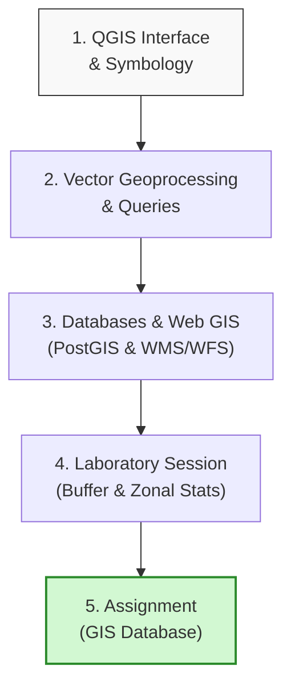

# Day 3: QGIS Workflows & Spatial Data Management

Welcome to Day 3. Today we transition from concepts and satellite imagery to operational data manipulation using **QGIS Desktop**. We will focus on geoprocessing, attribute querying, database modeling, and styling data for professional cartographic presentations.

---

## Learning Objectives
By the end of today's sessions, you will be able to:

* **Navigate** the QGIS user interface, panels, and processing toolboxes.

* **Apply** advanced symbology (categorized, graduated, rule-based) and label rendering.

* **Query** databases using QGIS expressions and execute tabular joins and relations.

* **Perform** vector geoprocessing (buffering, clipping, dissolving) and raster processing (map algebra, reclassifications).

* **Extract** zonal statistics (e.g., average elevation or rainfall per sub-district).

* **Integrate** OGC web services (WMS, WFS) and spatial database layers (PostGIS).

---

## Day 3 Learning Roadmap

