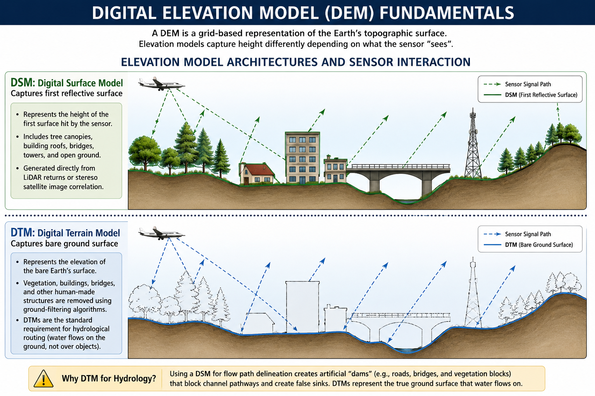
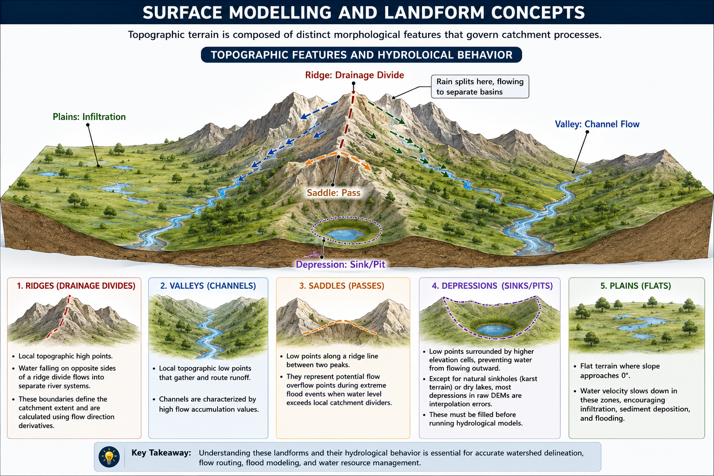
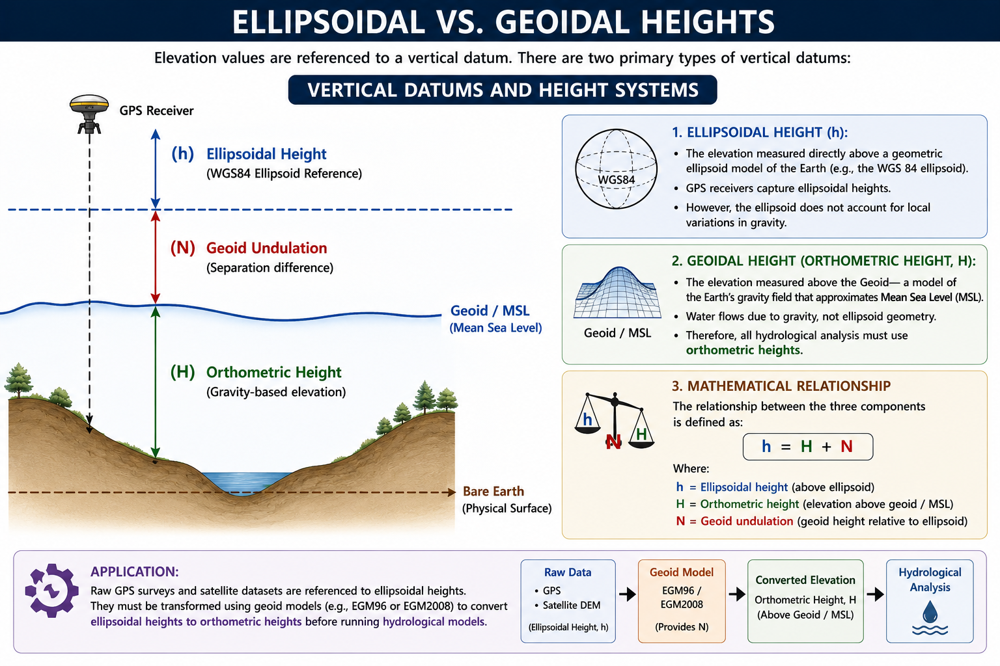

# Introduction to Terrain Analysis

Terrain analysis uses digital elevation datasets to analyze, model, and visualize topographic surfaces. Topography is the primary driver of hydrological processes at the catchment scale. It governs gravity-driven fluid dynamics, determining where water flows, how fast it travels, where it accumulates, and how it interacts with the landscape.

Understanding elevation data models, satellite missions, and landform classifications is essential for hydrologists to build reliable models of runoff, soil erosion, and flood hazards.

---

## 1. Digital Elevation Model (DEM) Fundamentals

A Digital Elevation Model (DEM) is a grid-based representation of the Earth's topographic surface. In spatial analysis, three terms are commonly used to describe elevation models, and it is critical to distinguish between them:

```text
       ELEVATION MODEL ARCHITECTURES AND SENSOR INTERACTION
       
       [DSM: Digital Surface Model]  -- Captures first reflective surface
         ___    _/\_               ___    /\_  (Canopy / Tree Tops)
        /   \  /    \   _/\_      /   \  /   \ (Building Roofs)
       |     |/      \_/    \____|     |/     \
       
       ...............................................................
       
       [DTM: Digital Terrain Model]  -- Captures bare ground surface
        _______________________________________/\_
       /                                         \ (Bare Soil / Rock)
```

*   **Digital Elevation Model (DEM):**
    
    A generic, umbrella term representing any digital dataset containing elevation values above a reference datum.
    
    In literature, it can refer to either a DSM or a DTM depending on context.

*   **Digital Surface Model (DSM):**
    
    Captures the absolute height of the first reflective surface encountered by the sensor.
    
    This includes tree canopies, building roofs, transmission lines, and open ground.
    
    DSMs are generated directly from raw LiDAR returns or stereo satellite image correlation.

*   **Digital Terrain Model (DTM):**
    
    Represents the elevation of the bare Earth's surface.
    
    Vegetation canopy, buildings, bridges, and other human-made structures are mathematically filtered out using ground-filtering algorithms.
    
    **DTMs are the standard requirement for hydrological routing.**
    
    Water flows along the physical ground, not over tree canopies or building roofs.
    
    Using a DSM for flow path delineation results in artificial "dams" (e.g., roads, bridges, and vegetation blocks) that block channel pathways and create false sinks.



### Grid Parameters and Precision

To utilize DEMs effectively in QGIS, analysts must understand how elevation values are stored and referenced.

*   **Data Types and Precision:**
    
    DEMs are typically stored as single-band **Float32 GeoTIFF** files.
    
    Each pixel contains a decimal floating-point number representing height above a datum (e.g., $1450.72\text{ meters}$).
    
    Some datasets are distributed as **Int16** (integer format), rounding heights to the nearest meter.
    
    Integer formats can cause artificial flat steps (terracing) on gentle slopes, which disrupts flow direction algorithms.

*   **Spatial Resolution (Cell Size):**
    
    Determines the minimum physical dimension represented by a single cell (e.g., $30\text{ m} \times 30\text{ m}$).
    
    Higher resolution DEMs resolve narrow stream channels and banklines, while coarse resolution DEMs smooth topographic variations, leading to underestimations of slope gradients and stream density.

*   **Pixel-is-Area vs. Pixel-is-Point:**
    
    *   **Pixel-is-Area:** The elevation value represents the average height of the entire grid cell area. The cell coordinate is anchored at the corner.
    
    *   **Pixel-is-Point:** The elevation value represents the height at a single point coordinate in the exact center of the cell.
    
    When combining multiple DEMs, mismatched cell alignments require resampling with half-pixel coordinate offsets.

---

## 2. Comparison of Global Elevation Datasets

Most regional studies rely on global spaceborne elevation datasets. Selecting the right DEM requires balancing spatial resolution, geographic coverage, and vertical accuracy limits:

| Dataset | Provider | Spatial Resolution | Vertical Accuracy (LE90) | Capture Technology | Hydrological Applicability |
| :--- | :--- | :--- | :--- | :--- | :--- |
| **SRTM GL1** | NASA / USGS | $30\text{ m}$ | $\approx 16\text{ m}$ | C-band InSAR (Space Shuttle) | Historical baseline. Poor in high-slope mountain zones; contains voids (missing values) in steep Himalayan valleys. |
| **ALOS AW3D30** | JAXA | $30\text{ m}$ | $\approx 5\text{ m}$ | Optical Stereo Photogrammetry | Generated from optical stereo imagery. Captures high-relief mountain ridges clearly, but can have anomalies in cloud-prone zones. |
| **Copernicus GLO-30** | ESA | $30\text{ m}$ | $< 2\text{ m}$ | Radar Interferometry (TanDEM-X) | **Modern global standard**. High vertical accuracy and consistency; voids are filled using multi-sensor interpolation. |
| **FABDEM** | University of Bristol | $30\text{ m}$ | $\approx 2\text{ m}$ | Machine Learning (Copernicus DEM corrected) | **Forest And Buildings removed DEM**. The first global DTM derived by systematically removing canopy/building heights from Copernicus GLO-30. |
| **LiDAR DTM** | Civil Authorities | $< 1\text{ m}$ | $< 0.15\text{ m}$ | Airborne Laser Scanning | High-precision engineering projects, urban flood modeling, and precise river cross-section mapping. |

### Data Capture Methods and Limitations

*   **Radar Interferometry (InSAR):**
    
    Used by SRTM and TanDEM-X.
    
    Calculates elevation by measuring the phase difference between radar signals received by two separate antennas.
    
    *Limitation (Penetration Depth):* Radar signals do not fully penetrate dense forest canopies.
    
    C-band radar (SRTM) penetrates partially, resulting in a surface that is neither a pure DTM nor a pure DSM.
    
    *Limitation (Geometry Distortions):* Radar sensors suffer from geometric distortions in steep terrain (layover, foreshortening, and shadow).
    
    This results in missing data (voids) along steep cliffs, which is common in Himalayan valleys.

*   **Optical Stereo Photogrammetry:**
    
    Used by ALOS AW3D30 and ASTER GDEM.
    
    Correlates two or more images captured of the same target area from different angles (along-track stereo).
    
    *Limitation (Cloud Cover):* Persistent cloud cover prevents optical cameras from viewing the ground.
    
    This leads to data gaps or interpolation artifacts in mountain ranges during monsoon seasons.

*   **Airborne LiDAR:**
    
    Uses laser pulses emitted from an aircraft.
    
    Measures the travel time of returning light pulses.
    
    LiDAR registers multiple returns for a single pulse.
    
    The first return represents the canopy top, while the last return represents the ground.
    
    This enables the generation of highly accurate bare-earth DTMs.
    
    *Limitation:* High mobilization and acquisition costs restrict LiDAR coverage to high-value infrastructure corridors and urban floodplains.

---

## 3. Surface Modelling and Landform Concepts

Topographic terrain is composed of distinct morphological features that govern catchment processes:

```text
       TOPOGRAPHIC FEATURES AND HYDROLGICAL BEHAVIOR
                     
                     [Ridge: Drainage Divide]
                              /\
                             /  \   <-- Rain splits here, flowing to separate basins
                            /    \
                           /      \
                          /        \
       [Plains: Infiltration]       \  [Valley: Channel Flow]
       _______________________       \_________/\________
```

*   **Ridges (Drainage Divides):**
    
    Local topographic high points.
    
    Water falling on opposite sides of a ridge divide flows into separate river systems.
    
    These boundaries define the catchment extent and are calculated using flow direction derivatives.

*   **Valleys (Channels):**
    
    Local topographic low points that gather and route runoff.
    
    Channels are characterized by high flow accumulation values.

*   **Saddles (Passes):**
    
    Low points along a ridge line between two peaks.
    
    They represent potential flow overflow points during extreme flood events when water level exceeds local catchment dividers.

*   **Depressions (Sinks/Pits):**
    
    Low points surrounded by higher elevation cells, preventing water from flowing outward.
    
    Except for natural sinkholes (karst terrain) or dry lakes, most depressions in raw DEMs are interpolation errors.
    
    These must be filled before running hydrological models.

*   **Plains (Flats):**
    
    Flat terrain where slope approaches $0^{\circ}$.
    
    Water velocity slows down in these zones, encouraging infiltration, sediment deposition, and flooding.



### The Topographic Position Index (TPI)

The Topographic Position Index (TPI) is a quantitative method used to classify landforms by comparing the elevation of a central cell to the average elevation of its surrounding neighborhood.

$$\text{TPI} = Z_0 - \frac{1}{n} \sum_{i=1}^{n} Z_i$$

Where:

*   $Z_0$ is the elevation of the central cell.

*   $Z_i$ is the elevation of a neighboring cell within a specified search radius.

*   $n$ is the total number of neighboring cells inside the search window.

*   **Landform Classification Rules:**
    
    *   **High positive TPI values:** The central cell is higher than its surroundings, indicating **ridges** or hilltops.
    
    *   **High negative TPI values:** The central cell is lower than its surroundings, indicating **valleys** or stream channels.
    
    *   **TPI values near zero:** Indicates flat terrain (plains) or a constant, uniform slope.

### Terrain Analysis Challenges in the Himalayas

Nepal's topography presents extreme challenges for terrain analysis:

*   **High Relief Dynamics:**
    
    Elevation rises from $60\text{ m}$ in the southern Terai plains to $8848\text{ m}$ at Mount Everest within a horizontal distance of less than $150\text{ km}$.
    
    This steep gradient causes rapid changes in flow velocity and channel scour.

*   **Steep Slope Geometry:**
    
    Slopes exceeding $45^{\circ}$ cause radar layover and shadow.
    
    This results in high noise levels in global datasets like SRTM and AW3D30.

*   **Digital Dams in Gorges:**
    
    Many Himalayan rivers flow through deep, narrow gorges that are narrower than the $30\text{ m}$ pixel resolution of global DEMs.
    
    In a raw DEM, the canyon walls blend into a single pixel, creating a "digital dam" that artificially blocks the flow routing.
    
    Analysts must apply DEM conditioning techniques to burn the stream vectors through these digital dams.

---

## 4. Coordinate Reference Systems, Projections, and Datums in Hydrology

To perform spatial calculations on terrain datasets, analysts must understand how horizontal and vertical dimensions are measured and projected.

### Ellipsoidal vs. Geoidal Heights

Elevation values are referenced to a vertical datum. There are two primary types of vertical datums:

```text
       VERTICAL DATUMS AND HEIGHT SYSTEMS
       
       [GPS Receiver]
            |
            |   (h) Ellipsoidal Height (WGS84 Ellipsoid Reference)
            v
       -----+---------------------------------------------------------
            |   (N) Geoid Undulation (Separation difference)
            v
       =============================================================== [Geoid / MSL]
            |
            |   (H) Orthometric Height (Gravity-based elevation)
            v
       --------------------------------------------------------------- [Bare Earth]
```

*   **Ellipsoidal Height ($h$):**
    
    The elevation measured directly above a geometric ellipsoid model of the Earth (e.g., the WGS 84 ellipsoid).
    
    GPS receivers capture ellipsoidal heights.
    
    However, the ellipsoid does not account for local variations in gravity.

*   **Geoidal Height (Orthometric Height, $H$):**
    
    The elevation measured above the Geoid—a model of the Earth's gravity field that approximates Mean Sea Level (MSL).
    
    **Water flows due to gravity, not ellipsoid geometry.**
    
    Therefore, all hydrological analysis must use orthometric heights.
    
    The mathematical relationship is defined as:
    
    $$h = H + N$$
    
    Where:
    
    *   $h$ is the ellipsoidal height.
    
    *   $H$ is the orthometric height (elevation above geoid).
    
    *   $N$ is the geoid undulation (geoid height relative to the ellipsoid).
    
    *   **Application:** Raw GPS surveys and satellite datasets must be transformed using geoid models (e.g., **EGM96** or **EGM2008**) to convert ellipsoidal heights to orthometric heights before running runoff models.



### Horizontal Projections and Grid Distortion

A common error in hydrological modelling is performing calculations on DEMs stored in Geographic Coordinate Systems (GCS, e.g., WGS 84, EPSG: 4326):

*   **Unit Mismatch:**
    
    In GCS, horizontal units are stored in decimal degrees, while vertical units are in meters.
    
    Calculating slope on a GCS raster results in incorrect values because the software tries to calculate rise (meters) over run (degrees).

*   **Cell Area Distortion:**
    
    The physical length of $1$ degree of longitude decreases as you move from the equator toward the poles.
    
    At the equator, $1^{\circ} \approx 111\text{ km}$. In northern Nepal ($28^{\circ}\text{ N}$), $1^{\circ}$ longitude decreases to $\approx 98\text{ km}$.
    
    Consequently, raster cells in a GCS are not square; they are tall rectangles that distort area and volume calculations.

*   **UTM Projection Resolution:**
    
    Before calculating slope, flow direction, or watershed boundaries, the DEM must be reprojected to a conformal Projected Coordinate System, such as **UTM Zone 44N** or **Zone 45N** in Nepal.
    
    Projecting standardizes the grid cells into equal-area squares ($30\text{ m} \times 30\text{ m}$), ensuring that horizontal and vertical measurements use the same unit (meters).
