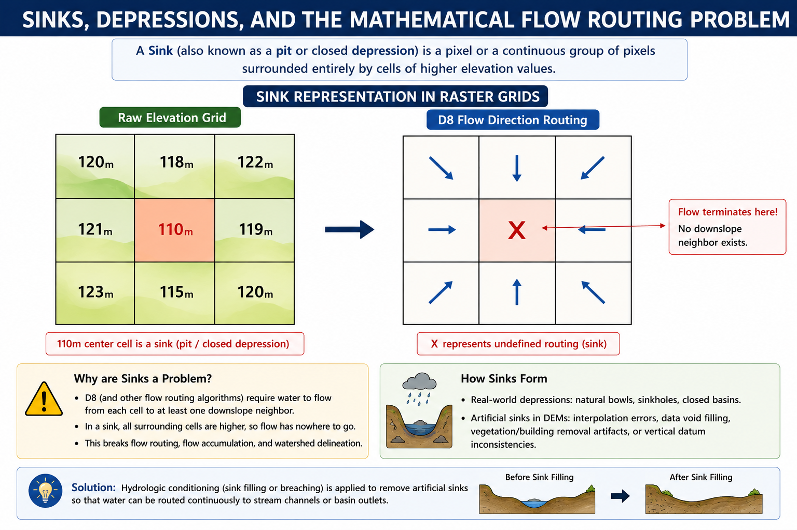
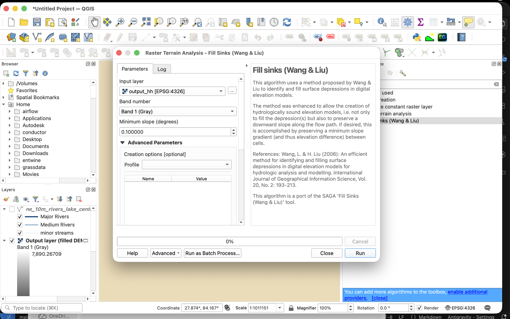
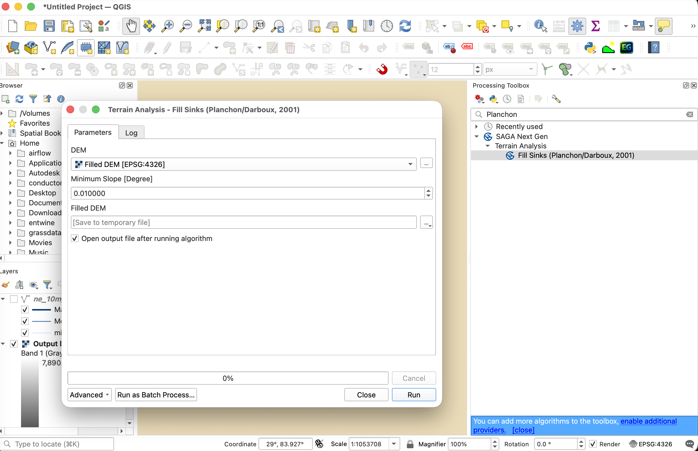
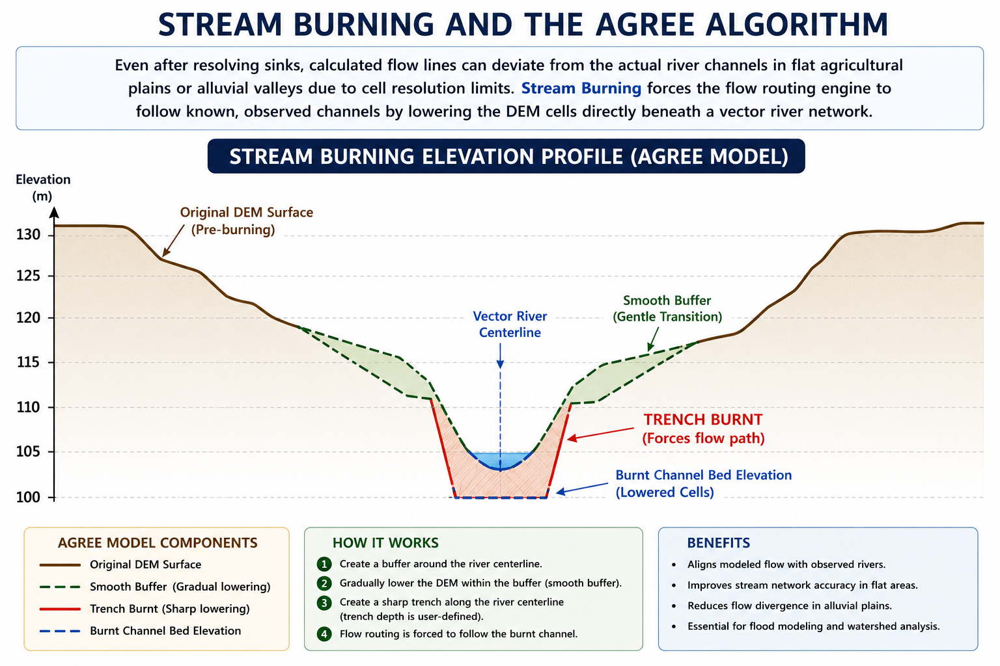

# DEM Processing and Conditioning

Raw digital elevation models (DEMs) contain vertical measurements errors, forest canopy artifacts, and coordinate interpolation noise. These errors must be resolved before running any surface water model. This section details how sinks and depressions disrupt flow routing, the mathematics of conditioning algorithms (breaching and filling), and the theory of vector stream burning.

---

## 1. Sinks, Depressions, and the Mathematical Flow Routing Problem

A **Sink** (also known as a pit or closed depression) is a pixel or a continuous group of pixels surrounded entirely by cells of higher elevation values.

### The Mathematics of D8 Flow Routing

In hydrological modeling, surface water routing relies on digital flow path direction engines. The standard method is the **D8 (Eight-Direction) Flow Model**, which routes water from a center cell $Z_0$ to one of its eight neighboring cells $Z_i$ ($i = 1 \text{ to } 8$) along the path of steepest downward slope.

The slope $s$ to each neighbor is calculated as:

$$s = \frac{Z_0 - Z_i}{d}$$

Where:

*   $Z_0$ is the elevation of the central pixel.

*   $Z_i$ is the elevation of the neighboring pixel.

*   $d$ is the horizontal distance between pixel centers.
    
    For orthogonal neighbors (north, south, east, west), $d = L_x$ (the cell resolution, e.g., $30\text{ m}$).
    
    For diagonal neighbors, $d = \sqrt{2} \times L_x$ (e.g., $\approx 42.42\text{ m}$).

### The Routing Obstacle

If a central cell $Z_0$ is lower than all its neighboring cells ($Z_0 \le Z_i$ for all $i$), the slope calculation $s$ yields negative or zero values for all directions.

*   **Undefined Flow Direction:** The routing engine cannot assign a flow direction. The flow path terminates, creating a digital water trap.

*   **Impact on Catchment Delineation:**
    
    *   **Broken Stream Networks:** The calculated river lines terminate abruptly in small pools instead of reaching the basin outlet.
    
    *   **Underestimated Basin Area:** Upstream catchments that drain into the sink are disconnected, distorting the final watershed boundary.
    
    *   **Zero Accumulation:** Zonal statistics and hydrographs for downstream sections drop to zero, failing to represent actual runoff values.

While natural closed depressions exist (e.g., limestone sinkholes in karst terrain, volcanic craters, or tectonic lakes), the vast majority of sinks in $30\text{ m}$ global satellite DEMs are artifacts of data capture.

*   **Radar Speckle & Phase Noise:** Variations in signal reflectance during InSAR capture create local spikes and troughs.

*   **Forest Canopy Bridges:** Dense vegetation lines crossing a narrow canyon block the sensor, creating a "virtual dam" across the channel.

*   **Integer Terracing:** Rounding decimal values to integer values creates artificial flat shelves with zero slope.

---

## 2. DEM Conditioning Algorithms

To establish a continuous flow network, elevation grids must be preprocessed using terrain conditioning algorithms. There are three primary geoprocessing methods:

### Wang and Liu Sink Filling (SAGA)

The SAGA **Fill Sinks (Wang & Liu)** algorithm is the standard tool for resolving depressions. It operates through the following mathematical steps:

1.  **Identify Pit Cells:** Scan the DEM grid to locate all individual sink pixels and multi-pixel depression basins.

2.  **Determine Spill Elevation ($Z_{\text{spill}}$):** Traverse the outer boundaries of each depression basin to locate the lowest elevation cell along the rim where water would naturally spill out.

3.  **Raise Elevation Values:** Set the elevation of all cells inside the depression basin to the spill elevation value:
    
    $$Z_{\text{new}} = \max(Z_{\text{raw}}, Z_{\text{spill}})$$

4.  **Inject Micro-Gradients:**
    
    Simply raising cells to the spill path creates a perfectly flat surface with zero slope.
    
    To ensure a continuous flow path, the algorithm injects a micro-gradient (e.g., $10^{-5}\text{ meters per meter}$) from the interior of the filled basin pointing toward the outlet spill cell, ensuring a valid D8 flow path.

### QGIS Tool Execution:

*   **Tool Path:** Open the **Processing Toolbox** panel (`Ctrl + Alt + T` or `Cmd + Option + T` on macOS) and navigate to **SAGA** > **Terrain Analysis - Hydrology** > **Fill Sinks (Wang & Liu)**.

*   **Key Parameters:**
    
    *   **DEM:** Select the raw elevation raster (e.g., `output_hh.tif`).
    
    *   **Minimum Slope (Degree):** Set to `0.01` (injects a micro-gradient to prevent flat areas).
    
    *   **Filled DEM:** Define the output path for the filled raster layer.

*   **WhiteboxTools Alternative:** 
    *   **Tool Path:** Navigate to **WhiteboxTools** > **Hydrological Analysis** > **FillDepressions**.
    *   **Key Parameters:** Select the input DEM, set the **Flat Increment** to a small value (e.g., `0.001`), and define the output **Dem** path.

### Planchon and Darboux Sink Filling (GDAL / GRASS)

The Planchon & Darboux algorithm uses a virtual flooding simulation:

1.  **Initialize Grid:** Set the elevation of all non-boundary cells in the DEM to an extremely high value (approaching infinity). Boundary cells (the edges of the raster) are set to their actual raw elevation.

2.  **Flood Simulation:**
    
    The algorithm scans the raster from the outer edges inward.
    
    For each cell, it adjusts the elevation to the maximum of its raw elevation and the elevation of its lowest neighbor plus a small increment.

3.  **Convergence:** The iterations run until no further cell adjustments occur, producing a conditioned surface where every cell drains toward the boundary.

### QGIS Tool Execution:

*   **Tool Path:** Open the **Processing Toolbox** and navigate to **SAGA** > **Terrain Analysis - Hydrology** > **Fill Sinks (Planchon/Darboux)**.

*   **Alternative (GRASS Tool):** Navigate to **GRASS** > **Raster (r.*)** > **r.fill.dir**. Set the input **Elevation** to the raw DEM, select **D8** for flow direction format, and specify the output path for the **Depressionless DEM**.

### DEM Breaching (Sliver Cutting)

In flat floodplains or low-slope valley floors, sink filling can create massive, artificial flat zones, distorting drainage channels. Breaching is an alternative method:

*   **Concept:**
    
    Instead of raising the cells inside the sink, breaching lowers the elevation of the blocking cells (the barrier) downstream.
    
    It carves a narrow trench (breach channel) through the barrier to connect the sink to a lower downstream outlet.

*   **Optimization:** The tool search for the path of least resistance (minimizing the volume of excavation) to cut the breach channel.

### QGIS Tool Execution:

*   **Tool Path:** Open the **Processing Toolbox** and navigate to **SAGA** > **Terrain Analysis - Hydrology** > **DEM Breaching**.

*   **Key Parameters:**
    
    *   **DEM:** Select the raw elevation raster.
    
    *   **Maximum Search Radius:** Specify the search distance in cells (default is `100`). A larger radius allows carving channels through wider barriers.
    
    *   **Breached DEM:** Define the output path for the carved raster layer.

*   **WhiteboxTools Alternative:**
    *   **Tool Path:** Navigate to **WhiteboxTools** > **Hydrological Analysis** > **BreachDepressions**.
    *   **Key Parameters:** Select the input DEM, set the **Maximum Breach Depth** (optional, or leave default), and specify the output **Dem** path. (WBT uses an advanced least-cost pathway breaching algorithm).

### Comparison Matrix: Filling vs. Breaching

| Parameter | Sink Filling | DEM Breaching |
| :--- | :--- | :--- |
| **Elevation Change** | Positive (adds height). | Negative (subtracts height). |
| **Slope Preservation** | Flattens valleys; can create wide shelves. | Preserves steep gorge walls and channel slopes. |
| **Volume Impact** | Artificially adds water storage mass. | Artificially removes topographic mass. |
| **Primary Use Case** | Steep headwater catchments with small, isolated pits. | Flat plains, alluvial fans, and urban road embankments. |

---

## 3. Stream Burning and the AGREE Algorithm

Even after resolving sinks, calculated flow lines can deviate from the actual river channels in flat agricultural plains or alluvial valleys due to cell resolution limits. **Stream Burning** forces the flow routing engine to follow known, observed channels by lowering the DEM cells directly beneath a vector river network.

### The AGREE Algorithm Method

Developed at the University of Texas at Austin, the AGREE algorithm processes the DEM using a vector stream network:

1.  **Rasterize Vector Streams:**
    
    Convert the vector river lines into a grid aligning perfectly with the DEM cells.

2.  **Define Buffer Widths:**
    
    *   **Sharp Buffer ($w_s$):** A narrow corridor representing the immediate stream width (typically $1-2$ pixels).
    
    *   **Smooth Buffer ($w_d$):** A wider corridor representing the valley influence zone (typically $5-10$ pixels).

3.  **Compute Drop Elevations:**
    
    Calculate the distance $d$ from each raster cell to the nearest stream pixel.
    
    *   **Inside Sharp Buffer ($d \le w_s$):**
        
        Drop the elevation of the cells by a fixed sharp value ($dz_s$, e.g., $15\text{ meters}$):
        
        $$Z_{\text{new}} = Z_{\text{raw}} - dz_s$$

    *   **Inside Smooth Buffer ($w_s < d \le w_d$):**
        
        Apply a linear interpolation drop ($dz_d$) from the outer edge of the smooth buffer down to the top of the sharp trench:
        
        $$Z_{\text{new}} = Z_{\text{raw}} - dz_d \times \left( \frac{w_d - d}{w_d - w_s} \right)$$

4.  **Resulting Hydrological Routing:**
    
    This creates a V-shaped valley centered on the actual stream.
    
    The D8 flow routing engine is forced to route water into this valley and follow the correct channel path, preventing flow line deviations.

### QGIS Tool Execution:

*   **Tool Path:** Open the **Processing Toolbox** and navigate to **SAGA** > **Terrain Analysis - Hydrology** > **Burn Stream Network into DEM**.

*   **Key Parameters:**
    
    *   **DEM:** Select the input elevation raster.
    
    *   **Streams:** Select the vector line layer containing your digitized river networks.
    
    *   **Burn-in Depth:** Set the trench depth (e.g., `$10\text{ meters}$` or `$15\text{ meters}$`).
    
    *   **Burnt DEM:** Define the output path for the stream-burned raster layer.

*   **WhiteboxTools Alternative:**
    *   **Tool Path:** Navigate to **WhiteboxTools** > **Hydrological Analysis** > **BurnStreams**.
    *   **Key Parameters:** Select the input **Dem**, the input vector **Streams**, set the **Decrease** value (e.g. `15.0`), and set the output **Dem** path.

---

## 4. Practical Exercises: DEM Conditioning in QGIS

We will execute, analyze, and compare terrain conditioning algorithms in QGIS using local datasets.

### Prerequisites: Load Datasets

1.  Open QGIS. Load the local elevation raster `output_hh.tif` from the [docs/data/Natural_Earth_quick_start/DEM/](file:///Users/krishnaglodha/Documents/work/wb/QGIS-WECS/docs/data/Natural_Earth_quick_start/DEM/) folder.

2.  Load the vector river network layer `ne_10m_rivers_lake_centerlines.shp` from the [docs/data/Natural_Earth_quick_start/10m_physical/](file:///Users/krishnaglodha/Documents/work/wb/QGIS-WECS/docs/data/Natural_Earth_quick_start/10m_physical/) folder.

3.  Ensure the project coordinate system is set to **WGS 84 / UTM Zone 45N** (`EPSG:32645`). If the DEM is in `EPSG:4326`, reproject it via **Raster** > **Projections** > **Warp (Reproject)...** to `EPSG:32645` and save as `output_hh_utm.tif` before proceeding.

---

### Exercise 1: Wang & Liu Sink Filling and Pit Depth Mapping

In this exercise, we will identify and fill closed depressions using SAGA's Wang & Liu algorithm and map their depths.

1.  **Run the Fill Sinks Tool:**
    
    *   Navigate to **Processing Toolbox** > **SAGA** > **Terrain Analysis - Hydrology** > **Fill Sinks (Wang & Liu)**.
    
    *   **DEM:** Select `output_hh_utm.tif`.
    
    *   **Minimum Slope (Degree):** Set to `0.01` (injects a micro-gradient to force downstream flow).
    
    *   **Filled DEM:** Save as `filled_dem_wang_liu.tif`.
    
    *   **Flow Directions:** Save as `flow_directions_filled.tif`.
    
    *   Click **Run**.

2.  **Calculate Depression Depths:**
    
    *   Go to **Raster** > **Raster Calculator...**.
    
    *   Enter the formula to subtract the raw DEM from the filled DEM:
        
        `"filled_dem_wang_liu@1" - "output_hh_utm@1"`
    
    *   Save the output layer as `sink_depth_wang_liu.tif` and click **OK**.

3.  **Visualize and Analyze:**
    
    *   In the **Layer Styling Panel** (`F7`), style `sink_depth_wang_liu.tif` using **Singleband pseudocolor**.
    
    *   Choose a sequential red ramp (e.g., *Reds*).
    
    *   Set the **Min / Max** values from `0.1` to `10.0` meters.
    
    *   Observe how local pits and artificial data dams are highlighted in red where elevation values were raised.

---

### Exercise 2: Planchon & Darboux Sink Filling (GRASS r.fill.dir)

Now, we will resolve depressions using Planchon & Darboux's virtual flooding simulation inside GRASS GIS to compare it with SAGA's method.

1.  **Run the GRASS r.fill.dir Tool:**
    
    *   Navigate to **Processing Toolbox** > **GRASS** > **Raster (r.*)** > **r.fill.dir**.
    
    *   **Elevation:** Select `output_hh_utm.tif`.
    
    *   **Format of flow direction:** Select **D8**.
    
    *   **Depressionless DEM:** Save the output as `filled_dem_planchon.tif`.
    
    *   **Flow Direction:** Save the output as `flow_directions_planchon.tif`.
    
    *   Click **Run**.

2.  **Verify Depression Boundaries:**
    
    *   Open **Raster** > **Raster Calculator...**.
    
    *   Enter the formula:
        
        `"filled_dem_planchon@1" - "output_hh_utm@1"`
    
    *   Save the output as `sink_depth_planchon.tif`.
    
    *   Compare the output visually with `sink_depth_wang_liu.tif` to note the similarities and differences in how each algorithm handles depression edges.

---

### Exercise 3: DEM Breaching to Preserve Drainage Channels

In flat terrains, sink filling can create massive flat terraces. We will carve narrow breach channels through blocking ridges using SAGA's DEM Breaching.

1.  **Run the DEM Breaching Tool:**
    
    *   Navigate to **Processing Toolbox** > **SAGA** > **Terrain Analysis - Hydrology** > **DEM Breaching**.
    
    *   **DEM:** Select `output_hh_utm.tif`.
    
    *   **Maximum Search Radius:** Set to `100` cells (determines the downstream scanning distance to find a lower outlet).
    
    *   **Breached DEM:** Save as `breached_dem.tif`.
    
    *   Click **Run**.

2.  **Map Carved Trenches:**
    
    *   Breaching subtracts elevation from cells, so we compute raw minus breached elevation. Go to **Raster** > **Raster Calculator...**.
    
    *   Enter the formula:
        
        `"output_hh_utm@1" - "breached_dem@1"`
    
    *   Save the output as `breach_channels.tif`.

3.  **Visualize and Compare:**
    
    *   Style `breach_channels.tif` using a bright green color ramp.
    
    *   Observe how breaching carves thin linear pathways through ridges rather than flooding entire basins, preserving slope profiles.

---

### Exercise 4: Stream Burning with Vector River Networks

We will burn a vector river network into the DEM using SAGA's stream burning tool to force the routing engine to follow real-world rivers.

1.  **Run the Burn Stream Network Tool:**
    
    *   Navigate to **Processing Toolbox** > **SAGA** > **Terrain Analysis - Hydrology** > **Burn Stream Network into DEM**.
    
    *   **DEM:** Select `output_hh_utm.tif`.
    
    *   **Streams:** Select the vector layer `ne_10m_rivers_lake_centerlines`.
    
    *   **Burn-in Depth (Epsilon):** Set to `20.0` (this drops the elevation of cells under the lines by $20\text{ meters}$).
    
    *   **Burnt DEM:** Save as `burnt_dem.tif`.
    
    *   Click **Run**.

2.  **Verify Stream Carving:**
    
    *   Open **Raster** > **Raster Calculator...**.
    
    *   Enter the subtraction formula:
        
        `"output_hh_utm@1" - "burnt_dem@1"`
    
    *   Save the output as `stream_burn_difference.tif`.

3.  **Visualize Stream Trenches:**
    
    *   Style `stream_burn_difference.tif` using unique value styling.
    
    *   Note that only cells overlapping the vector river lines have a value of `20`, proving the river corridors were burned successfully into the DEM surface.
