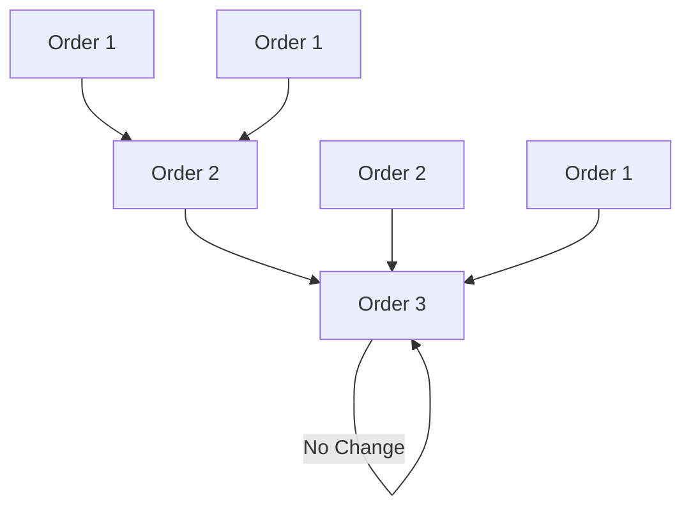

# River Basins and Stream Ordering

River basins are organized hierarchically. Large basins are composed of multiple smaller sub-watersheds. Stream ordering systems classify stream segments based on their position in the network.

---

## 1. Strahler Stream Order
Strahler stream ordering is a hierarchical classification system:

* **Order 1:** Headwater streams without any tributaries.

* **Order 2:** Formed when two Order 1 streams intersect.

* **Order 3:** Formed when two Order 2 streams intersect, and so on.

* **Key Rule:** The intersection of a lower-order stream with a higher-order stream does not increase the order of the higher stream (e.g., an Order 1 stream intersecting an Order 2 stream remains an Order 2 stream).

---

## 2. Shreve Stream Order (Stream Magnitude)
Shreve stream ordering is additive:

* **Order 1:** Headwater streams.

* **Higher Orders:** Formed by adding the orders of intersecting streams together. When two streams of orders $A$ and $B$ intersect, the output order is $A + B$. This is highly correlated with cumulative river flow volumes.
