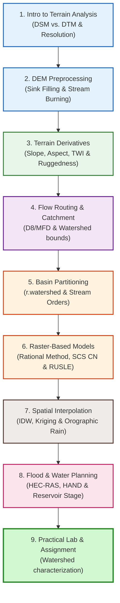

# Terrain Modelling & Hydrological Spatial Analysis

Welcome to Module 4. Today we dive into the core of **Spatial Hydrology**. We will focus on how terrain elevation models (DEMs) are processed to extract flow lines, stream directions, catchment divisions, and flood accumulation paths. This forms the analytical heart of water resource planning in WECS.

---

## Learning Objectives

By the end of today's sessions, you will be able to:

*   **Understand** DEM surface concepts, horizontal-vertical grid resolutions, and topographic representation models (DSM, DTM).

*   **Execute** DEM conditioning to resolve sinks, depressions, and canopy bridges using sink filling (Wang & Liu, Planchon & Darboux), DEM breaching, and vector stream burning.

*   **Generate** primary and secondary terrain derivatives (slope, aspect, curvatures, hillshade, TWI, SPI, TRI, TPI) and interpret their geological and hydrological significance.

*   **Calculate** flow direction grids (D8, MFD, D-Infinity) and unweighted/weighted flow accumulation paths to estimate water yield discharges.

*   **Delineate** regional watershed basins automatically, extract stream networks based on threshold density parameters, and classify channels using Strahler and Shreve stream ordering.

*   **Model** peak surface runoff discharge (Rational Method), runoff volume depths (SCS Curve Number), and annual soil erosion loss susceptibility (RUSLE).

*   **Interpolate** point rain gauge records into continuous grids (IDW, Thin Plate Splines, Kriging), modeling orographic precipitation using elevation covariates (Regression Kriging).

*   **Execute** flood inundation mapping using GIS-hydraulic coupling (HEC-RAS), the HAND relative height model, and calculate reservoir storage capacities via stage-volume curves.

---

## Learning Roadmap

The day is structured into 9 comprehensive topics:

### Day 4 Course Materials:

1.  **[01: Introduction to Terrain Analysis](01_intro_terrain_analysis.md)**: DEM concepts, grid cell size and precision, differences between DSM/DTM, data sources (SRTM, ALOS, Copernicus), and horizontal-vertical datums.

2.  **[02: DEM Processing and Conditioning](02_dem_processing.md)**: Sinks and depressions, mathematical flow routing problems, SAGA Wang & Liu sink filling, GRASS r.fill.dir Planchon & Darboux, DEM breaching, and AGREE stream burning.

3.  **[03: Primary and Secondary Terrain Derivatives](03_terrain_derivatives.md)**: Moving neighborhood windows (Horn's vs. Zevenbergen & Thorne), slope, aspect, standard/multi-directional hillshading, curvatures, TRI ruggedness indices, TPI landforms, TWI wetness index, and SPI stream power calculations.

4.  **[04: Hydrological Analysis and Flow Routing](04_hydrological_analysis.md)**: Flow direction models (D8, MFD, D-Infinity), flow accumulation (unweighted area vs. weighted runoff discharge), threshold-based stream network extraction, and pour point snapping single-basin upslope delineations.

5.  **[05: River Basins and Stream Ordering](05_river_basin_watershed.md)**: Automated regional sub-basin delineation using SAGA Channel Network and GRASS r.watershed. Delineating Strahler stream orders (Horton's laws, bifurcation ratios) and Shreve stream magnitude ordering.

6.  **[06: Raster-Based Hydrological and Soil Erosion Modelling](06_raster_modelling.md)**: Runoff peak discharge modeling (Rational Method), runoff volume depth estimation (SCS Curve Number), and annual soil loss susceptibility mapping (RUSLE).

7.  **[07: Rainfall Gridding and Spatial Interpolation](07_rainfall_environmental.md)**: Proximity-based IDW, Thin Plate Splines, Ordinary Kriging (nuggets, sills, ranges), elevation-based Regression Kriging, and Zonal statistics volumetric basin inputs.

8.  **[08: Flood Mapping and Water Resource Applications](08_flood_water_resources.md)**: Pre- and post-processing coupling with HEC-RAS, Height Above Nearest Drainage (HAND) inundation models, and reservoir capacity stage-volume analysis curves.

9.  **[09: Practical Laboratory and Mini-Assignment](09_practical_session.md)**: Guided step-by-step workspace configuration, DEM conditioning, flow accumulation routing, and watershed delineations, followed by an independent catchment characterization, zonal stats, and QGIS print layout mapping assignment.
