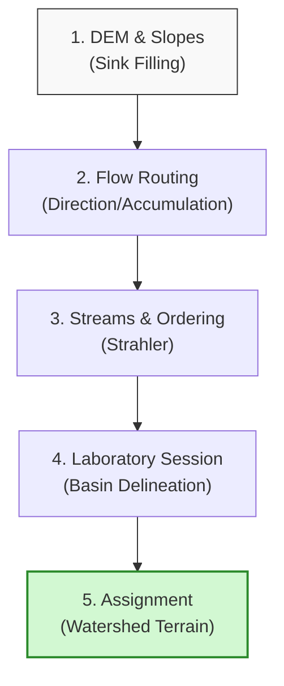

# Day 4: Terrain Modelling & Hydrological Spatial Analysis

Welcome to Day 4. Today we dive into the core of **Spatial Hydrology**. We will focus on how terrain elevation models (DEMs) are processed to extract flow lines, stream directions, catchment divisions, and flood accumulation paths. This forms the analytical heart of water resource planning in WECS.

---

## Learning Objectives
By the end of today's sessions, you will be able to:

* **Understand** DEM surface concepts and topographic representation models.

* **Execute** DEM conditioning, including sink filling and stream burning.

* **Generate** primary terrain derivatives (slope, aspect, curvature, hillshade).

* **Calculate** flow direction grids (D8 algorithm) and flow accumulation paths.

* **Delineate** watershed catchment divisions and extract stream networks based on threshold parameters.

* **Classify** river basins using Strahler and Shreve stream ordering.

---

## Day 4 Learning Roadmap

