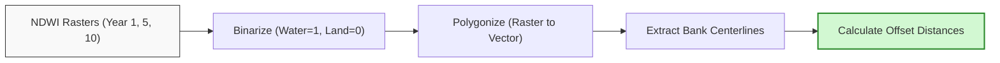

# Multi-Temporal Workflows

Multi-temporal workflows enable GIS analysts to track dynamic processes, such as river bank migration, shoreline displacement, and reservoir volume loss over multi-year periods.

---

## 1. River Channel Migration Analysis

Meandering rivers across active floodplains (such as the Koshi or Gandaki Rivers in Nepal) change course continuously due to deposition and erosion. We can model this migration using a multi-temporal workflow:

*   **Workflow Steps:**
    
    1.  **Delineate Water Extent:** Calculate NDWI for Landsat or Sentinel scenes representing the dry season across multiple years.
    
    2.  **Reclassify to Binary Masks:**
        
        Set water pixels ($NDWI > 0.0$) to $1$, and non-water pixels to $0$.
    
    3.  **Vector Conversion:**
        
        Convert the binary water raster to polygons using the **Polygonize** tool.
        
        Filter out minor lakes or ponds by excluding geometries with area fields below a target threshold (e.g. area $< 10,000\text{ m}^2$).
    
    4.  **Extract River Banklines:**
        
        Convert polygon boundaries to polylines, or extract centerlines using GRASS `r.to.vect` with the line feature type option.
    
    5.  **Compute Lateral Migration:**
        
        Use the QGIS **Hub Distance** tool or the **QChainage** plugin to generate cross-sections along the main river channel.
        
        Measure the offset distance between centerline vectors from different years to calculate bank migration rates (meters/year).

---

## 2. Reservoir Sedimentation and Bathymetric Differencing

Silt accumulation reduces active reservoir storage capacity over time.

*   **The Volume Calculation Formula:**
    
    To calculate the change in reservoir volume between two bathymetric survey dates ($t_1$ and $t_2$), we perform pixel-by-pixel subtraction across the DEMs:
    
    $$\text{Volume Loss} = \sum_{i=1}^{n} (\text{DEM}_{t1, i} - \text{DEM}_{t2, i}) \times A_{\text{pixel}}$$
    
    Where:
    
    *   $\text{DEM}_{t1}$ is the baseline elevation grid.
    
    *   $\text{DEM}_{t2}$ is the subsequent survey elevation grid.
    
    *   $A_{\text{pixel}}$ is the surface area of a single raster pixel (e.g., $900\text{ m}^2$ for a $30\text{ m}$ pixel).

*   **Sediment Distribution Analysis:**
    
    By mapping the difference raster, engineers can identify where sediment deposition is concentrated (e.g., deltas near inlet channels vs. deep siltation near the dam wall), which informs dredging operations.

---

## 3. Step-by-Step Exercise: River Centerline Drift

1.  **Load Vector Centerlines:**
    
    Load `river_centerline_2015.shp` and `river_centerline_2025.shp` into the QGIS layers panel.

2.  **Generate Transverse Transects:**
    
    Select the 2015 centerline layer.
    
    Go to **Processing Toolbox** > **Vector Geometry** > **Create Transects (or Lines Along Line)**.
    
    Set the interval distance to $500\text{ m}$ and transect length to $200\text{ m}$ (sufficient to intersect both centerlines). Save as `transect_lines.gpkg`.

3.  **Compute Intersections:**
    
    Use **Line Intersections** to find the points where the 2015 and 2025 centerlines cross the transects.
    
    This creates two point layers: `points_2015` and `points_2025`.

4.  **Calculate Offset Distance:**
    
    Use the **Distance to Nearest Hub (Points)** tool:
    
    *   **Source Points:** `points_2015`
    
    *   **Destination Hub Layer:** `points_2025`
    
    *   **Hub ID Attribute:** `transect_id`
    
    *   **Measurement Unit:** Meters.
    
    Click **Run**.

5.  **Examine Statistics:**
    
    Open the attribute table of the resulting point layer to view the calculated distance field.
    
    Identify the segments showing maximum migration and export the data to a CSV file for report compilation.
