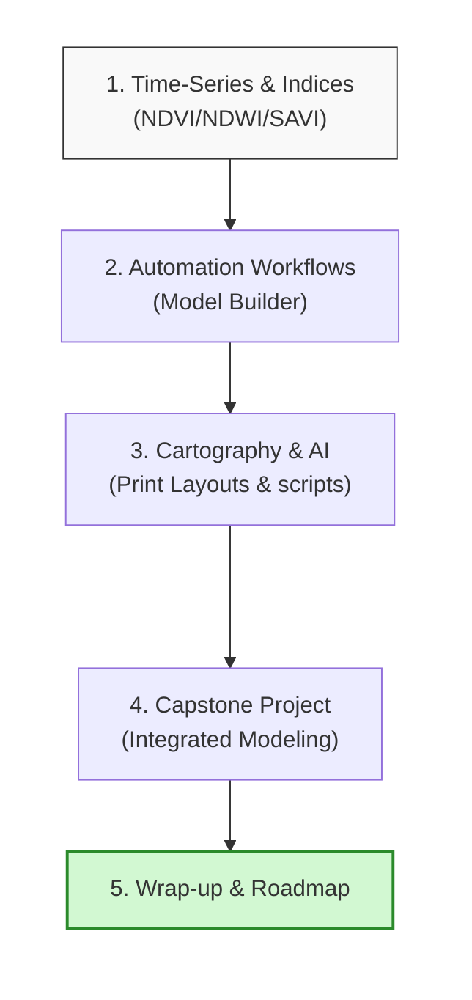

# Day 5: Time Series Analysis, Spectral Indices & Decision Support

Welcome to the final day of the training program. Today we bring together everything we have learned. We will focus on **Time-Series Analysis** (tracking changes over years and seasons), generating **Spectral Indices** (NDVI, NDWI, NDBI, SAVI), automating our tasks with the QGIS **Model Builder**, and compiling map layouts to support environmental decision-making.

The day concludes with an integrated Capstone Practical and group presentations.

---

## Learning Objectives
By the end of today's sessions, you will be able to:

* **Execute** time-series analysis on multi-temporal satellite images to track river migrations or reservoir changes.

* **Generate** diverse indices (NDVI, NDWI, NDBI, SAVI) to model vegetation, water, and built-up areas.

* **Delineate** drought indices and monitor agricultural water stress.

* **Automate** repeatable spatial analyses using the QGIS Graphical Model Builder.

* **Apply** AI assistants to troubleshoot Python scripts and QGIS expression formats.

* **Produce** print-ready map booklets and interactive reports for executive policy reviews.

---

## Day 5 Learning Roadmap

