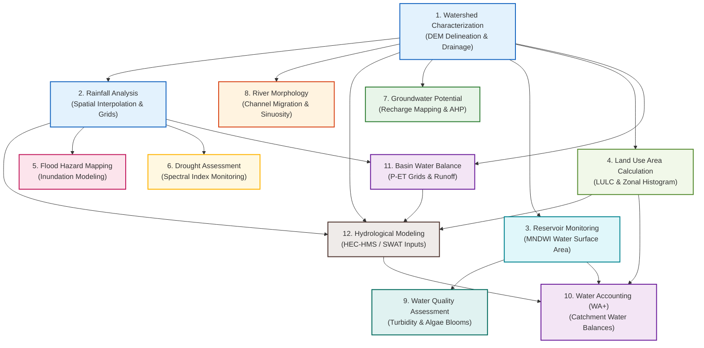

# Hydrology Applications Using GIS

Geospatial information systems (GIS) and Earth observation (EO) technologies have revolutionized modern hydrology. By integrating topographic elevation grids, multi-spectral satellite imagery, and tabular observation databases, hydrologists can model physical processes across spatial and temporal scales.

This module details ten distinct applications of GIS and remote sensing in hydrology, illustrating how desktop and cloud-based geoprocessing workflows are deployed to solve real-world water resources, environmental, and engineering challenges.

---

## Spatial Application Roadmap

The following flowchart shows how spatial datasets and analysis workflows feed into one another to support integrated watershed management, water security modeling, and decision-support systems:

---

## Thematic Modules

Select a theme below to explore the physical principles, GIS datasets, and geoprocessing steps for each application:

1.  **[Watershed Characterization](watershed_characterization.md)**
    
    *   Delineate sub-catchments, trace stream networks, and calculate morphometric indices (drainage density, bifurcation ratios, and catchment slope) to characterize watershed response.

2.  **[Rainfall Analysis](rainfall_analysis.md)**
    
    *   Interpolate point rain gauges using IDW and Kriging methods. Process gridded satellite precipitation datasets (such as CHIRPS and IMERG) using zonal statistics to compute catchment rainfall.

3.  **[Reservoir Monitoring](reservoir_monitoring.md)**
    
    *   Extract water boundaries using MNDWI thresholding, develop elevation-area-volume curves, and calculate reservoir storage depletion and sedimentation rates.

4.  **[Land Use Area Calculation per Sub-catchment](landuse_percentage.md)**
    
    *   Reproject categorical LULC grids (like the ESA WorldCover 10m product) using Nearest Neighbor, extract pixel counts using Zonal Histogram, and calculate class area percentages to analyze environmental and hydrological impacts.

5.  **[Flood Hazard Mapping](flood_hazard_mapping.md)**
    
    *   Establish river cross-sections, estimate terrain buffers, and threshold active synthetic aperture radar (SAR) backscatter to delineate active flood inundation zones.

6.  **[Drought Assessment](drought_assessment.md)**
    
    *   Evaluate agricultural and meteorological drought intensity using multi-spectral indices like NDVI, NDWI, and the Vegetation Condition Index (VCI).

7.  **[Groundwater Potential Mapping](groundwater_potential.md)**
    
    *   Deploy Multi-Criteria Decision Analysis (MCDA) and the Analytical Hierarchy Process (AHP) to weight slope, lithology, lineaments, and land cover to map recharge zones.

8.  **[River Morphology & Erosion](river_morphology.md)**
    
    *   Track historical channel migration using multi-temporal satellite imagery, calculate river sinuosity indexes, and map bank erosion susceptibility.

9.  **[Water Quality Assessment](water_quality.md)**
    
    *   Estimate suspended sediment concentrations, turbidity, and chlorophyll-a algal blooms using multi-spectral band ratios from Landsat and Sentinel-2.

10. **[Water Accounting (WA+ style)](water_accounting.md)**
    
    *   Apply remote sensing models to calculate the components of a watershed water balance, tracking precipitation, evapotranspiration fluxes, storage change, and runoff.

11. **[Basin Water Balance in QGIS](basin_water_balance.md)**
    
    *   Align multi-source satellite rasters (Precipitation and Evapotranspiration), calculate grid-cell surplus/deficit maps using QGIS Raster Calculator, and tabulate volumetric water budgets per sub-catchment.

12. **[Hydrological Modeling with HEC-HMS / SWAT](hydrological_modeling.md)**
    
    *   Extract and format spatial parameter inputs (such as SCS Curve Number layers, average slope, and sub-basin splits) required to initialize HEC-HMS and SWAT models.
