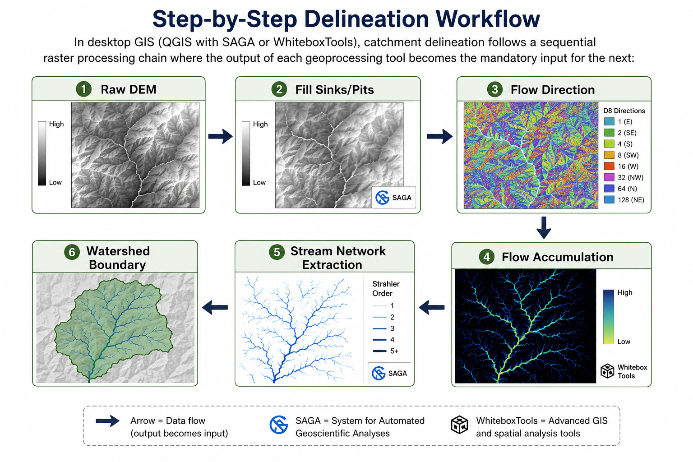

# Watershed Characterization

Watershed characterization involves extracting the topographic and drainage properties of a catchment area from a digital elevation model (DEM). These physical properties govern how precipitation is routed across land surfaces and eventually discharged at the basin outlet.

> [!TIP]
> **Data Sources & Acquisition:**
> If you do not have local elevation data, you can download global Digital Elevation Models (DEMs) for free from the following open-access portals:
> 
> *   **Copernicus DEM (30m resolution):** The global standard for topographic routing. Available via the [Copernicus Browser](https://dataspace.copernicus.eu/). Sign up for a free account, search for your Area of Interest (AOI), select the Copernicus DEM (COP-DEM-30) product, and download the tiles in GeoTIFF format.
> 
> *   **ALOS World 3D (30m resolution):** High-quality surface model from JAXA. Download from the [JAXA ALOS Portal](https://www.eorc.jaxa.jp/ALOS/en/aw3d30/index.htm).
> 
> *   **NASA SRTM DEM (30m resolution):** The legacy shuttle radar topographic mission dataset. Download via [USGS EarthExplorer](https://earthexplorer.usgs.gov/) under the *Digital Elevation* > *SRTM* category, or search on [NASA Earthdata Search](https://search.earthdata.nasa.gov/).

---

## 1. Core Objectives

*   **Delineate** boundary divides that define the surface runoff drainage area.

*   **Extract** drainage networks (streams and rivers) and classify them by order.

*   **Compute** quantitative morphometric parameters that describe the geometry, shape, and relief of the watershed.

---

## 2. Key GIS Inputs

*   **Digital Elevation Model (DEM):** High-resolution elevation data (such as Copernicus DEM 30m, SRTM 30m, or ALOS AW3D30).

*   **Pour Point Coordinates:** The coordinates of the outlet point (e.g., a stream gauging station, reservoir inlet, or river confluence) where runoff exits the watershed.

---

## 3. Step-by-Step Delineation Workflow

In desktop GIS (QGIS with SAGA or WhiteboxTools), catchment delineation follows a sequential raster processing chain where the output of each geoprocessing tool becomes the mandatory input for the next:

1.  **Reproject DEM if needed to CRS with Meters:**
    
    *   **What We Are Doing:** Transforming the coordinate reference system (CRS) of the elevation model from degrees (geographic coordinates, e.g., WGS 84 / `EPSG:4326`) to meters (projected metric coordinates, e.g., WGS 84 / UTM Zone 45N / `EPSG:32645`).
    
    *   **Why This Step is Needed:** Standard hydrology computations (such as slopes, flow routing, drainage densities, and catchment areas) must have identical horizontal (X-Y) and vertical (Z) units. Measuring slopes on geographic coordinates (degrees) yields distorted results. Reprojecting the DEM to a metric projected CRS ensures that distance and area calculations are geometrically accurate.
    
    *   *Input:* Geographic coordinate DEM (`output_hh.tif`).
    
    *   *Output:* Projected metric DEM (`output_hh_utm.tif`).
    
    *   *How to Fill the Form in QGIS:*
        
        *   **Tool Path:** Go to the main QGIS menu and select **Raster** > **Projections** > **Warp (Reproject)...**.
        
        *   **Input Layer:** Select your raw DEM raster (`output_hh.tif`).
        
        *   **Source CRS (Optional):** Set to `EPSG:4326` (geographic).
        
        *   **Target CRS:** Select `EPSG:32645` (or your local metric UTM Zone).
        
        *   **Resampling Method:** Select **Bilinear** (best for preserving continuous elevation slopes).
        
        *   **Converted:** Save the reprojected raster layer as `output_hh_utm.tif`.

2.  **Fill Sink (Wang & Liu):**
    
    *   **What We Are Doing:** Identifying and filling local topographic depressions (sinks/pits) in the elevation model to ensure flow pathways can route continuously downhill.
    
    *   **Why This Step is Needed:** Most depressions in global digital elevation models are noise artifacts, radar speckle, or canopy obstructions. Sinks act as digital water traps; if they are not filled, the flow routing engine terminates at these points, producing broken stream networks and underestimating the contributing watershed area.
    
    *   *Input:* Projected metric DEM (`output_hh_utm.tif`) from **Step 1**.
    
    *   *Output:* Conditioned elevation grid (`filled_dem.tif`).
    
    *   *How to Fill the SAGA Form in QGIS:*
        
        *   **Tool Path:** Open the **Processing Toolbox** and navigate to **SAGA** > **Terrain Analysis - Hydrology** > **Fill Sinks (Wang & Liu)**.
        
        *   **DEM:** Select `output_hh_utm.tif` (from Step 1).
        
        *   **Minimum Slope:** Set to `0.01` (to force a micro-slope downstream across filled flat shelves).
        
        *   **Filled DEM:** Save as `filled_dem.tif`. (Uncheck other outputs like Flow Directions).

3.  **Strahler on Filled DEM:**
    
    *   **What We Are Doing:** Generating stream hierarchy order values (Strahler orders) directly from the conditioned topographic DEM.
    
    *   **Why This Step is Needed:** Strahler Stream Ordering systematically categorizes stream networks. Headwater streams are assigned Order 1; when two Order 1 streams intersect, they form Order 2, and so on. This hierarchy allows us to quantify the channel structure and establish a threshold to extract major channels while filtering out minor gullies.
    
    *   *Input:* Conditioned DEM (`filled_dem.tif`) from **Step 2**.
    
    *   *Output:* Strahler stream order grid (`strahler_order.tif`).
    
    *   *How to Fill the SAGA Form in QGIS:*
        
        *   **Tool Path:** Open the **Processing Toolbox** and navigate to **SAGA** > **Terrain Analysis - Channels** > **Stream Order**.
        
        *   **Elevation:** Select `filled_dem.tif` (from Step 2).
        
        *   **Method:** Select `Strahler`.
        
        *   **Stream Order:** Save as `strahler_order.tif`. (Uncheck other outputs like Flow Directions).

4.  **Filter Strahler >= 6:**
    
    *   **What We Are Doing:** Extracting high-hierarchy stream channels (Strahler order $\ge 6$) using mathematical operators to filter out headwater gullies and extract main river branches.
    
    *   **Why This Step is Needed:** Raw stream networks are extremely dense, mapping every minor runnel. For regional watershed management, it is necessary to study only the main river segments. Filtering the Strahler raster extracts only high-order channels to keep the geoprocessing model clean.
    
    *   *Input:* Strahler order grid (`strahler_order.tif`) from **Step 3**.
    
    *   *Output:* Binary major stream grid (`major_streams.tif` where stream = 1, land = 0).
    
    *   *How to Fill the Form in QGIS:*
        
        *   **Tool Path:** Go to the main QGIS menu and select **Raster** > **Raster Calculator...**.
        
        *   **Expression:** Double-click the Strahler layer to enter the threshold formula:
            `"strahler_order@1" >= 6`
        
        *   **Output Layer:** Save the output as a GeoTIFF named `major_streams.tif`.

5.  **Channel Network and Drainage Basins:**
    
    *   **What We Are Doing:** Vectorizing the raster major stream network into line features and delineating the corresponding regional drainage sub-basins.
    
    *   **Why This Step is Needed:** Delineated channels and sub-basins must be converted into vector lines and polygons to perform network query overlays, draw maps, or compile sub-basin area totals. SAGA handles stream vectorization and sub-basin boundary mapping simultaneously.
    
    *   *Input:* Conditioned DEM (`filled_dem.tif` from **Step 2**) and binary major stream grid (`major_streams.tif` from **Step 4**).
    
    *   *Output:* Vector stream lines (`channels.gpkg`) and sub-basin polygons (`sub_basins.gpkg`).
    
    *   *How to Fill the SAGA Form in QGIS:*
        
        *   **Tool Path:** Open the **Processing Toolbox** and navigate to **SAGA** > **Terrain Analysis - Channels** > **Channel Network and Drainage Basins**.
        
        *   **Elevation:** Select `filled_dem.tif` (from Step 2).
        
        *   **Initiation Grid:** Select `major_streams.tif` (the filtered stream raster from Step 4).
        
        *   **Initiation Type:** Select `[0] Greater than`.
        
        *   **Initiation Threshold:** Enter `0` (this ensures that any cell in the `major_streams.tif` grid with a value greater than 0, i.e., the stream cells marked with 1, initiates a channel).
        
        *   **Channels:** Click and save as `channels.gpkg`.
        
        *   **Drainage Basins:** Click and save as `sub_basins.gpkg`.

6.  **Upslope Area Based on Location:**
    
    *   **What We Are Doing:** Delineating the exact catchment boundary draining into a specific coordinate point (outlet/pour point) selected on the map.
    
    *   **Why This Step is Needed:** Regional sub-basins are generated automatically, but water resource projects (such as dams, bridges, or gauge stations) require the specific total catchment area contributing drainage directly to their planned geographic location.
    
    *   *Input:* Conditioned DEM (`filled_dem.tif` from **Step 2**) and targeted coordinate location.
    
    *   *Output:* Catchment boundary raster (`watershed_basin.tif`).
    
    *   *How to Fill the SAGA Form in QGIS:*
        
        *   **Tool Path:** Open the **Processing Toolbox** and navigate to **SAGA** > **Terrain Analysis - Hydrology** > **Upslope Area**.
        
        *   **Elevation:** Select `filled_dem.tif` (from Step 2).
        
        *   **Target X Coordinate / Target Y Coordinate:** Click the coordinate picker button (`...`) and click on the stream network (`channels.gpkg`) at your chosen outlet location.
        
        *   **Flow Method:** Select `[0] Deterministic 8 (D8)`.
        
        *   **Upslope Area:** Save as `watershed_basin.tif`.

---

## 4. Catchment Morphometry Parameters

Morphometry is the quantitative measurement of watershed shapes and networks:

### Drainage Density ($D_d$)

Drainage density measures the total length of streams per unit area:

$$D_d = \frac{\sum L}{A}$$

Where:

*   $\sum L$ = Sum of all stream segment lengths inside the catchment ($\text{km}$).

*   $A$ = Total watershed area ($\text{km}^2$).

*   *Significance:* High drainage density ($D_d > 5\text{ km/km}^2$) indicates impermeable soils, steep slopes, and rapid runoff routing (flashy hydrographs). Low density suggests highly permeable soils and high groundwater infiltration.

### Stream Bifurcation Ratio ($R_b$)

The ratio of the number of streams of a given order ($N_u$) to the number of streams of the next higher order ($N_{u+1}$):

$$R_b = \frac{N_u}{N_{u+1}}$$

*   *Significance:* Typically ranges between $3.0$ and $5.0$ for natural catchments. Higher ratios indicate structurally controlled drainage networks (e.g. geological faults), whereas lower ratios suggest a highly circular catchment with rapid peak flows converging simultaneously at the outlet.

### Relief Ratio ($R_h$)

Measures the overall steepness of the watershed:

$$R_h = \frac{H}{L_b}$$

Where:

*   $H$ = Elevation difference between the highest ridge point and the outlet (relief, $\text{m}$).

*   $L_b$ = Length of the basin parallel to the principal drainage line ($\text{m}$).

---

## 5. Hydrological Significance

Watershed parameters derived via GIS directly configure hydrological routing:

*   **Time of Concentration ($T_c$):** The time required for runoff to travel from the hydraulically most remote point of the watershed to the outlet. GIS catchment slopes and flow lengths are used in the Kirpich equation to estimate $T_c$.

*   **Unit Hydrograph Shape:** Circular catchments route peak flows faster than elongated catchments, producing higher, sharper hydrograph peaks. Sinuosity and form factors calculated in QGIS help estimate peak lag times.
